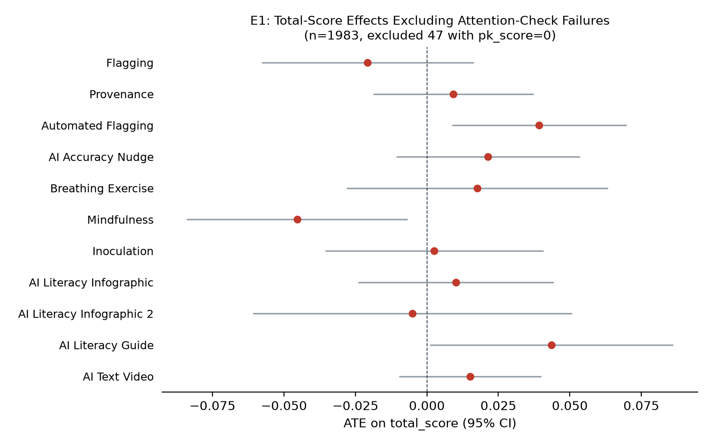
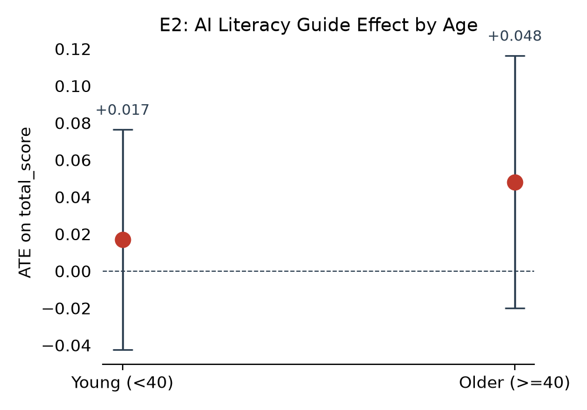

# Improving AI Discernment: do misinformation interventions help people spot AI-generated media?

*Yamil Velez | 2026-10-01 | N = 2,030 analysed of 2,257 collected | survey experiment*

> **Provenance: FULLY AGENTIC — no human review recorded.** Generated by filedrawer 0.1.0 on 2026-10-01 with openrouter (orchestrator `anthropic/claude-sonnet-5.5`, standard `qwen/qwen3.8-27b`, zero data retention requested). Reviewer pass: yes. Human steps recorded: 0. Release status: draft.

## Key findings

- Most interventions did not improve AI-detection accuracy; Automated Flagging raised it by 4.4 points (95% CI [1.4, 7.3]).
- Mindfulness reduced accuracy by 3.9 points (95% CI [−7.4, −0.3]), the only registered arm to harm performance.
- The pooled effect on AI attitudes was negative (−0.11, p = .026), driven by the Breathing Exercise arm.
- Exploratory: the pooled effect on detecting AI-generated posts was +3.8 points (p < .001).
- Eleven arms were tested without multiplicity correction; several effects sit near the .05 threshold.

## Summary

This registered survey experiment tested eleven interventions aimed at improving people's ability to detect AI-generated media. Participants in a US online panel (N = 2,030) were randomly assigned to one of eleven treatment arms or a control condition and then completed a discernment task. The primary outcome was overall detection accuracy. Two arms significantly improved accuracy: Automated Flagging (+4.4 percentage points, 95% CI [1.4, 7.3]) and AI Literacy Guide (+4.7 points, 95% CI [0.2, 9.2]). One arm, Mindfulness, significantly reduced accuracy (−3.9 points, 95% CI [−7.4, −0.3]). The pooled effect across all eleven arms was small and not distinguishable from zero. On secondary outcomes, the Breathing Exercise arm reduced AI attitudes (−0.54, p = .018), and three arms shifted confidence in AI detection. Exploratory analyses showed a pooled improvement in detecting AI-generated posts (+3.8 points, p < .001) but no pooled effect on recognising authentic posts.

## Design and data

Design: survey experiment. Arms: `treatment`: 11 treatment arms (1 = Flagging, 2 = Provenance, 3 = Automated Flagging, 4 = AI Accuracy Nudge, 5 = Breathing Exercise, 6 = Mindfulness, 7 = Inoculation, 8 = AI Literacy Infographic, 9 = AI Literacy Infographic 2, 10 = AI Literacy Guide, 11 = AI Text Video) vs control 0 = Control. Population: online_panel, United States.

Sample: 2,257 raw responses; 2,030 in the analysis sample.

Analysis plan: author-supplied pap.json; registration: https://aspredicted.org/q2eh95.pdf. Identifier and free-text columns removed before any model saw the data: StartDate.

The study was pre-registered on AsPredicted (#151,281) on 2023-11-15; some data had been collected before registration, and batches 3–4 followed the plan. The sample was a US online panel. Of 2,257 raw respondents, 2,030 were retained for analysis. The control group contained 181 participants. Treatment arms ranged from 77 to 333 participants. A small number of rows were dropped for missing values on secondary outcomes (20 on AI attitudes, 4 on confidence). The primary outcome is a proportion on a 0–1 scale; secondary outcomes use ordinal scales.

## Results

### H1. Accuracy (share of 24 posts judged correctly)

*Each intervention changes AI-detection accuracy relative to control.*  
*Pre-registered.*

11 treatment arms are compared with control (Control) in one model on Accuracy (share of 24 posts judged correctly).


Two of the eleven arms significantly changed overall detection accuracy relative to control (two-sided tests). Automated Flagging improved accuracy by 4.4 percentage points (95% CI [1.4, 7.3], p = .004), and AI Literacy Guide improved it by 4.7 points (95% CI [0.2, 9.2], p = .043). Mindfulness reduced accuracy by 3.9 points (95% CI [−7.4, −0.3], p = .032). The other eight arms were within about ±3 points of control and not distinguishable from it. The pooled random-effects estimate across all eleven arms was +1.0 points (95% CI [−0.3, 2.4], p = .132), indicating no reliable average effect.

Pooled across 11 arms (random effects): 0.010, SE 0.007, p = 0.132, tau2 = 0.0002, I2 = 0.45. Caveat: the arm effects share one control group, so they are not independent; the random-effects pooling treats them as if they were, and its standard error and heterogeneity statistics are approximate.

```
total_score ~ C(arm_code, Treatment(reference='0')) * (media_trust_c + pk_score_c + ai_scale_c + political_interest_c)
Lin (2013) covariate adjustment | weights = ipw | HC2 robust SEs | N = 2030 | two-sided test, alpha = 0.05
```

| Arm | Estimate | SE | p | 95% CI | n (arm) | Supported |
|---|---|---|---|---|---|---|
| Flagging | -0.010 | 0.015 | 0.5128 | [-0.039, 0.019] | 215 | no |
| Provenance | 0.011 | 0.014 | 0.4423 | [-0.017, 0.038] | 145 | no |
| Automated Flagging | 0.044 | 0.015 | 0.0035 | [0.014, 0.073] | 127 | yes |
| AI Accuracy Nudge | 0.020 | 0.015 | 0.1855 | [-0.010, 0.050] | 333 | no |
| Breathing Exercise | 0.015 | 0.022 | 0.5092 | [-0.029, 0.059] | 134 | no |
| Mindfulness | -0.039 | 0.018 | 0.0318 | [-0.074, -0.003] | 180 | yes |
| Inoculation | 0.008 | 0.019 | 0.6509 | [-0.028, 0.045] | 78 | no |
| AI Literacy Infographic | 0.012 | 0.017 | 0.4753 | [-0.021, 0.044] | 102 | no |
| AI Literacy Infographic 2 | -0.008 | 0.021 | 0.7178 | [-0.049, 0.034] | 80 | no |
| AI Literacy Guide | 0.047 | 0.023 | 0.0429 | [0.002, 0.092] | 162 | yes |
| AI Text Video | 0.016 | 0.013 | 0.2217 | [-0.009, 0.040] | 293 | no |

### H2. AI attitudes (opportunity vs threat, 6 items)

*Each intervention changes attitudes toward AI relative to control.*  
*Pre-registered.*

11 treatment arms are compared with control (Control) in one model on AI attitudes (opportunity vs threat, 6 items).


The Breathing Exercise arm significantly reduced AI attitudes by 0.54 points on the scale (95% CI [−0.99, −0.09], p = .018). The other ten arms were not distinguishable from control. The pooled estimate across all eleven arms was −0.11 (95% CI [−0.21, −0.01], p = .026), indicating a small but reliable average reduction in positive AI attitudes. The Breathing Exercise effect is the largest single-arm effect and drives the pooled result; the remaining arms show estimates within about ±0.16 of zero.

Pooled across 11 arms (random effects): -0.111, SE 0.050, p = 0.026, tau2 = 0.0000, I2 = 0.00. Caveat: the arm effects share one control group, so they are not independent; the random-effects pooling treats them as if they were, and its standard error and heterogeneity statistics are approximate.

```
ai_attitudes ~ C(arm_code, Treatment(reference='0')) * (media_trust_c + pk_score_c + ai_scale_c + political_interest_c)
Lin (2013) covariate adjustment | weights = ipw | HC2 robust SEs | N = 2010 | two-sided test, alpha = 0.05
```

| Arm | Estimate | SE | p | 95% CI | n (arm) | Supported |
|---|---|---|---|---|---|---|
| Flagging | -0.136 | 0.167 | 0.4127 | [-0.463, 0.190] | 212 | no |
| Provenance | -0.077 | 0.128 | 0.5473 | [-0.328, 0.174] | 144 | no |
| Automated Flagging | -0.117 | 0.156 | 0.4503 | [-0.422, 0.187] | 127 | no |
| AI Accuracy Nudge | -0.029 | 0.276 | 0.9156 | [-0.571, 0.512] | 331 | no |
| Breathing Exercise | -0.543 | 0.230 | 0.0183 | [-0.994, -0.092] | 129 | yes |
| Mindfulness | -0.099 | 0.132 | 0.4525 | [-0.358, 0.159] | 177 | no |
| Inoculation | -0.160 | 0.280 | 0.5689 | [-0.709, 0.389] | 77 | no |
| AI Literacy Infographic | -0.082 | 0.158 | 0.6060 | [-0.391, 0.228] | 102 | no |
| AI Literacy Infographic 2 | -0.033 | 0.228 | 0.8861 | [-0.480, 0.415] | 80 | no |
| AI Literacy Guide | -0.002 | 0.179 | 0.9926 | [-0.353, 0.349] | 161 | no |
| AI Text Video | -0.108 | 0.116 | 0.3541 | [-0.336, 0.120] | 291 | no |

### H3. Confidence in AI detection (single 7-point item)

*Each intervention changes confidence in detecting AI relative to control.*  
*Pre-registered.*

11 treatment arms are compared with control (Control) in one model on Confidence in AI detection (single 7-point item).


Three arms significantly changed confidence in detecting AI-generated content. Flagging reduced confidence by 0.53 points (95% CI [−0.94, −0.12], p = .012), AI Literacy Infographic 2 reduced it by 0.69 points (95% CI [−1.20, −0.17], p = .010), and Inoculation increased it by 0.51 points (95% CI [0.14, 0.88], p = .007). The other eight arms were not distinguishable from control. The pooled estimate was −0.13 (95% CI [−0.32, 0.06], p = .177), not distinguishable from zero, reflecting the opposing directions of the significant arm effects.

Pooled across 11 arms (random effects): -0.131, SE 0.097, p = 0.177, tau2 = 0.0602, I2 = 0.57. Caveat: the arm effects share one control group, so they are not independent; the random-effects pooling treats them as if they were, and its standard error and heterogeneity statistics are approximate.

```
ai_confidence ~ C(arm_code, Treatment(reference='0')) * (media_trust_c + pk_score_c + ai_scale_c + political_interest_c)
Lin (2013) covariate adjustment | weights = ipw | HC2 robust SEs | N = 2026 | two-sided test, alpha = 0.05
```

| Arm | Estimate | SE | p | 95% CI | n (arm) | Supported |
|---|---|---|---|---|---|---|
| Flagging | -0.525 | 0.209 | 0.0121 | [-0.935, -0.115] | 215 | yes |
| Provenance | -0.049 | 0.158 | 0.7581 | [-0.359, 0.262] | 145 | no |
| Automated Flagging | -0.012 | 0.176 | 0.9465 | [-0.357, 0.333] | 127 | no |
| AI Accuracy Nudge | 0.075 | 0.220 | 0.7343 | [-0.357, 0.507] | 332 | no |
| Breathing Exercise | 0.043 | 0.252 | 0.8638 | [-0.451, 0.538] | 134 | no |
| Mindfulness | -0.106 | 0.209 | 0.6106 | [-0.516, 0.303] | 178 | no |
| Inoculation | 0.509 | 0.189 | 0.0070 | [0.139, 0.879] | 77 | yes |
| AI Literacy Infographic | -0.267 | 0.198 | 0.1770 | [-0.655, 0.121] | 102 | no |
| AI Literacy Infographic 2 | -0.686 | 0.264 | 0.0095 | [-1.204, -0.167] | 80 | yes |
| AI Literacy Guide | -0.474 | 0.320 | 0.1379 | [-1.100, 0.152] | 162 | no |
| AI Text Video | -0.211 | 0.146 | 0.1484 | [-0.496, 0.075] | 293 | no |

### H4. Trust in online information (7 items)

*Each intervention changes trust in online information relative to control.*  
*Pre-registered.*

11 treatment arms are compared with control (Control) in one model on Trust in online information (7 items).


One arm significantly changed trust in online information. AI Literacy Infographic reduced trust by 0.15 points (95% CI [−0.27, −0.02], p = .023). The other ten arms were not distinguishable from control. The pooled estimate was −0.04 (95% CI [−0.08, 0.00], p = .060), not distinguishable from zero at the conventional threshold. This is consistent with prior evidence that awareness of AI-generated media can erode trust in online information (Ternovski et al., 2022; Vaccari and Chadwick, 2020).

Pooled across 11 arms (random effects): -0.038, SE 0.020, p = 0.060, tau2 = 0.0000, I2 = 0.00. Caveat: the arm effects share one control group, so they are not independent; the random-effects pooling treats them as if they were, and its standard error and heterogeneity statistics are approximate.

```
trust_online ~ C(arm_code, Treatment(reference='0')) * (media_trust_c + pk_score_c + ai_scale_c + political_interest_c)
Lin (2013) covariate adjustment | weights = ipw | HC2 robust SEs | N = 2008 | two-sided test, alpha = 0.05
```

| Arm | Estimate | SE | p | 95% CI | n (arm) | Supported |
|---|---|---|---|---|---|---|
| Flagging | -0.013 | 0.066 | 0.8490 | [-0.142, 0.117] | 214 | no |
| Provenance | -0.036 | 0.070 | 0.6013 | [-0.173, 0.100] | 144 | no |
| Automated Flagging | -0.021 | 0.061 | 0.7249 | [-0.140, 0.097] | 124 | no |
| AI Accuracy Nudge | -0.001 | 0.054 | 0.9880 | [-0.107, 0.105] | 327 | no |
| Breathing Exercise | -0.065 | 0.070 | 0.3485 | [-0.202, 0.071] | 134 | no |
| Mindfulness | 0.012 | 0.081 | 0.8793 | [-0.147, 0.172] | 178 | no |
| Inoculation | 0.035 | 0.065 | 0.5932 | [-0.093, 0.162] | 76 | no |
| AI Literacy Infographic | -0.146 | 0.065 | 0.0235 | [-0.273, -0.020] | 102 | yes |
| AI Literacy Infographic 2 | -0.100 | 0.081 | 0.2180 | [-0.259, 0.059] | 79 | no |
| AI Literacy Guide | -0.094 | 0.082 | 0.2511 | [-0.256, 0.067] | 161 | no |
| AI Text Video | -0.034 | 0.061 | 0.5806 | [-0.153, 0.086] | 288 | no |

### H5. AI-content detection accuracy (share of 12 AI-generated posts identified)

*Not registered: each intervention changes detection of AI-generated posts relative to control.*  
*Exploratory, not pre-registered.*

11 treatment arms are compared with control (Control) in one model on AI-content detection accuracy (share of 12 AI-generated posts identified).


The pooled effect across all eleven arms on detecting AI-generated posts was +3.8 percentage points (95% CI [1.7, 5.8], p < .001). Three arms were individually significant: Breathing Exercise (+9.1 points, p = .003), AI Literacy Guide (+7.9 points, p = .049), and AI Accuracy Nudge (+6.6 points, p = .014). The other eight arms were not distinguishable from control. This exploratory finding suggests that interventions may improve detection of synthetic content specifically, even when overall accuracy shows a smaller or null pooled effect.

Pooled across 11 arms (random effects): 0.038, SE 0.011, p = 0.000, tau2 = 0.0002, I2 = 0.18. Caveat: the arm effects share one control group, so they are not independent; the random-effects pooling treats them as if they were, and its standard error and heterogeneity statistics are approximate.

```
fake_score ~ C(arm_code, Treatment(reference='0')) * (media_trust_c + pk_score_c + ai_scale_c + political_interest_c)
Lin (2013) covariate adjustment | weights = ipw | HC2 robust SEs | N = 2023 | two-sided test, alpha = 0.05
```

| Arm | Estimate | SE | p | 95% CI | n (arm) | Supported |
|---|---|---|---|---|---|---|
| Flagging | 0.018 | 0.027 | 0.4991 | [-0.035, 0.071] | 215 | no |
| Provenance | 0.040 | 0.029 | 0.1703 | [-0.017, 0.098] | 145 | no |
| Automated Flagging | 0.050 | 0.030 | 0.0995 | [-0.009, 0.110] | 127 | no |
| AI Accuracy Nudge | 0.066 | 0.027 | 0.0135 | [0.014, 0.119] | 332 | yes |
| Breathing Exercise | 0.091 | 0.030 | 0.0027 | [0.032, 0.150] | 134 | yes |
| Mindfulness | -0.041 | 0.041 | 0.3249 | [-0.122, 0.040] | 179 | no |
| Inoculation | 0.007 | 0.045 | 0.8737 | [-0.081, 0.096] | 76 | no |
| AI Literacy Infographic | 0.024 | 0.031 | 0.4352 | [-0.037, 0.085] | 102 | no |
| AI Literacy Infographic 2 | 0.055 | 0.037 | 0.1379 | [-0.018, 0.128] | 79 | no |
| AI Literacy Guide | 0.079 | 0.040 | 0.0488 | [0.000, 0.157] | 160 | yes |
| AI Text Video | 0.005 | 0.025 | 0.8242 | [-0.043, 0.054] | 293 | no |

### H6. Authentic-content accuracy (share of 12 real posts identified)

*Not registered: each intervention changes recognition of authentic posts relative to control.*  
*Exploratory, not pre-registered.*

11 treatment arms are compared with control (Control) in one model on Authentic-content accuracy (share of 12 real posts identified).


The pooled effect on recognising authentic posts was −0.7 points (95% CI [−2.6, 1.3], p = .502), not distinguishable from zero. One arm, AI Literacy Infographic 2, significantly reduced recognition of authentic posts by 6.1 points (95% CI [−11.1, −1.0], p = .019). The other ten arms were not distinguishable from control. This pattern—improved detection of AI content alongside reduced recognition of authentic content in one arm—suggests a possible trade-off, though the effect is exploratory and from a single arm.

Pooled across 11 arms (random effects): -0.007, SE 0.010, p = 0.502, tau2 = 0.0004, I2 = 0.40. Caveat: the arm effects share one control group, so they are not independent; the random-effects pooling treats them as if they were, and its standard error and heterogeneity statistics are approximate.

```
real_score ~ C(arm_code, Treatment(reference='0')) * (media_trust_c + pk_score_c + ai_scale_c + political_interest_c)
Lin (2013) covariate adjustment | weights = ipw | HC2 robust SEs | N = 2025 | two-sided test, alpha = 0.05
```

| Arm | Estimate | SE | p | 95% CI | n (arm) | Supported |
|---|---|---|---|---|---|---|
| Flagging | -0.030 | 0.026 | 0.2572 | [-0.082, 0.022] | 215 | no |
| Provenance | -0.012 | 0.021 | 0.5443 | [-0.053, 0.028] | 145 | no |
| Automated Flagging | 0.040 | 0.023 | 0.0751 | [-0.004, 0.084] | 127 | no |
| AI Accuracy Nudge | -0.018 | 0.026 | 0.5025 | [-0.070, 0.034] | 333 | no |
| Breathing Exercise | -0.048 | 0.034 | 0.1551 | [-0.113, 0.018] | 134 | no |
| Mindfulness | -0.041 | 0.032 | 0.1966 | [-0.104, 0.021] | 179 | no |
| Inoculation | 0.012 | 0.028 | 0.6696 | [-0.042, 0.066] | 77 | no |
| AI Literacy Infographic | -0.001 | 0.027 | 0.9710 | [-0.054, 0.052] | 100 | no |
| AI Literacy Infographic 2 | -0.061 | 0.026 | 0.0192 | [-0.111, -0.010] | 80 | yes |
| AI Literacy Guide | 0.021 | 0.025 | 0.4015 | [-0.028, 0.069] | 162 | no |
| AI Text Video | 0.023 | 0.018 | 0.1905 | [-0.012, 0.058] | 292 | no |


## Exploratory analyses

*Everything in this section is exploratory and was not pre-registered.*

### E1. Attention-check exclusion robustness (H1: total_score)

Excluding respondents who failed both attention checks (pk_score=0) tests whether registered null results are inflated by inattentive respondents.

Method: IPW-weighted OLS of total_score on arm dummies (HC2 SEs), restricted to pk_score>0 (n=1983, 47 excluded).

**Finding.** After excluding 47 attention-check failures, the same three arms remain significant as in the registered analysis: Automated Flagging (+0.039, p<.05), Mindfulness (−0.045, p<.05), and AI Literacy Guide (+0.044, p<.05), confirming the registered results are not driven by inattentive respondents.



After excluding 47 attention-check failures, the same three arms remain significant on total accuracy (Automated Flagging, Mindfulness, AI Literacy Guide), confirming the registered results are not driven by inattentive respondents.

| arm_code | arm_label | estimate | std_error | p_value | conf_low | conf_high | n_arm | n_control |
|---|---|---|---|---|---|---|---|---|
| 1 | Flagging | -0.021 | 0.019 | 0.273 | -0.058 | 0.016 | 214 | 176 |
| 2 | Provenance | 0.009 | 0.014 | 0.517 | -0.019 | 0.037 | 141 | 176 |
| 3 | Automated Flagging | 0.039 | 0.016 | 0.012 | 0.009 | 0.070 | 125 | 176 |
| 4 | AI Accuracy Nudge | 0.021 | 0.016 | 0.192 | -0.011 | 0.053 | 326 | 176 |
| 5 | Breathing Exercise | 0.018 | 0.023 | 0.451 | -0.028 | 0.063 | 132 | 176 |
| 6 | Mindfulness | -0.045 | 0.020 | 0.021 | -0.084 | -0.007 | 174 | 176 |
| 7 | Inoculation | 0.003 | 0.019 | 0.895 | -0.036 | 0.041 | 77 | 176 |
| 8 | AI Literacy Infographic | 0.010 | 0.017 | 0.559 | -0.024 | 0.044 | 100 | 176 |
| 9 | AI Literacy Infographic 2 | -0.005 | 0.028 | 0.859 | -0.061 | 0.051 | 78 | 176 |
| 10 | AI Literacy Guide | 0.044 | 0.022 | 0.045 | 0.001 | 0.086 | 155 | 176 |
| 11 | AI Text Video | 0.015 | 0.013 | 0.235 | -0.010 | 0.040 | 285 | 176 |

### E2. Age heterogeneity — AI Literacy Guide (arm 10) on total_score

The AI Literacy Guide showed the largest positive effect on total_score (H1: +0.047, p=.043); testing whether this is concentrated in younger vs. older respondents informs whether the intervention works through age-specific channels.

Method: IPW-weighted OLS of total_score on arm dummies (HC2 SEs), run separately for age<40 and age>=40 sub-samples.

**Finding.** The AI Literacy Guide effect is larger among older respondents (+0.048, p=.167, n=73) than younger ones (+0.017, p=.575, n=76), suggesting the benefit is not concentrated in a younger, more digitally-native subgroup, though neither subgroup estimate is individually significant.



The AI Literacy Guide effect on accuracy is larger among older respondents (+4.8 points, p = .167, n = 73) than younger ones (+1.7 points, p = .575, n = 76), though neither subgroup estimate is individually significant.

| age_group | estimate | std_error | p_value | conf_low | conf_high | n_treated | n_control |
|---|---|---|---|---|---|---|---|
| Young (<40) | 0.017 | 0.030 | 0.575 | -0.043 | 0.076 | 76 | 75 |
| Older (>=40) | 0.048 | 0.035 | 0.167 | -0.020 | 0.116 | 73 | 67 |

### E3. Manipulation check — arm effects on attention (pk_score)

If an intervention changes general attention (pk_score), it could explain outcome effects through a non-specific attention channel rather than the intended AI-detection mechanism.

Method: IPW-weighted OLS of pk_score on arm dummies (HC2 SEs), full sample n=2030.

**Finding.** None of the 11 arms significantly changes pk_score (all p>.05; largest |effect| = AI Accuracy Nudge, +0.054), indicating that the registered outcome effects are not confounded by differential attention across arms.

No arm significantly changed the attention score (all p > .05; largest effect was AI Accuracy Nudge at +5.4 points), indicating the registered outcome effects are not confounded by differential attention across arms.

| arm_code | arm_label | estimate | std_error | p_value | conf_low | conf_high | n_arm |
|---|---|---|---|---|---|---|---|
| 1 | Flagging | 0.029 | 0.043 | 0.509 | -0.056 | 0.113 | 215 |
| 2 | Provenance | -0.021 | 0.035 | 0.541 | -0.091 | 0.048 | 145 |
| 3 | Automated Flagging | -0.021 | 0.034 | 0.540 | -0.088 | 0.046 | 127 |
| 4 | AI Accuracy Nudge | 0.054 | 0.034 | 0.116 | -0.013 | 0.121 | 333 |
| 5 | Breathing Exercise | 0.026 | 0.043 | 0.549 | -0.059 | 0.110 | 134 |
| 6 | Mindfulness | -0.009 | 0.038 | 0.816 | -0.084 | 0.066 | 180 |
| 7 | Inoculation | 0.032 | 0.040 | 0.429 | -0.047 | 0.111 | 78 |
| 8 | AI Literacy Infographic | 0.034 | 0.034 | 0.328 | -0.034 | 0.101 | 102 |
| 9 | AI Literacy Infographic 2 | -0.028 | 0.059 | 0.638 | -0.142 | 0.087 | 80 |
| 10 | AI Literacy Guide | 0.044 | 0.040 | 0.268 | -0.034 | 0.122 | 162 |
| 11 | AI Text Video | 0.030 | 0.027 | 0.272 | -0.024 | 0.083 | 293 |

## Silicon-sampling replication

*Exploratory. LLM personas are not evidence about humans.*

_Skipped: silicon sampling skipped._

## Related findings

A small body of experimental work on deepfake-related interventions is directly relevant to the present hypotheses. Ternovski et al. (2021) found that warnings about deepfakes increased participants' disbelief of political videos but did not improve their ability to discriminate between synthetic and authentic content, suggesting that such interventions may shift confidence without improving detection accuracy (H1, H3, H5, H6). A follow-up study by the same team (Ternovski et al., 2022) reported that informing voters about deepfakes produced negative downstream effects on trust in online information, consistent with a potential adverse effect on H4. Vaccari and Chadwick (2020) similarly showed that exposure to synthetic political video heightened uncertainty and eroded trust in news, providing evidence that awareness of AI-generated media can reduce trust even in the absence of a detection-accuracy gain. The broader misinformation-experimental literature (Murphy et al., 2023) notes a growing but heterogeneous set of intervention studies, though few have isolated the specific detection-accuracy and confidence outcomes targeted here.

Retrieved works (OpenAlex; queries: inoculation intervention AI-generated content detection accuracy; misinformation nudge deepfake synthetic media discernment; AI literacy media trust detection of synthetic media survey; accuracy nudge AI-generated posts recognition control experiment):

- Jesús M. Bañales, José J.G. Marı́n, Ángela Lamarca, Pedro Miguel Rodrigues (2020). Cholangiocarcinoma 2020: the next horizon in mechanisms and management. Nature Reviews Gastroenterology & Hepatology. https://doi.org/10.1038/s41575-020-0310-z
- Kaplan, Jared, Sam McCandlish, Tom Henighan, Brown, Tom B. (2020). Scaling Laws for Neural Language Models. arXiv (Cornell University). https://doi.org/10.48550/arxiv.2001.08361
- Joana Azeredo, Nuno F. Azevedo, Romain Briandet, Nuno Cerca (2016). Critical review on biofilm methods. Critical Reviews in Microbiology. https://doi.org/10.1080/1040841x.2016.1208146
- John Ternovski, Joshua Kalla, Peter Michael Aronow (2022). Negative Consequences of Informing Voters about Deepfakes: Evidence from Two Survey Experiments. Journal of Online Trust and Safety. https://doi.org/10.54501/jots.v1i2.28
- Gillian Murphy, Constance de Saint Laurent, Megan Reynolds, Omar Aftab (2023). What do we study when we study misinformation? A scoping review of experimental research (2016-2022). Harvard Kennedy School Misinformation Review. https://doi.org/10.37016/mr-2020-130
- John Ternovski, Joshua Kalla, Peter Michael Aronow (2021). Deepfake Warnings for Political Videos Increase Disbelief but Do Not Improve Discernment: Evidence from Two Experiments. . https://doi.org/10.31219/osf.io/dta97
- OpenAI, Achiam, Josh, Adler, Steven, Agarwal, Sandhini (2023). GPT-4 Technical Report. arXiv (Cornell University). https://doi.org/10.4230/lipics.cosit.2024.11
- Lynn H. Kaack, David Rolnick, Priya L. Donti, Kelly Kochanski (2022). Tackling Climate Change with Machine Learning. OPUS 4 (Zuse Institute Berlin). https://doi.org/10.1145/3485128
- Cristian Vaccari, Andrew T. Chadwick (2020). Deepfakes and Disinformation: Exploring the Impact of Synthetic Political Video on Deception, Uncertainty, and Trust in News. Social Media + Society. https://doi.org/10.1177/2056305120903408
- Yogesh Kumar Dwivedi, Nir Kshetri, Laurie Hughes, Emma Louise Slade (2023). Opinion Paper: “So what if ChatGPT wrote it?” Multidisciplinary perspectives on opportunities, challenges and implications of generative conversational AI for research, practice and policy. International Journal of Information Management. https://doi.org/10.1016/j.ijinfomgt.2023.102642

## Limitations

Eleven arms were tested against a single control without multiplicity correction, so the family-wise error rate is inflated; several significant effects (AI Literacy Guide on accuracy, p = .043; AI Literacy Infographic on trust, p = .023) sit near the conventional threshold. Some arms are small (Inoculation, n = 77–78; AI Literacy Infographic 2, n = 79–80), limiting precision. The pooled estimates for confidence and trust are not significant, and the significant arm effects on confidence point in opposite directions, making the average effect ambiguous. The exploratory outcomes were not pre-registered and should be interpreted as hypothesis-generating. The sample is a US online panel, which may limit generalisability.

## Plan fidelity

Tags compare the registered and implemented specifications field by field; they are not self-reported.

| Analysis | Tag | Registered | Implemented | Justification |
|---|---|---|---|---|
| H1 | **registered** | as registered | as registered |  |
| H2 | **registered** | as registered | as registered |  |
| H3 | **registered** | as registered | as registered |  |
| H4 | **registered** | as registered | as registered |  |
| H5 | **exploratory** | as registered | as registered | no registered counterpart |
| H6 | **exploratory** | as registered | as registered | no registered counterpart |

Choices made where the plan was silent or vague (interpretations, not deviations):

- H2 / outcome.reverse: "a six-item scale capturing whether AI is seen as an opportunity or threat" -> Items 4 and 6 (threat, manipulation) reverse-coded; higher = opportunity (The registration does not state the scoring direction)
- H4 / outcome.reverse: "a seven-item scale capturing willingness to believe and verify information" -> Items 3, 5, 6, 7 (distrust, verification) reverse-coded; higher = trust (The registration says '(dis)trust' without a scoring direction)
- H1 / estimator.robust: "Linear regression ... using the Lin (2013) estimator" -> HC2 robust standard errors, no clustering (The registration does not specify the variance estimator; one row per respondent)
- H1 / estimator.continuous: "media trust, political knowledge, AI usage, and political interest" -> All four covariates enter linearly (The registration lists the covariates without coding; the authors' script enters them linearly)

Derived columns, computed in `scripts/02_clean.py`:

```
ipw = 1 / pr
ai_scale = (chatgpt + bing + claude + character + dalle + midjourney + stable_diff) / 7
```

## Reviewer pass

A single automated reviewer pass flagged 8 issue(s); see `review.md`.

## Reproduction

From the study folder:

```bash
python scripts/02_clean.py && python scripts/03_registered.py
python scripts/04_exploratory.py   # if present
filedrawer reproduce .             # re-runs everything and checks every results table is byte-identical
```

Data files: `data/raw_tidy.csv` (tidy export, identifiers removed), `data/clean.csv` (analysis sample with constructed outcomes), `codebook.md` (from the survey schema), `pap.json` (machine-readable analysis plan). See `RUN.md`.

## Files

- `.git/COMMIT_EDITMSG`
- `.git/FETCH_HEAD`
- `.git/HEAD`
- `.git/ORIG_HEAD`
- `.git/config`
- `.git/description`
- `.git/hooks/applypatch-msg.sample`
- `.git/hooks/commit-msg.sample`
- `.git/hooks/fsmonitor-watchman.sample`
- `.git/hooks/post-update.sample`
- `.git/hooks/pre-applypatch.sample`
- `.git/hooks/pre-commit.sample`
- `.git/hooks/pre-merge-commit.sample`
- `.git/hooks/pre-push.sample`
- `.git/hooks/pre-rebase.sample`
- `.git/hooks/pre-receive.sample`
- `.git/hooks/prepare-commit-msg.sample`
- `.git/hooks/push-to-checkout.sample`
- `.git/hooks/update.sample`
- `.git/index`
- `.git/info/exclude`
- `.git/logs/HEAD`
- `.git/logs/refs/heads/main`
- `.git/logs/refs/remotes/origin/main`
- `.git/objects/00/319b8980e9e7e44832d846553a10adc43ce3ab`
- `.git/objects/00/401fba63e04fb483e2325a29c74c497bced142`
- `.git/objects/02/174767cd67ffeafa36c97b3903d44032c45eab`
- `.git/objects/03/4fabdea8c248d515920457a0345a940f3fd8e8`
- `.git/objects/03/decc535340f4c029b7b53696c1f2303eb7e221`
- `.git/objects/04/f6719fb44d32712e1ec454cebc525f0fe6f226`
- `.git/objects/05/4a9a9e6d538105171f292e9ca12110aa9961d8`
- `.git/objects/05/cfaccf226960e4464a755338116f794814a210`
- `.git/objects/07/0f5c9ab4615be3831bce268894fd0b53900433`
- `.git/objects/07/336dfc582cc45a894af2b2ee5c2e7a1581c5c2`
- `.git/objects/07/b4e7e7860092604ede630c014c4f25b066122e`
- `.git/objects/08/ab00a3793bbf3f92845b8873d99776c5646343`
- `.git/objects/09/3dbe96a0db36a80638f915f665426e45ff95c4`
- `.git/objects/0a/184ef5924aed5c86c796a8de71a8cdfb304b51`
- `.git/objects/0a/e2ae1d8d74d86e7537e98e3bc77825852d5785`
- `.git/objects/0e/752d731cc3f879ef49d746f8ab3fb0498cdb21`
- `.git/objects/0f/c1ada236d08e3b709d7ca3de6dc00edeb02066`
- `.git/objects/10/01587959b3ef8ae165cca7cabdd30f489245ef`
- `.git/objects/13/62700d73973d6acff08750d734cc243490eb50`
- `.git/objects/14/a59374d0d8e557954d6a0ddbcf369a36e8e811`
- `.git/objects/17/544be884e29e35347bbbb6af3426dcb2e33bfd`
- `.git/objects/18/0ff1edb40c0e3e5ea67cc4011e76b8edb92e40`
- `.git/objects/1e/3d22fadbbc190039edd8b115a9e2c9f2f276ad`
- `.git/objects/1f/b945cd4c58df41a58fb3e1f7ac81b103cc7447`
- `.git/objects/21/3ac3e8fd693182e4f2e6fe3cc9b1c391e6c62c`
- `.git/objects/23/505b39970323e9ac59058a5c59e295bd89a964`
- `.git/objects/24/1f3ffca3ee650ef2b1b79419fd004c5b6f1e5a`
- `.git/objects/24/f4a3effd83c9f5ac00dfc64977a03632d1abce`
- `.git/objects/25/3b367526b11644e26db7b5f1d42198ee85b31a`
- `.git/objects/27/4b41d1f4e514579e2c39e4d0236e209b977841`
- `.git/objects/27/822c885aecb640179cb90bdfc9113befe7d750`
- `.git/objects/27/991007ee2800b0e38c6b23d71750b687fbf160`
- `.git/objects/27/c9d4bf9486741cf273607d3858fd2f17709619`
- `.git/objects/27/fb0d025834c74e785d4c66a6127265beddc8c6`
- `.git/objects/28/2f34536609131f79974378765f52a936fdf5a3`
- `.git/objects/29/a827fd1e75d0bf4b78fa541293ddc99217e97e`
- `.git/objects/2b/fa1b81518a24b631cef5a5544468faff5c287c`
- `.git/objects/2e/6303d94df56d6822abc0cba5cc48787ee84dce`
- `.git/objects/31/757e72c94d49aad7bff6d226a0284a0b36bacb`
- `.git/objects/33/1fc31fd20d51bb256956a647a503a3228ff8a9`
- `.git/objects/33/a11ee768b5df60eb21ba4769da224bd55893af`
- `.git/objects/36/1f48d3a56295c900d9ceba3565ba14af15f712`
- `.git/objects/36/97eae91a5cbb5c5c579fc84dd07345e92c8d97`
- `.git/objects/36/c5d9b5f74ee126881d958e23e8f595fa47dd51`
- `.git/objects/37/dc8f3e14c9aa1fc7540696e2bc0b19ae4e294e`
- `.git/objects/38/79ed288008960d3709506722ef0d5e0620a873`
- `.git/objects/38/b5ed5b3bd3aa70be4286fbb95e006583663c54`
- `.git/objects/3a/fe489bfa1ae1a32e03a95b1736f4eb8104adfe`
- `.git/objects/3b/3cce70b8abbac3ff9f1edfde8bea4407deb355`
- `.git/objects/3f/2007e0a5ec7c1d60d6def6250e8c99f5725402`
- `.git/objects/3f/60b8d2c06e6d49889dc19e99346df6f0f2b0e5`
- `.git/objects/41/b0550869a20995abc658d0864e11d94614029c`
- `.git/objects/42/e059dbd90cfcdeb1eed434f1f611d44ca6cf09`
- `.git/objects/43/d7a38b5399058bf868ba03238bca7c72c4e105`
- `.git/objects/44/7419b81ea729e26ec54b3c85a1b86089e14463`
- `.git/objects/45/633f82bf755ece723b023c20dcd7a1972597e3`
- `.git/objects/45/c72b951b9799dad5f67e56497aba096275e434`
- `.git/objects/45/d53afbc216f9595adacda9c0ecb1e877c0b7e8`
- `.git/objects/48/bf542c3078c75d48f740eae956564ca5ff6f24`
- `.git/objects/48/bfedb45b26a2a1aebf05295d6bd2c2ee69b4a9`
- `.git/objects/49/b1d2c7cc27780cbbd166480aa59c0ed454e97e`
- `.git/objects/4a/bb947522a6857e51feb4ef3e009fa9668bff5c`
- `.git/objects/4b/854f41d289ea30eedefa037f3f525c0d5494cb`
- `.git/objects/4d/843afd76af1f09bd27a1c60d7b67680ee59296`
- `.git/objects/4e/2b401f2e022d75ad618d16e564b90ac0f86dcf`
- `.git/objects/4e/fb12cd18e8fa9a3d7ef22b855b97c67099eb14`
- `.git/objects/50/660b41646405013ab5ac7c7fabf3c0306c17ca`
- `.git/objects/51/c7758d6509c5d45195e26aa01bd4f554198df6`
- `.git/objects/52/ac4058f1bcb1086fbc9dc379527ff1d496964a`
- `.git/objects/52/e2d2fd9ae76f2aa4703c4ca1f584d8a391dfac`
- `.git/objects/53/68a5b9ffac30e8268920558cfc917a431bd5ef`
- `.git/objects/57/217ee6df4c128764509c8df201693b0840186d`
- `.git/objects/57/de58fa62d3b1223f90d4401f34a13aeaba2f31`
- `.git/objects/59/80d2d9118cc03168e36049665faac719fa3f48`
- `.git/objects/5a/db40540055f7eadc6dd28380a9c5808bda150c`
- `.git/objects/5c/9b52bc3332dd6482c01fbf6ec23821b62a356e`
- `.git/objects/5d/1e452c207a1e3266710790beca9fb759b056e3`
- `.git/objects/5d/9321dae54a7995f157b2b65a0a15781d809759`
- `.git/objects/5e/8ea9912335433ca73ce2c7d456bcdfe1379a58`
- `.git/objects/5e/e8edbcc523ca6ce532670945428a476b6e7f9d`
- `.git/objects/5f/4d91d0ec7ce51c69de3c35037d4165c661f28d`
- `.git/objects/5f/c8f721b901c5642824b5460d9557360384e106`
- `.git/objects/60/b27a632ab357b7b5cc722551190ab6ab5adfe3`
- `.git/objects/61/2f989f4bbe94b439efd1465dba0fc548636f35`
- `.git/objects/61/9539f22e0adea8f8b5ca4657a36533faa646fe`
- `.git/objects/62/37dfe979a73e5082ce97f5eae9c2c1c8695bf9`
- `.git/objects/64/63e7125677f2c6139551c15b6427fb1071b365`
- `.git/objects/65/20fe30f85a971e975ca4c5555f17c7b97cce9c`
- `.git/objects/68/1e2c61027293651218262218785aa2db829bcb`
- `.git/objects/68/49e0c9f39bf2a09eae5eb76c601f67282b56ae`
- `.git/objects/6b/9e1362c549656ce7c963f61b472c303b50857b`
- `.git/objects/6b/ec6f73bfa145c7169778aa4d4bacc6fea83c5c`
- `.git/objects/6c/e5dc305b9085d9fc4e394e88d70bf35df7631e`
- `.git/objects/6d/f62d579b72e6f53badd04838361b1bc5df0c96`
- `.git/objects/70/e51920704cdf848a3283a97b1303b852398623`
- `.git/objects/71/1e1869306aafe6bdcc478a5c4a8f147defd2f0`
- `.git/objects/72/d1aa15270c9fbbe7867a8d6a7137e7bbf17b70`
- `.git/objects/73/0572dda606dce6386cd55eca60925943c1e80c`
- `.git/objects/77/c0537aa06ae0dcacbf478dc17713e65684c052`
- `.git/objects/79/35dda421db09094d7954df3f5bacc6011643ea`
- `.git/objects/79/b11246595dcad4a7e44b0d728fa841f407857a`
- `.git/objects/7a/2a51938e6f190374134d0fe7041245b343b89d`
- `.git/objects/7b/ab233c254d46f120903dcb2402a0a38edd6dee`
- `.git/objects/7b/fc2bd5be30da93bcc1a8e0ec24736c4f9fb3c8`
- `.git/objects/7c/75df70b8a5dae1648f43c8341a26550a56380f`
- `.git/objects/7d/24fe5600dde4f03dbb944cf715ddde3bc3eb37`
- `.git/objects/7d/dbe3c57b70deedb80a5e548d241155514691f6`
- `.git/objects/7d/f867495e4912b6f1cf450265450f63b3c32764`
- `.git/objects/7e/0ddc53884f6be458bbcd9bb65c05cfb691e730`
- `.git/objects/7f/0709361e7fa91f7bf1487717821cccd45e3b34`
- `.git/objects/7f/1cad57d5f8ef6776718500cdef13c95e832cd6`
- `.git/objects/80/9bf7d4e9a4a7736f7eb1093e2747ba5b1be3a2`
- `.git/objects/81/1330fe0eb137e26c5af916a918cc23cdf76c96`
- `.git/objects/81/2d86462434f29e9f2212cf9ae3c91910aead14`
- `.git/objects/81/da32f47a445f6f18631a0c5e9ddd9910a27502`
- `.git/objects/82/a7b88522bb6b82386aaf3f6ccdbf285868d979`
- `.git/objects/84/f2566c605c46cb968c53fedcf7cf620e3468b2`
- `.git/objects/86/d1260b93958a2e99134e083bf4d88acef54148`
- `.git/objects/88/f5360120500d0aa8ad214259a6b1deea1250e6`
- `.git/objects/8a/6815aa03fcc3498b23caf1659f12a2d583a6ff`
- `.git/objects/8a/f3b0dd5ac666ed7ba46dc6b3008523e7a2ab09`
- `.git/objects/8d/5f61a5d6e562dd8de7112e9326a22e03d1b3a4`
- `.git/objects/8d/cd84d7a803b3ff14abf66586b78c0b8828c39b`
- `.git/objects/8e/ea9a09dc222976a8db2c830b5a15ca3f82a87b`
- `.git/objects/8f/24406bc651e5e9a714a814feef60fafeaf5796`
- `.git/objects/8f/2f711a02dcad0eeb1f3cc66f7ba36ff67d3771`
- `.git/objects/8f/d8a5ac9c0a04586ebf9f13b25aee06b8f5c1c8`
- `.git/objects/90/7a1569e4e621ccb37718e539269ffdd47e1b4f`
- `.git/objects/90/84eb02bad99f2076df11d6c8b3e31c565c7c66`
- `.git/objects/90/edcf51c61fc775c629b7faf4a4220495cb352e`
- `.git/objects/91/db84074690c8d43b0e63fd7a876baefafe7938`
- `.git/objects/93/417ed66709b9f5048c23d2044958a6ff3c4c25`
- `.git/objects/93/b15bca7661ce7cc21feef4d11541d471818056`
- `.git/objects/94/0852060894f9cc7cad2a9db048da492c17caf1`
- `.git/objects/94/3ab668c32079ec61cd8759c616730a22ca134a`
- `.git/objects/95/7d09e702499272b6506eade14e85b94f9c11a2`
- `.git/objects/95/dce9933a5c44bde55438fe81c9430f6192708e`
- `.git/objects/98/614e5201a3d065b41f2313078dba58057114d9`
- `.git/objects/98/63190d1b1821781b6fe9003be17a6882639dff`
- `.git/objects/9a/71f905a0adb8e8eb913e4548b69d867a7e23e1`
- `.git/objects/9a/d867e8787188dd248d7f9933354aa180c77df9`
- `.git/objects/9b/8a39298596b6ab5ddf6fb14e3bfdb5397ec6bd`
- `.git/objects/9b/fc0af649d1eac059905d8d27b2b033dad6012f`
- `.git/objects/9d/0017bee09caa1e5ba0a04508ab50930f611db3`
- `.git/objects/9d/815ab3195e8642d988dd6db3688cc45a2f8c9c`
- `.git/objects/9e/374382d4a0e50d79d46027b5c0eb34551ee212`
- `.git/objects/9e/da7da1e10420a7718b2da2a6884352cd8cc710`
- `.git/objects/a3/042fa56ef6cde690b72594465363c2efe7acb4`
- `.git/objects/a7/a96d31d78381834db9f60eaa57f131f53af33e`
- `.git/objects/a7/f6f3dac40c53127c06add7c4eec10a8b6ce385`
- `.git/objects/a8/2e6785a9bdd2a28064a17965a0bcaff8549593`
- `.git/objects/a9/17a9fb349f137531d7f830b2a60bd496d10602`
- `.git/objects/a9/a04ad798577794db11cf1114e25fa15c610b22`
- `.git/objects/ae/d75af6a54b7f6aa61b95b05a871d7febfb2a13`
- `.git/objects/af/ad37ff08e042895e595e6ce84a7a8f932059a0`
- `.git/objects/b1/ff5fb00a98239fe0e426e590a5ace1d873f692`
- `.git/objects/b2/52e1fe65ef83a7e32c0ff99e8c00bd69dca8fe`
- `.git/objects/b4/30e7e3153fc588d7021e2089c3372b551990b2`
- `.git/objects/b4/3c4ed005af6c5d6ab177ee499a33b977685b1d`
- `.git/objects/b5/72f20a4e3cf135c7c8922622c860eab78b6114`
- `.git/objects/b6/89f92ba46a1ea4d4e6c4e3ab0194ab3b4bba37`
- `.git/objects/b8/dd23339fe1cd15eb26dce5703e0cdd98d853f4`
- `.git/objects/b9/cbf4c9400004053522f846734a72e67bcb30e9`
- `.git/objects/ba/8617f035bc08d2d844ae3fd921e2c94eaca0cb`
- `.git/objects/be/839ec41d534977727031bf16c79712a05e4da3`
- `.git/objects/bf/11658b7c8b3aace0ba39e986be2645f04f6e24`
- `.git/objects/bf/72383baddeb9031e7550ed3a9521aafa35a0e4`
- `.git/objects/c1/541a953c23b7924b236d59195663c405e2f128`
- `.git/objects/c1/7112985716f1b35252a42df7dd61ef853f2fd0`
- `.git/objects/c1/d03126397137d69747628e414ee6db612ab1d9`
- `.git/objects/c2/f01b3140ddcc29f0606d38147a740608abc580`
- `.git/objects/c2/fd2f78390c490bc2aca885152877d73f939529`
- `.git/objects/c6/0a64c5f53e4515bf1ef2a128603c9e1c9c1e13`
- `.git/objects/c6/cd35531fcebd0326e137b001b973135b2c7015`
- `.git/objects/c7/ca595fc1aee229524a6289adafff86340e830e`
- `.git/objects/c9/f317c6513034014a6d036e670adda991e43a8f`
- `.git/objects/cb/49e5980af0a20e3bf35625565be6fe1e5778fa`
- `.git/objects/cb/6774eafe5598fb266fb8218e09ffc4b662305f`
- `.git/objects/cb/b599e64f6897945c3d8e32d824b259f4e8d8b2`
- `.git/objects/cd/3d6363e87021053eb6337974e6a8c408eabf30`
- `.git/objects/cd/d6cd3a01b272e3a2f8a6f11bb36686383aa44d`
- `.git/objects/ce/bc94822dbeae158769089d5d8e4bb0165df81b`
- `.git/objects/d2/50fdae70f3a9a2cb28e95badff8191de137f73`
- `.git/objects/d2/e920de474d12a6ad9bc0a388e66a4309efb351`
- `.git/objects/d4/c21fce65106e818b2257684bcc15702bdd003e`
- `.git/objects/d6/ae8697572d1438a921b667d328d1c5e10b9473`
- `.git/objects/d9/595fdd76575028f8ea23c1ff1b77cbd8c13253`
- `.git/objects/da/04366ef1d58bdeefd8c7372b7b08bea5713bd9`
- `.git/objects/db/cbe65a182f699fd925eb4786e29771bafa577a`
- `.git/objects/dc/83958f5a1ac3ea87a68aae50471ba7481ef431`
- `.git/objects/dd/68c8d28a31454b065bb7598bc594c5ce71f63d`
- `.git/objects/df/51acf94816367d3fc0e2be723705a37d71bd1a`
- `.git/objects/e0/5fe4de4ebbd3e6323956ea0f968507eee8fb4e`
- `.git/objects/e0/9c1775b2cb4cbde13f0b4df945f7b0c9c2d738`
- `.git/objects/e0/d473666d557509034764cc231cbc67dc43d5ec`
- `.git/objects/e0/d814ffc71e94c77e2c78646475d44e850e722b`
- `.git/objects/e1/d9d58cd819532c4ee36bedd59541e4b4dc8f90`
- `.git/objects/e3/55f42aab28857306a83c5d2414f79eabeb3b4d`
- `.git/objects/e4/e3c839ff86ce3f400cc840dd89f3e6448444b1`
- `.git/objects/e5/2356acbe2dc94050275fe699cc29f6cc0e3ebc`
- `.git/objects/e8/5211ed4d5ea4a01f7a00bd2de62c6d2247e801`
- `.git/objects/eb/6a1b9b850145c35d8fa7251fe3c535631ce6c1`
- `.git/objects/eb/c63afe7f5c8763984b6b0059a176974dd5ee52`
- `.git/objects/ee/af86525f3d46a481c1399b8768f11ae9cbac11`
- `.git/objects/ef/5cd123213298bee0ebda3c0d7ac5c64422257c`
- `.git/objects/f0/745d6e68bd6a9214932f4492074d58e54d7108`
- `.git/objects/f1/ad38be860aaa08df0c60ca98df495f97b36f06`
- `.git/objects/f2/648f477170bd3aceb4d139bccbdf34a2d4aedc`
- `.git/objects/f2/dd7d894f844bbef0c0481e7e9daf65031329ac`
- `.git/objects/f4/07eff62d53c9816df178e92a0aced5dbc9fb91`
- `.git/objects/f4/52eb277591ebe4a9742e099d488a8c98812392`
- `.git/objects/f6/59ee1c186f17b56c90cd7f7dd8b71a230fbd9b`
- `.git/objects/f7/124109f0733789a6ec201f292b5ff83a0e6e0d`
- `.git/objects/f8/a938240fdc143c7144332fc3ef331114c0311a`
- `.git/objects/f9/0c863ab7b796c9743dcd27da771b952c579129`
- `.git/objects/fb/2602c35b69e52bf2271c515300cac3e8909388`
- `.git/objects/fb/48374622975718da85c7598631ed0204272a5c`
- `.git/objects/fc/b07091e64703289b12469ca8a517a07e696581`
- `.git/objects/fc/fb8ddf2c454b74c8b2feb73157d136218a891c`
- `.git/objects/fd/392781f3bdb5da52fc8a81972b6fbf5693bca1`
- `.git/objects/fd/df2ff01f46779aa789de490a78f2e4fe1b7a4b`
- `.git/objects/fd/f03290d86c0da0b07250507d0fc88f63499ee0`
- `.git/objects/fe/7c9af71e33d3fd551cc7ddfa139e5587d25941`
- `.git/objects/ff/a793cec0409b13da0d11508a78a1d15941343b`
- `.git/refs/heads/main`
- `.git/refs/remotes/origin/main`
- `.gitignore`
- `AGENTS.md`
- `README.md`
- `RUN.md`
- `codebook.json`
- `codebook.md`
- `data/clean.csv`
- `data/raw_tidy.csv`
- `figures/E1_attention_check_robustness.png`
- `figures/E1_chatgpt_moderator.png`
- `figures/E2_age_heterogeneity_arm10.png`
- `figures/E2_real_item_effects.png`
- `figures/H1_arms.png`
- `figures/H2_arms.png`
- `figures/H3_arms.png`
- `figures/H4_arms.png`
- `figures/H5_arms.png`
- `figures/H6_arms.png`
- `figures/registered_effects.png`
- `inputs/pap.json`
- `inputs/pap.md`
- `inputs/replication_data.csv`
- `inputs/survey.qsf`
- `original/code/create_replication_data.R`
- `original/code/replication_script.R`
- `original/site/index.html`
- `pap.json`
- `pap.md`
- `provenance/literature.json`
- `provenance/llm_log.jsonl`
- `provenance/provenance.json`
- `report.md`
- `results/E1_attention_check_robustness.csv`
- `results/E2_age_heterogeneity_arm10.csv`
- `results/E3_manipulation_check_attention.csv`
- `results/H1.csv`
- `results/H1_arms.csv`
- `results/H2.csv`
- `results/H2_arms.csv`
- `results/H3.csv`
- `results/H3_arms.csv`
- `results/H4.csv`
- `results/H4_arms.csv`
- `results/H5.csv`
- `results/H5_arms.csv`
- `results/H6.csv`
- `results/H6_arms.csv`
- `results/analysis_tags.csv`
- `results/registered_summary.csv`
- `review.md`
- `run.log`
- `run.sh`
- `scripts/01_tidy.py`
- `scripts/02_clean.py`
- `scripts/03_registered.py`
- `scripts/04_exploratory.py`
- `study.json`
- `survey.qsf`
