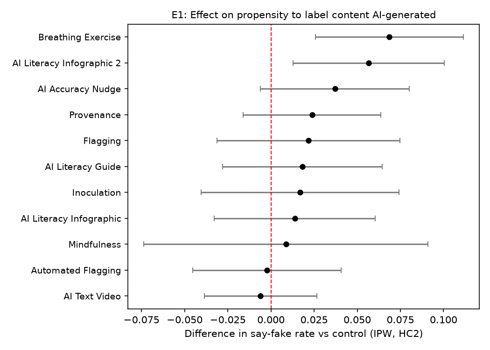
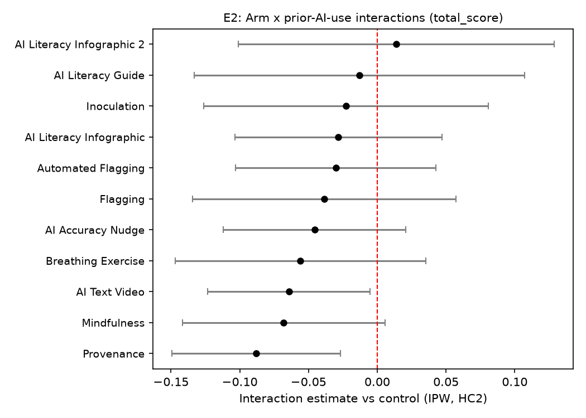

# Improving AI Discernment: do misinformation interventions help people spot AI-generated media?

> **Provenance: FULLY AGENTIC — no human review recorded.** Generated by filedrawer 0.1.0 on 2026-10-01 using openrouter (strong: `anthropic/claude-sonnet-5.5`, fast: `moonshotai/kimi-k3`, zero-data-retention requested). Reviewer pass: yes. Human steps recorded: 0. Release status: **draft**.
> **No pre-registration: the analysis plan was reconstructed post hoc from the original analysis script (original/code/replication_script.R) and the study write-up; no pre-registration exists; every test below is labeled unregistered or exploratory.**

Authors: Yamil Velez

## Summary

In a US survey experiment (fielded 2023-10-30 to 2023-11-21), 2,257 respondents were randomized to a control condition or one of 11 interventions intended to improve detection of AI-generated media; 2,030 entered analysis (control n=181). No pre-registration exists, so every test reported here is post hoc. Outcomes are proportions correct: total discernment (total_score), AI-content detection (fake_score), and authentic-content recognition (real_score). On total_score, Automated Flagging (+0.044, two-sided p=0.004) and the AI Literacy Guide (+0.047, p=0.043) scored above control and Mindfulness scored below (-0.039, p=0.032); the pooled effect was inconclusive (+0.010, p=0.132). On fake_score, the pooled effect was positive (+0.038, p=0.000371), with gains for the Accuracy Nudge, Breathing Exercise, and Guide — though exploratory analysis attributes the Breathing gain to a shift toward labeling content 'AI-generated'. On real_score, only Infographic 2 differed from control (-0.061, p=0.019). Most arm-level estimates were not distinguishable from zero and remain inconclusive.

## Design and data

- Design: survey_experiment; arms: `treatment`: 11 treatment arms (1 = Flagging, 2 = Provenance, 3 = Automated Flagging, 4 = AI Accuracy Nudge, 5 = Breathing Exercise, 6 = Mindfulness, 7 = Inoculation, 8 = AI Literacy Infographic, 9 = AI Literacy Infographic 2, 10 = AI Literacy Guide, 11 = AI Text Video) vs control 0 = Control; population: {'country': 'US', 'sample': 'other'}.
- Derived columns (computed in `scripts/02_clean.py`): `ipw` = `1 / pr`.
- Analysis plan source: author-supplied pap.json; registration: none.
- Sample: 2257 raw responses, 2030 in the analysis sample after exclusions ['total_score == total_score'].
- Identifier and free-text columns removed before any processing by the model: ['StartDate'].
- Files: `data/raw_tidy.csv` (tidy export, identifiers removed), `data/clean.csv` (analysis sample with constructed outcomes), `codebook.md` (from the survey schema), `pap.json` (machine-readable pre-analysis plan).

Twelve-arm online survey experiment (one control, 11 interventions) with a US sample; IRB Columbia AAAU9484. Models use inverse-probability weights (1/pr) and HC2 robust standard errors. All three hypotheses carry a deviation tag: the reported models depart from the original analysis script by using HC2 robust SEs without clustering — the shipped data have one row per respondent and no participant_id, so clustering is impossible and, with one observation per respondent, unnecessary — and estimates should be read as contingent on that analytic choice. Sample flow: 2,257 raw to 2,030 analysed. H1: n_eligible=2,030, model n=2,030, n_control=181. H2: n_eligible=2,030, model n=2,023 (7 dropped for missing fake_score), n_control=181. H3: n_eligible=2,030, model n=2,025 (5 dropped for missing real_score), n_control=181. Arm sizes range from 78 (Inoculation) to 333 (Accuracy Nudge).

## Registered versus implemented analyses

Tags are computed by comparing the registered and implemented specifications field by field; they are not self-reported.

| Analysis | Tag | Registered | Implemented | Justification |
|---|---|---|---|---|
| H1 | **deviation** | estimator.cluster="participant_id" | estimator.cluster=null | HC2 robust standard errors without clustering (the shipped data has one row per respondent and no participant_id column; clustering is impossible and, with one observation per respondent, unnecessary) |
| H2 | **deviation** | estimator.cluster="participant_id" | estimator.cluster=null | HC2 robust standard errors without clustering (as for H1) |
| H3 | **deviation** | estimator.cluster="participant_id" | estimator.cluster=null | HC2 robust standard errors without clustering (as for H1) |

Interpretations where the plan was silent or vague (not deviations):
- H1 / sample_exclusions: "filter(!is.na(treatment)) %>% filter(!is.na(total_score))" → rows outside the twelve arms are dropped by the arm filter; total_score == total_score drops missing outcomes (pandas query equivalent of the R filters)

## Planned results

### H1. Each intervention changes total discernment accuracy relative to control. (DEVIATION from the original analysis plan: HC2 robust standard errors without clustering (the shipped data has one row per respondent and no participant_id column; clustering is impossible and, with one observation per respondent, unnecessary))

11 treatment arms are compared with the control arm (Control) in one Lin (2013) covariate-adjusted OLS model on `total_score`: `total_score ~ C(arm_code, Treatment(reference='0')) * (media_trust_c + political_interest_c + pk_score_c + ai_scale_c)`; weights `ipw`; HC2 robust standard errors; N = 2030. Registered direction: two_sided; alpha = 0.05.

| Arm | Estimate | SE | p | 95% CI | n (arm) | Supported |
|---|---|---|---|---|---|---|
| Flagging | -0.010 | 0.015 | 0.5128 | [-0.039, 0.019] | 215 | no |
| Provenance | 0.011 | 0.014 | 0.4423 | [-0.017, 0.038] | 145 | no |
| Automated Flagging | 0.044 | 0.015 | 0.0035 | [0.014, 0.073] | 127 | yes |
| AI Accuracy Nudge | 0.020 | 0.015 | 0.1855 | [-0.010, 0.050] | 333 | no |
| Breathing Exercise | 0.015 | 0.022 | 0.5092 | [-0.029, 0.059] | 134 | no |
| Mindfulness | -0.039 | 0.018 | 0.0318 | [-0.074, -0.003] | 180 | yes |
| Inoculation | 0.008 | 0.019 | 0.6509 | [-0.028, 0.045] | 78 | no |
| AI Literacy Infographic | 0.012 | 0.017 | 0.4753 | [-0.021, 0.044] | 102 | no |
| AI Literacy Infographic 2 | -0.008 | 0.021 | 0.7178 | [-0.049, 0.034] | 80 | no |
| AI Literacy Guide | 0.047 | 0.023 | 0.0429 | [0.002, 0.092] | 162 | yes |
| AI Text Video | 0.016 | 0.013 | 0.2217 | [-0.009, 0.040] | 293 | no |

**Pooled across 11 arms (random effects, iterated tau²):** 0.010 (SE 0.007, p = 0.1322); tau² = 0.0002, I² = 0.45; supported: **no**. Caveat: the arm effects share one control group, so they are not independent; the random-effects pooling treats them as if they were, and its standard error and heterogeneity statistics are approximate.

Two-sided tests of each intervention vs control on total_score (control mean 0.693; n_eligible=2,030, model n=2,030, n_control=181). Automated Flagging (+0.044, 95% CI [0.014, 0.073], two-sided p=0.004) and AI Literacy Guide (+0.047, [0.002, 0.092], p=0.043) scored above control; Mindfulness scored below (-0.039, [-0.074, -0.003], p=0.032). The other eight arms were not distinguishable from zero (e.g., Flagging -0.010, [-0.039, 0.019], p=0.513) and are inconclusive. The random-effects pooled estimate was +0.010 (p=0.132, I2=0.445), also inconclusive.

### H2. Each intervention changes detection of AI-generated content relative to control. (DEVIATION from the original analysis plan: HC2 robust standard errors without clustering (as for H1))

11 treatment arms are compared with the control arm (Control) in one Lin (2013) covariate-adjusted OLS model on `fake_score`: `fake_score ~ C(arm_code, Treatment(reference='0')) * (media_trust_c + political_interest_c + pk_score_c + ai_scale_c)`; weights `ipw`; HC2 robust standard errors; N = 2023. Registered direction: two_sided; alpha = 0.05.

| Arm | Estimate | SE | p | 95% CI | n (arm) | Supported |
|---|---|---|---|---|---|---|
| Flagging | 0.018 | 0.027 | 0.4991 | [-0.035, 0.071] | 215 | no |
| Provenance | 0.040 | 0.029 | 0.1703 | [-0.017, 0.098] | 145 | no |
| Automated Flagging | 0.050 | 0.030 | 0.0995 | [-0.009, 0.110] | 127 | no |
| AI Accuracy Nudge | 0.066 | 0.027 | 0.0135 | [0.014, 0.119] | 332 | yes |
| Breathing Exercise | 0.091 | 0.030 | 0.0027 | [0.032, 0.150] | 134 | yes |
| Mindfulness | -0.041 | 0.041 | 0.3249 | [-0.122, 0.040] | 179 | no |
| Inoculation | 0.007 | 0.045 | 0.8737 | [-0.081, 0.096] | 76 | no |
| AI Literacy Infographic | 0.024 | 0.031 | 0.4352 | [-0.037, 0.085] | 102 | no |
| AI Literacy Infographic 2 | 0.055 | 0.037 | 0.1379 | [-0.018, 0.128] | 79 | no |
| AI Literacy Guide | 0.079 | 0.040 | 0.0488 | [0.000, 0.157] | 160 | yes |
| AI Text Video | 0.005 | 0.025 | 0.8242 | [-0.043, 0.054] | 293 | no |

**Pooled across 11 arms (random effects, iterated tau²):** 0.038 (SE 0.011, p = 0.0004); tau² = 0.0002, I² = 0.18; supported: **yes**. Caveat: the arm effects share one control group, so they are not independent; the random-effects pooling treats them as if they were, and its standard error and heterogeneity statistics are approximate.

Two-sided tests on fake_score (control mean 0.678; n_eligible=2,030, model n=2,023 after 7 missing-value drops, n_control=181). AI Accuracy Nudge (+0.066, 95% CI [0.014, 0.119], two-sided p=0.014), Breathing Exercise (+0.091, [0.032, 0.150], p=0.003), and AI Literacy Guide (+0.079, [0.0004, 0.157], p=0.049, near the 0.05 threshold) scored above control; the pooled estimate was +0.038 (p=0.000371, I2=0.175). Remaining arms were not distinguishable from zero (e.g., Mindfulness -0.041, [-0.122, 0.040], p=0.325) and are inconclusive. E1 qualifies the Breathing result.

### H3. Each intervention changes recognition of authentic content relative to control. (DEVIATION from the original analysis plan: HC2 robust standard errors without clustering (as for H1))

11 treatment arms are compared with the control arm (Control) in one Lin (2013) covariate-adjusted OLS model on `real_score`: `real_score ~ C(arm_code, Treatment(reference='0')) * (media_trust_c + political_interest_c + pk_score_c + ai_scale_c)`; weights `ipw`; HC2 robust standard errors; N = 2025. Registered direction: two_sided; alpha = 0.05.

| Arm | Estimate | SE | p | 95% CI | n (arm) | Supported |
|---|---|---|---|---|---|---|
| Flagging | -0.030 | 0.026 | 0.2572 | [-0.082, 0.022] | 215 | no |
| Provenance | -0.012 | 0.021 | 0.5443 | [-0.053, 0.028] | 145 | no |
| Automated Flagging | 0.040 | 0.023 | 0.0751 | [-0.004, 0.084] | 127 | no |
| AI Accuracy Nudge | -0.018 | 0.026 | 0.5025 | [-0.070, 0.034] | 333 | no |
| Breathing Exercise | -0.048 | 0.034 | 0.1551 | [-0.113, 0.018] | 134 | no |
| Mindfulness | -0.041 | 0.032 | 0.1966 | [-0.104, 0.021] | 179 | no |
| Inoculation | 0.012 | 0.028 | 0.6696 | [-0.042, 0.066] | 77 | no |
| AI Literacy Infographic | -0.001 | 0.027 | 0.9710 | [-0.054, 0.052] | 100 | no |
| AI Literacy Infographic 2 | -0.061 | 0.026 | 0.0192 | [-0.111, -0.010] | 80 | yes |
| AI Literacy Guide | 0.021 | 0.025 | 0.4015 | [-0.028, 0.069] | 162 | no |
| AI Text Video | 0.023 | 0.018 | 0.1905 | [-0.012, 0.058] | 292 | no |

**Pooled across 11 arms (random effects, iterated tau²):** -0.007 (SE 0.010, p = 0.5020); tau² = 0.0004, I² = 0.40; supported: **no**. Caveat: the arm effects share one control group, so they are not independent; the random-effects pooling treats them as if they were, and its standard error and heterogeneity statistics are approximate.

Two-sided tests on real_score (control mean 0.706; n_eligible=2,030, model n=2,025 after 5 missing-value drops, n_control=181). Only AI Literacy Infographic 2 differed from control, scoring lower (-0.061, 95% CI [-0.111, -0.010], two-sided p=0.019). Every other arm was not distinguishable from zero — e.g., Automated Flagging +0.040 ([-0.004, 0.084], p=0.075) and Breathing Exercise -0.048 ([-0.113, 0.018], p=0.155) — so those results are inconclusive, with modest gains or losses both plausible.

## Exploratory analyses (EXPLORATORY — not pre-registered)

### E1. Criterion shift: effect of arms on the propensity to label content AI-generated (EXPLORATORY — not pre-registered)

Rationale: Several arms improved fake detection (H2) without improving real recognition (H3); regressing each respondent's overall 'say-fake' rate on arms tests whether those gains reflect a skepticism/criterion shift rather than genuine sensitivity.

Method: Constructed say_fake = mean of responses on fake items and (1 - response) on real items across all 24 stimuli; WLS of say_fake on arm dummies with IPW weights and HC2 robust SEs (N=2030).

Finding: Breathing Exercise significantly raised the say-fake rate by +0.069 (p=0.002) and AI Literacy Infographic 2 by +0.057 (p=0.012), indicating their H2 fake-detection gains (and Infographic 2's H3 real-recognition loss) are largely a criterion shift toward labeling content fake rather than improved discernment.

| analysis_id | arm_code | arm_label | term | estimate | std_error | statistic | p_value | conf_low | conf_high | n |
|---|---|---|---|---|---|---|---|---|---|---|
| E1 | 1 | Flagging | C(arm_code, Treatment(reference=0))[T.1] | 0.022 | 0.027 | 0.806 | 0.420 | -0.031 | 0.075 | 2030 |
| E1 | 2 | Provenance | C(arm_code, Treatment(reference=0))[T.2] | 0.024 | 0.020 | 1.172 | 0.241 | -0.016 | 0.064 | 2030 |
| E1 | 3 | Automated Flagging | C(arm_code, Treatment(reference=0))[T.3] | -0.002 | 0.022 | -0.100 | 0.920 | -0.045 | 0.041 | 2030 |
| E1 | 4 | AI Accuracy Nudge | C(arm_code, Treatment(reference=0))[T.4] | 0.037 | 0.022 | 1.687 | 0.092 | -0.006 | 0.080 | 2030 |
| E1 | 5 | Breathing Exercise | C(arm_code, Treatment(reference=0))[T.5] | 0.069 | 0.022 | 3.131 | 0.002 | 0.026 | 0.112 | 2030 |
| E1 | 6 | Mindfulness | C(arm_code, Treatment(reference=0))[T.6] | 0.009 | 0.042 | 0.206 | 0.837 | -0.074 | 0.091 | 2030 |
| E1 | 7 | Inoculation | C(arm_code, Treatment(reference=0))[T.7] | 0.017 | 0.029 | 0.574 | 0.566 | -0.041 | 0.074 | 2030 |
| E1 | 8 | AI Literacy Infographic | C(arm_code, Treatment(reference=0))[T.8] | 0.014 | 0.024 | 0.582 | 0.560 | -0.033 | 0.060 | 2030 |
| E1 | 9 | AI Literacy Infographic 2 | C(arm_code, Treatment(reference=0))[T.9] | 0.057 | 0.022 | 2.526 | 0.012 | 0.013 | 0.101 | 2030 |
| E1 | 10 | AI Literacy Guide | C(arm_code, Treatment(reference=0))[T.10] | 0.018 | 0.024 | 0.774 | 0.439 | -0.028 | 0.065 | 2030 |
| E1 | 11 | AI Text Video | C(arm_code, Treatment(reference=0))[T.11] | -0.006 | 0.017 | -0.361 | 0.718 | -0.039 | 0.027 | 2030 |

Exploratory (hypothesis-generating; not one of the study's three hypothesis tests): arm effects on the propensity to label content AI-generated. Breathing Exercise raised this say-fake rate (+0.069, 95% CI [0.026, 0.112], p=0.002), as did AI Literacy Infographic 2 (+0.057, [0.013, 0.101], p=0.012); other arms were not distinguishable from zero. This indicates Breathing's H2 gain — and Infographic 2's H3 loss — largely reflect a criterion shift toward saying 'fake' rather than improved discernment.

### E2. Heterogeneity of total discernment effects by prior generative-AI tool use (EXPLORATORY — not pre-registered)

Rationale: The PAP registered no heterogeneity tests; whether intervention effects differ for respondents already familiar with generative-AI tools (ai_scale>0) helps interpret the literacy and nudge arms.

Method: WLS of total_score on arm dummies interacted with ai_user (ai_scale>0), IPW weights, HC2 SEs (N=2030); joint Wald test of all 11 arm x ai_user interactions.

Finding: The joint test of arm-by-prior-AI-use interactions is not significant (F=12.10, p=0.356), so treatment effects on total_score do not reliably differ by prior AI-tool experience despite two nominally significant individual interactions (Provenance -0.088, p=0.005; AI Text Video -0.064, p=0.033).

| analysis_id | arm_code | arm_label | term | estimate | std_error | statistic | p_value | conf_low | conf_high | n |
|---|---|---|---|---|---|---|---|---|---|---|
| E2 | 1 | Flagging | C(arm_code, Treatment(reference=0))[T.1]:ai_user | -0.039 | 0.049 | -0.789 | 0.430 | -0.134 | 0.057 | 2030 |
| E2 | 2 | Provenance | C(arm_code, Treatment(reference=0))[T.2]:ai_user | -0.088 | 0.031 | -2.823 | 0.005 | -0.149 | -0.027 | 2030 |
| E2 | 3 | Automated Flagging | C(arm_code, Treatment(reference=0))[T.3]:ai_user | -0.030 | 0.037 | -0.810 | 0.418 | -0.103 | 0.043 | 2030 |
| E2 | 4 | AI Accuracy Nudge | C(arm_code, Treatment(reference=0))[T.4]:ai_user | -0.046 | 0.034 | -1.348 | 0.178 | -0.112 | 0.021 | 2030 |
| E2 | 5 | Breathing Exercise | C(arm_code, Treatment(reference=0))[T.5]:ai_user | -0.056 | 0.047 | -1.198 | 0.231 | -0.147 | 0.036 | 2030 |
| E2 | 6 | Mindfulness | C(arm_code, Treatment(reference=0))[T.6]:ai_user | -0.068 | 0.038 | -1.810 | 0.070 | -0.142 | 0.006 | 2030 |
| E2 | 7 | Inoculation | C(arm_code, Treatment(reference=0))[T.7]:ai_user | -0.023 | 0.053 | -0.428 | 0.668 | -0.126 | 0.081 | 2030 |
| E2 | 8 | AI Literacy Infographic | C(arm_code, Treatment(reference=0))[T.8]:ai_user | -0.028 | 0.038 | -0.734 | 0.463 | -0.104 | 0.047 | 2030 |
| E2 | 9 | AI Literacy Infographic 2 | C(arm_code, Treatment(reference=0))[T.9]:ai_user | 0.014 | 0.059 | 0.236 | 0.813 | -0.101 | 0.129 | 2030 |
| E2 | 10 | AI Literacy Guide | C(arm_code, Treatment(reference=0))[T.10]:ai_user | -0.013 | 0.061 | -0.212 | 0.832 | -0.133 | 0.107 | 2030 |
| E2 | 11 | AI Text Video | C(arm_code, Treatment(reference=0))[T.11]:ai_user | -0.064 | 0.030 | -2.132 | 0.033 | -0.123 | -0.005 | 2030 |
| E2 |  | JOINT | JOINT: all arm x ai_user interactions = 0 |  |  | 12.099 | 0.356 |  |  | 2030 |

Exploratory heterogeneity test: do total_score effects vary by prior generative-AI tool use? The joint arm-by-AI-use interaction test was not significant (F=12.10, p=0.356), so effects do not reliably differ by prior AI experience. Two individual interactions were nominally significant (Provenance -0.088, p=0.005; AI Text Video -0.064, p=0.033), but given the non-significant joint test and post hoc status they should be treated as hypothesis-generating only.

### E3. Placebo check: arms vs pre-treatment political knowledge (EXPLORATORY — not pre-registered)

Rationale: Arm assignment should not predict the pre-treatment political-knowledge score (pk_score); a null result validates the randomization and IPW weighting underlying the registered estimates.

Method: WLS of pk_score on arm dummies with IPW weights and HC2 SEs (N=2030); joint Wald test that all 11 arm coefficients equal zero.

Finding: Arms jointly do not predict pre-treatment political knowledge (F=9.21, p=0.603), supporting the validity of the randomization/IPW design used in the registered tests.

| analysis_id | arm_code | arm_label | term | estimate | std_error | statistic | p_value | conf_low | conf_high | n |
|---|---|---|---|---|---|---|---|---|---|---|
| E3 | 1 | Flagging | C(arm_code, Treatment(reference=0))[T.1] | 0.029 | 0.043 | 0.661 | 0.509 | -0.056 | 0.113 | 2030 |
| E3 | 2 | Provenance | C(arm_code, Treatment(reference=0))[T.2] | -0.022 | 0.035 | -0.611 | 0.541 | -0.091 | 0.048 | 2030 |
| E3 | 3 | Automated Flagging | C(arm_code, Treatment(reference=0))[T.3] | -0.021 | 0.034 | -0.613 | 0.540 | -0.088 | 0.046 | 2030 |
| E3 | 4 | AI Accuracy Nudge | C(arm_code, Treatment(reference=0))[T.4] | 0.054 | 0.034 | 1.572 | 0.116 | -0.013 | 0.121 | 2030 |
| E3 | 5 | Breathing Exercise | C(arm_code, Treatment(reference=0))[T.5] | 0.026 | 0.043 | 0.599 | 0.549 | -0.059 | 0.110 | 2030 |
| E3 | 6 | Mindfulness | C(arm_code, Treatment(reference=0))[T.6] | -0.009 | 0.038 | -0.233 | 0.816 | -0.084 | 0.066 | 2030 |
| E3 | 7 | Inoculation | C(arm_code, Treatment(reference=0))[T.7] | 0.032 | 0.040 | 0.791 | 0.429 | -0.047 | 0.111 | 2030 |
| E3 | 8 | AI Literacy Infographic | C(arm_code, Treatment(reference=0))[T.8] | 0.033 | 0.034 | 0.979 | 0.328 | -0.034 | 0.101 | 2030 |
| E3 | 9 | AI Literacy Infographic 2 | C(arm_code, Treatment(reference=0))[T.9] | -0.028 | 0.059 | -0.471 | 0.638 | -0.142 | 0.087 | 2030 |
| E3 | 10 | AI Literacy Guide | C(arm_code, Treatment(reference=0))[T.10] | 0.044 | 0.040 | 1.108 | 0.268 | -0.034 | 0.122 | 2030 |
| E3 | 11 | AI Text Video | C(arm_code, Treatment(reference=0))[T.11] | 0.030 | 0.027 | 1.098 | 0.272 | -0.024 | 0.083 | 2030 |
| E3 |  | JOINT | JOINT: all arm dummies = 0 |  |  | 9.205 | 0.603 |  |  | 2030 |

Exploratory placebo check: the 11 arms jointly did not predict pre-treatment political knowledge (F=9.21, p=0.603), as expected under successful randomization. This is consistent with the validity of the IPW-weighted comparisons in the main tests, though a non-significant placebo test cannot prove balance on unmeasured variables.

## Silicon-sampling replication (EXPLORATORY — not pre-registered)

_Skipped: silicon sampling skipped._

## Related findings (minimal literature note)

Prior work on misinformation discernment suggests that individual-level cognitive interventions—such as accuracy prompts, inoculation, and media-literacy tools—can improve people's ability to judge the veracity of online content, providing a basis for expecting intervention effects on overall discernment accuracy (H1) (Kozyreva et al., 2020; Ecker et al., 2022). Reviews of fake news and disinformation similarly document a range of countermeasures, though with variable effectiveness across contexts [citation removed: not in retrieved set]. At the same time, critiques of individual-focused behavioral policy caution that such interventions often yield modest, short-lived effects when the surrounding information environment is unchanged (Chater & Loewenstein, 2022).

However, the retrieved list is largely off-topic for this study: most items concern AI in education, healthcare, or machine-learning deployment rather than content discernment. None of the retrieved works directly test interventions targeting the detection of AI-generated content (H2) or the recognition of authentic content (H3), so these hypotheses lack direct empirical precedent in the works provided here.

Retrieved works (OpenAlex; queries: deepfake detection misinformation interventions inoculation accuracy nudge; AI-generated media discernment literacy detection accuracy; synthetic media deepfakes trust credibility perception; misinformation intervention effectiveness AI content recognition):
- Ullrich K. H. Ecker, Stephan Lewandowsky, John Cook, Philipp Schmid (2022). The psychological drivers of misinformation belief and its resistance to correction. Nature Reviews Psychology. https://doi.org/10.1038/s44159-021-00006-y
- Esma Aı̈meur, Sabrine Amri, Gilles Brassard (2023). Fake news, disinformation and misinformation in social media: a review. Social Network Analysis and Mining. https://doi.org/10.1007/s13278-023-01028-5
- Anastasia Kozyreva, Stephan Lewandowsky, Ralph Hertwig (2020). Citizens Versus the Internet: Confronting Digital Challenges With Cognitive Tools. Gothic.net. https://doi.org/10.1177/1529100620946707
- Nick Chater, George F. Loewenstein (2022). The i-frame and the s-frame: How focusing on individual-level solutions has led behavioral public policy astray. Behavioral and Brain Sciences. https://doi.org/10.1017/s0140525x22002023
- Morris A. Gordon, Michelle M. Daniel, Aderonke Ajiboye, Hussein Uraiby (2024). A scoping review of artificial intelligence in medical education: BEME Guide No. 84. Medical Teacher. https://doi.org/10.1080/0142159x.2024.2314198
- Patrick J. Fitzpatrick (2023). Improving health literacy using the power of digital communications to achieve better health outcomes for patients and practitioners. Frontiers in Digital Health. https://doi.org/10.3389/fdgth.2023.1264780
- Zied Bahroun, Chiraz Anane, Vian M. Ahmed, Andrew Zacca (2023). Transforming Education: A Comprehensive Review of Generative Artificial Intelligence in Educational Settings through Bibliometric and Content Analysis. Sustainability. https://doi.org/10.3390/su151712983
- Andrei Paleyes, Raoul-Gabriel Urma, Neil David Lawrence (2022). Challenges in Deploying Machine Learning: A Survey of Case Studies. ACM Computing Surveys. https://doi.org/10.1145/3533378
- Yogesh Kumar Dwivedi, Laurie Hughes, Elvira Ismagilova, Gert Aarts (2019). Artificial Intelligence (AI): Multidisciplinary perspectives on emerging challenges, opportunities, and agenda for research, practice and policy. International Journal of Information Management. https://doi.org/10.1016/j.ijinfomgt.2019.08.002
- Yogesh Kumar Dwivedi, Nir Kshetri, Laurie Hughes, Emma Louise Slade (2023). Opinion Paper: “So what if ChatGPT wrote it?” Multidisciplinary perspectives on opportunities, challenges and implications of generative conversational AI for research, practice and policy. International Journal of Information Management. https://doi.org/10.1016/j.ijinfomgt.2023.102642

## Limitations

Multiplicity is the central concern: 33 arm-level comparisons across three outcomes, so p-values near 0.05 (Guide on total_score p=0.043 and fake_score p=0.049; Infographic 2 on real_score p=0.019) could be chance findings. Some arms are small (Inoculation n=78, Infographic 2 n=80), so their estimates are imprecise; non-significant results are inconclusive, not evidence of no effect. fake_score gains can reflect a criterion shift toward labeling content AI-generated (E1) rather than better discernment. The deviation from the original script (HC2 robust SEs, no clustering) is necessitated by the one-row-per-respondent data but limits comparability with the original analysis. Findings come from a single US online sample with brief interventions; generalization is uncertain, and the retrieved literature provides no direct precedent for the fake_score and real_score tests.

## Reviewer pass

A single automated reviewer pass flagged 8 issue(s); see `review.md`.

## Reproduction

See `RUN.md`. From the study folder: `python scripts/02_clean.py && python scripts/03_registered.py && python scripts/04_exploratory.py && python scripts/05_silicon.py`, or `filedrawer reproduce <this folder>` to re-run and verify that every results table is byte-identical.

## Files

- `.git/AUTO_MERGE`
- `.git/COMMIT_EDITMSG`
- `.git/FETCH_HEAD`
- `.git/HEAD`
- `.git/MERGE_HEAD`
- `.git/MERGE_MODE`
- `.git/MERGE_MSG`
- `.git/ORIG_HEAD`
- `.git/config`
- `.git/description`
- `.git/hooks/applypatch-msg.sample`
- `.git/hooks/commit-msg.sample`
- `.git/hooks/fsmonitor-watchman.sample`
- `.git/hooks/post-update.sample`
- `.git/hooks/pre-applypatch.sample`
- `.git/hooks/pre-commit.sample`
- `.git/hooks/pre-merge-commit.sample`
- `.git/hooks/pre-push.sample`
- `.git/hooks/pre-rebase.sample`
- `.git/hooks/pre-receive.sample`
- `.git/hooks/prepare-commit-msg.sample`
- `.git/hooks/push-to-checkout.sample`
- `.git/hooks/update.sample`
- `.git/index`
- `.git/info/exclude`
- `.git/logs/HEAD`
- `.git/logs/refs/heads/main`
- `.git/logs/refs/remotes/origin/main`
- `.git/objects/05/4a9a9e6d538105171f292e9ca12110aa9961d8`
- `.git/objects/08/ab00a3793bbf3f92845b8873d99776c5646343`
- `.git/objects/09/3dbe96a0db36a80638f915f665426e45ff95c4`
- `.git/objects/0a/184ef5924aed5c86c796a8de71a8cdfb304b51`
- `.git/objects/0e/752d731cc3f879ef49d746f8ab3fb0498cdb21`
- `.git/objects/1e/3d22fadbbc190039edd8b115a9e2c9f2f276ad`
- `.git/objects/1f/b945cd4c58df41a58fb3e1f7ac81b103cc7447`
- `.git/objects/24/f4a3effd83c9f5ac00dfc64977a03632d1abce`
- `.git/objects/27/991007ee2800b0e38c6b23d71750b687fbf160`
- `.git/objects/27/c9d4bf9486741cf273607d3858fd2f17709619`
- `.git/objects/31/757e72c94d49aad7bff6d226a0284a0b36bacb`
- `.git/objects/36/c5d9b5f74ee126881d958e23e8f595fa47dd51`
- `.git/objects/38/79ed288008960d3709506722ef0d5e0620a873`
- `.git/objects/38/b5ed5b3bd3aa70be4286fbb95e006583663c54`
- `.git/objects/3b/3cce70b8abbac3ff9f1edfde8bea4407deb355`
- `.git/objects/45/c72b951b9799dad5f67e56497aba096275e434`
- `.git/objects/45/d53afbc216f9595adacda9c0ecb1e877c0b7e8`
- `.git/objects/49/b1d2c7cc27780cbbd166480aa59c0ed454e97e`
- `.git/objects/4b/854f41d289ea30eedefa037f3f525c0d5494cb`
- `.git/objects/4d/843afd76af1f09bd27a1c60d7b67680ee59296`
- `.git/objects/4e/2b401f2e022d75ad618d16e564b90ac0f86dcf`
- `.git/objects/4e/fb12cd18e8fa9a3d7ef22b855b97c67099eb14`
- `.git/objects/50/660b41646405013ab5ac7c7fabf3c0306c17ca`
- `.git/objects/52/ac4058f1bcb1086fbc9dc379527ff1d496964a`
- `.git/objects/57/217ee6df4c128764509c8df201693b0840186d`
- `.git/objects/59/80d2d9118cc03168e36049665faac719fa3f48`
- `.git/objects/5d/1e452c207a1e3266710790beca9fb759b056e3`
- `.git/objects/5f/4d91d0ec7ce51c69de3c35037d4165c661f28d`
- `.git/objects/65/20fe30f85a971e975ca4c5555f17c7b97cce9c`
- `.git/objects/6b/ec6f73bfa145c7169778aa4d4bacc6fea83c5c`
- `.git/objects/6c/e5dc305b9085d9fc4e394e88d70bf35df7631e`
- `.git/objects/70/e51920704cdf848a3283a97b1303b852398623`
- `.git/objects/72/d1aa15270c9fbbe7867a8d6a7137e7bbf17b70`
- `.git/objects/73/0572dda606dce6386cd55eca60925943c1e80c`
- `.git/objects/79/35dda421db09094d7954df3f5bacc6011643ea`
- `.git/objects/79/b11246595dcad4a7e44b0d728fa841f407857a`
- `.git/objects/7b/ab233c254d46f120903dcb2402a0a38edd6dee`
- `.git/objects/81/1330fe0eb137e26c5af916a918cc23cdf76c96`
- `.git/objects/86/d1260b93958a2e99134e083bf4d88acef54148`
- `.git/objects/8a/6815aa03fcc3498b23caf1659f12a2d583a6ff`
- `.git/objects/8d/cd84d7a803b3ff14abf66586b78c0b8828c39b`
- `.git/objects/90/7a1569e4e621ccb37718e539269ffdd47e1b4f`
- `.git/objects/95/7d09e702499272b6506eade14e85b94f9c11a2`
- `.git/objects/95/dce9933a5c44bde55438fe81c9430f6192708e`
- `.git/objects/98/614e5201a3d065b41f2313078dba58057114d9`
- `.git/objects/9a/71f905a0adb8e8eb913e4548b69d867a7e23e1`
- `.git/objects/9b/8a39298596b6ab5ddf6fb14e3bfdb5397ec6bd`
- `.git/objects/a7/a96d31d78381834db9f60eaa57f131f53af33e`
- `.git/objects/a7/f6f3dac40c53127c06add7c4eec10a8b6ce385`
- `.git/objects/a9/17a9fb349f137531d7f830b2a60bd496d10602`
- `.git/objects/a9/a04ad798577794db11cf1114e25fa15c610b22`
- `.git/objects/ae/d75af6a54b7f6aa61b95b05a871d7febfb2a13`
- `.git/objects/af/ad37ff08e042895e595e6ce84a7a8f932059a0`
- `.git/objects/b1/ff5fb00a98239fe0e426e590a5ace1d873f692`
- `.git/objects/b6/89f92ba46a1ea4d4e6c4e3ab0194ab3b4bba37`
- `.git/objects/b9/cbf4c9400004053522f846734a72e67bcb30e9`
- `.git/objects/bf/72383baddeb9031e7550ed3a9521aafa35a0e4`
- `.git/objects/c2/f01b3140ddcc29f0606d38147a740608abc580`
- `.git/objects/c2/fd2f78390c490bc2aca885152877d73f939529`
- `.git/objects/c6/cd35531fcebd0326e137b001b973135b2c7015`
- `.git/objects/cb/49e5980af0a20e3bf35625565be6fe1e5778fa`
- `.git/objects/cd/d6cd3a01b272e3a2f8a6f11bb36686383aa44d`
- `.git/objects/d2/50fdae70f3a9a2cb28e95badff8191de137f73`
- `.git/objects/da/04366ef1d58bdeefd8c7372b7b08bea5713bd9`
- `.git/objects/df/51acf94816367d3fc0e2be723705a37d71bd1a`
- `.git/objects/e0/5fe4de4ebbd3e6323956ea0f968507eee8fb4e`
- `.git/objects/e0/9c1775b2cb4cbde13f0b4df945f7b0c9c2d738`
- `.git/objects/e8/5211ed4d5ea4a01f7a00bd2de62c6d2247e801`
- `.git/objects/ef/5cd123213298bee0ebda3c0d7ac5c64422257c`
- `.git/objects/f2/648f477170bd3aceb4d139bccbdf34a2d4aedc`
- `.git/objects/f6/59ee1c186f17b56c90cd7f7dd8b71a230fbd9b`
- `.git/objects/fb/2602c35b69e52bf2271c515300cac3e8909388`
- `.git/objects/fb/48374622975718da85c7598631ed0204272a5c`
- `.git/objects/fc/b07091e64703289b12469ca8a517a07e696581`
- `.git/objects/fc/fb8ddf2c454b74c8b2feb73157d136218a891c`
- `.git/objects/fd/df2ff01f46779aa789de490a78f2e4fe1b7a4b`
- `.git/refs/heads/main`
- `.git/refs/remotes/origin/main`
- `.gitignore`
- `README.md`
- `RUN.md`
- `codebook.json`
- `codebook.md`
- `data/clean.csv`
- `data/raw_tidy.csv`
- `figures/E1_say_fake_forest.png`
- `figures/E2_ai_use_interaction_forest.png`
- `figures/H1_arms.png`
- `figures/H2_arms.png`
- `figures/H3_arms.png`
- `figures/registered_effects.png`
- `inputs/pap.json`
- `inputs/pap.md`
- `inputs/replication_data.csv`
- `inputs/survey.qsf`
- `original/code/create_replication_data.R`
- `original/code/replication_script.R`
- `original/site/index.html`
- `pap.json`
- `pap.md`
- `provenance/literature.json`
- `provenance/llm_log.jsonl`
- `provenance/provenance.json`
- `report.md`
- `results/E1_say_fake_rate.csv`
- `results/E2_ai_use_heterogeneity.csv`
- `results/E3_placebo_pk.csv`
- `results/H1.csv`
- `results/H1_arms.csv`
- `results/H2.csv`
- `results/H2_arms.csv`
- `results/H3.csv`
- `results/H3_arms.csv`
- `results/analysis_tags.csv`
- `results/registered_summary.csv`
- `review.md`
- `run.log`
- `run.sh`
- `scripts/01_tidy.py`
- `scripts/02_clean.py`
- `scripts/03_registered.py`
- `scripts/04_exploratory.py`
- `scripts/_peek.py`
- `study.json`
- `survey.qsf`
