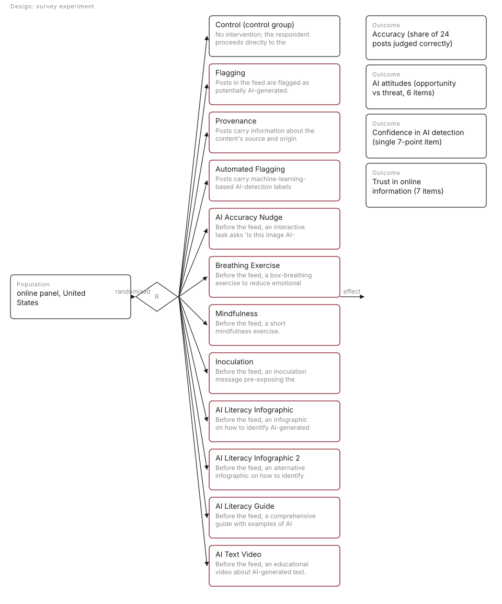
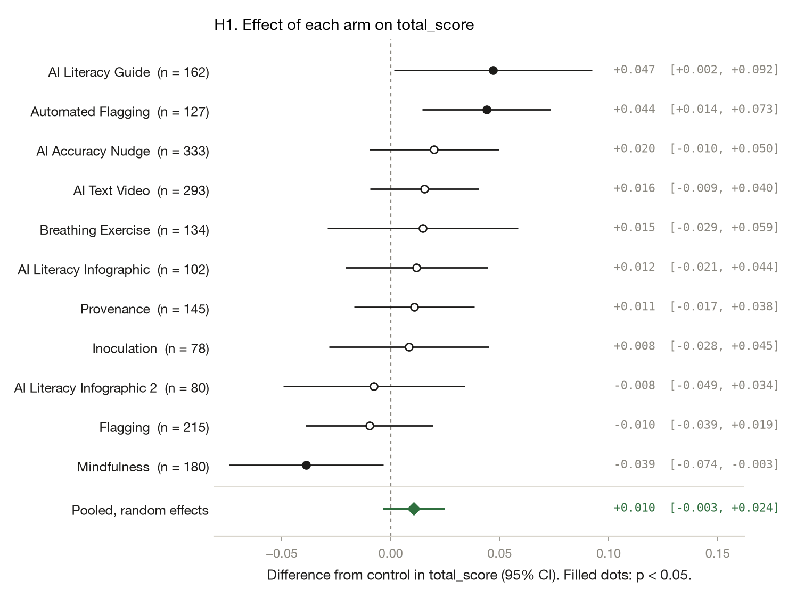
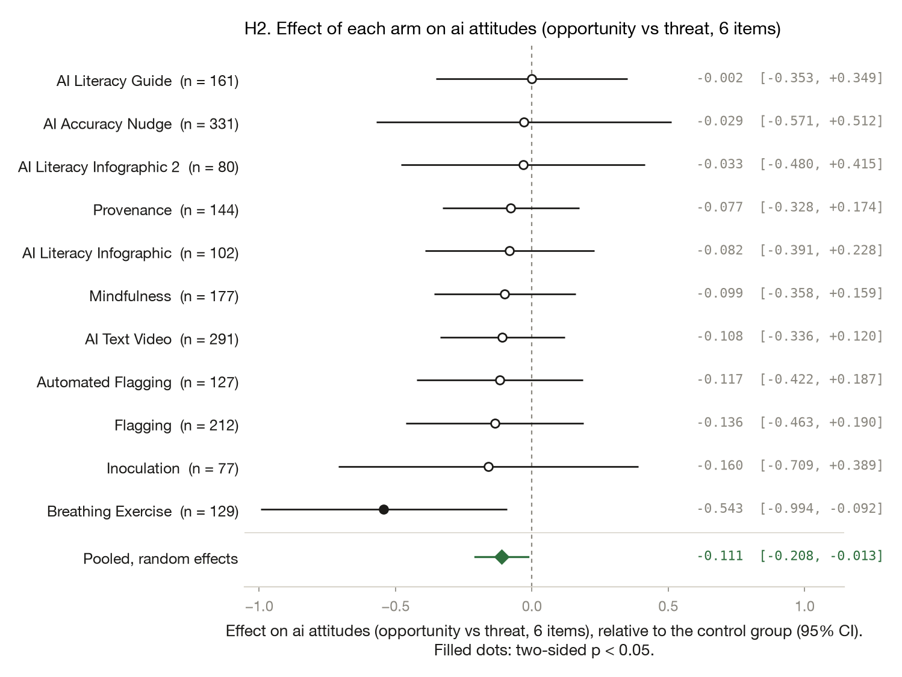
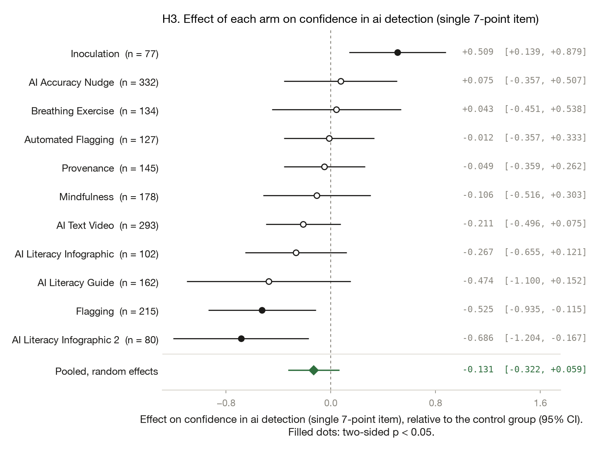
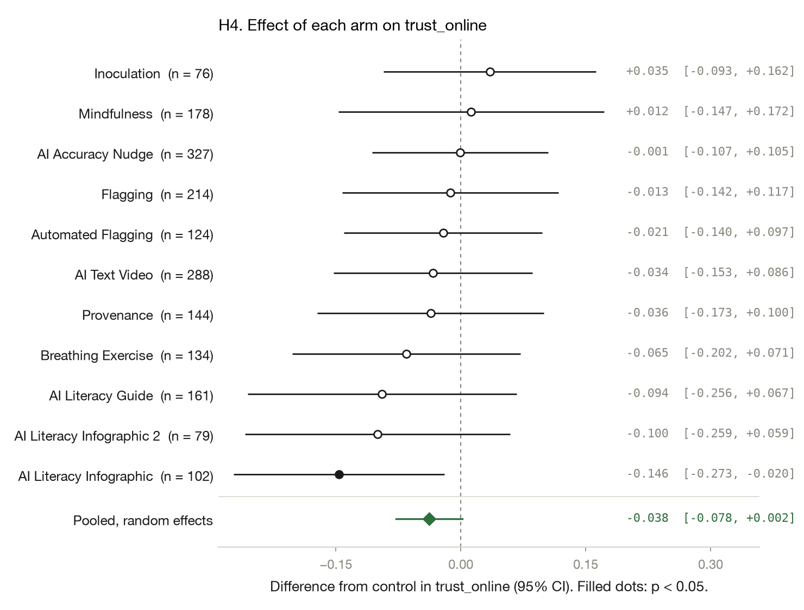
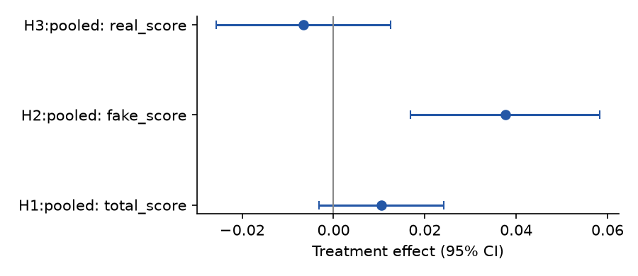
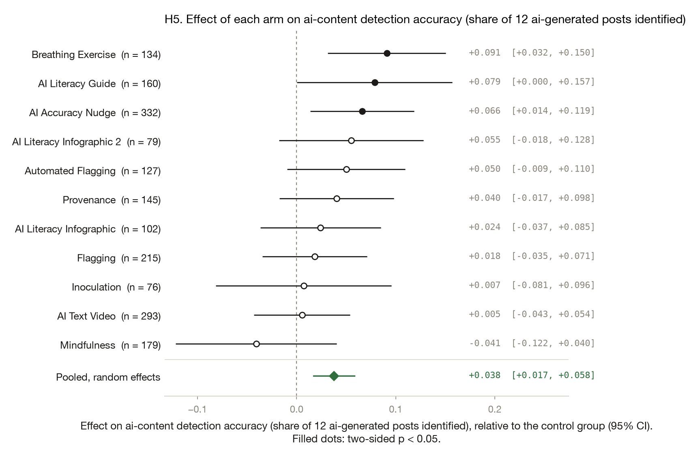
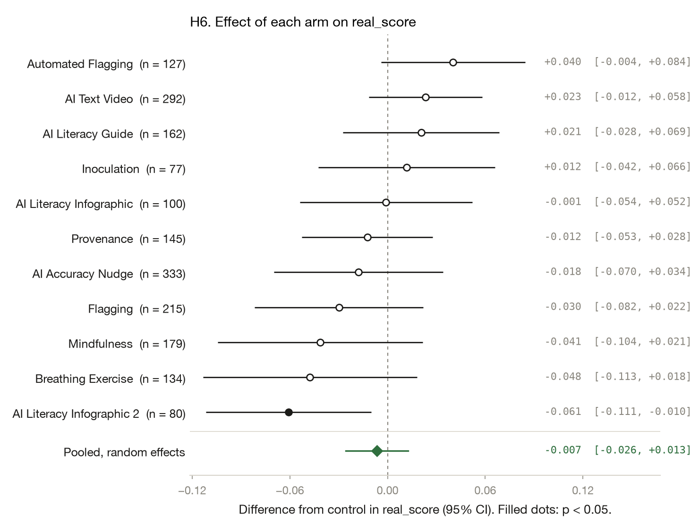

# Improving AI Discernment: do misinformation interventions help people spot AI-generated media?

*Yamil Velez · 2026-10-08 · N = 2,030 analysed of 2,257 collected · survey experiment*

<!-- fd:badges -->
  [](https://aspredicted.org/q2eh95.pdf)  [](https://doi.org/10.5281/zenodo.23166168)   

> **Provenance: FULLY AGENTIC — no human review recorded.** filedrawer 0.1.0, 2026-10-08; orchestrator `anthropic/claude-sonnet-5.5`, standard `anthropic/claude-haiku-5.5`, zero data retention requested. Reviewer pass: yes. Human steps recorded: 0. Release status: draft. Model calls: $0.49, 189k tokens in and 25k out. Cite as: Velez, Y. (2026). Improving AI Discernment: do misinformation interventions help people spot AI-generated media? [Unpublished study package, generated with filedrawer 0.1.0]. The File Drawer. https://doi.org/10.5281/zenodo.23166168

<!-- fd:section id=abstract -->
## Abstract

Can misinformation-style interventions help people tell AI-generated media from authentic media? We ran a registered online survey experiment in a US panel, fielded October to November 2023. Eleven interventions, including flagging, provenance, automated detection labels, mindfulness and AI literacy materials, were compared with a no-intervention control on detection accuracy, attitudes toward AI, confidence in detection and trust in online information. Analysis N was 2,030. Automated Flagging raised accuracy by 4.4 points (95% CI [1.4, 7.3]) and the AI Literacy Guide by 4.7 points (95% CI [0.2, 9.2]), while Mindfulness lowered it by 3.9 points (95% CI [−7.4, −0.3]). The pooled accuracy effect was small and not distinguishable from zero (p = 0.132). Several arms shifted confidence or attitudes in mixed directions. Only 8 of 44 uncorrected registered arm tests were significant, and some arms were small, so isolated effects should be treated cautiously.

<!-- fd:section id=findings -->
## Key findings

- Most interventions did not measurably improve people's accuracy at spotting AI-generated media; pooled across 11 arms, the accuracy gain was 1.0 point (SE 0.7, p = 0.132; derived 95% CI [−0.3, +2.4]).
- Registered: Automated Flagging raised total accuracy by 4.4 points (95% CI [1.4, 7.3], p = 0.004), and the AI Literacy Guide by 4.7 points (95% CI [0.2, 9.2]).
- Registered: Mindfulness lowered total accuracy by 3.9 points (95% CI [−7.4, −0.3]), so not every intervention helped.
- Exploratory: Breathing Exercise and AI Accuracy Nudge raised detection of AI-generated posts; these tests were not registered (no registered counterpart).
- Caveat: only 8 of 44 registered arm tests were significant at p < 0.05 without multiplicity correction, and several arms are small, so isolated effects need replication.

<!-- fd:section id=design -->
## Design and data

A survey experiment with 11 arms and a control group; online panel, United States. 2,257 responses were collected and 2,030 are analysed. The plan is pre-registered at https://aspredicted.org/q2eh95.pdf. Identifier and free-text columns removed before any model saw the data: none.



#### Details: the design in words

A survey experiment on online panel respondents in United States (N = 2,030 analysed). Respondents are randomly assigned to 12 arms: Flagging, Provenance, Automated Flagging, AI Accuracy Nudge, Breathing Exercise, Mindfulness, Inoculation, AI Literacy Infographic, AI Literacy Infographic 2, AI Literacy Guide, AI Text Video, against the control group Control. Flagging: Posts in the feed are flagged as potentially AI-generated. Provenance: Posts carry information about the content's source and origin (provenance). Automated Flagging: Posts carry machine-learning-based AI-detection labels (automated flagging). AI Accuracy Nudge: Before the feed, an interactive task asks 'Is this image AI-generated?' (accuracy nudge). Breathing Exercise: Before the feed, a box-breathing exercise to reduce emotional reactivity. Mindfulness: Before the feed, a short mindfulness exercise. Inoculation: Before the feed, an inoculation message pre-exposing the respondent to manipulation techniques used in AI-generated media. AI Literacy Infographic: Before the feed, an infographic on how to identify AI-generated content. AI Literacy Infographic 2: Before the feed, an alternative infographic on how to identify AI-generated content. AI Literacy Guide: Before the feed, a comprehensive guide with examples of AI artifacts in images and videos. AI Text Video: Before the feed, an educational video about AI-generated text. Outcomes: Accuracy (share of 24 posts judged correctly), AI attitudes (opportunity vs threat, 6 items), Confidence in AI detection (single 7-point item), Trust in online information (7 items).


The study was registered with AsPredicted (#151,281, amending an earlier registration); some data existed at registration, and later batches followed the plan. Of 2,257 raw respondents, 2,030 entered the analysis. Each arm was compared with control in a separate regression. Accuracy is a proportion correct, so effects are in percentage points. Attitude, confidence and trust models lost a few respondents per arm to missing values. Registered p-values are two-sided. Pooled confidence intervals are derived from the pooled estimate and its standard error.

<!-- fd:section id=results -->
## Results

<!-- fd:hyp id=H1 tag=registered outcome=total_score -->
### H1. Accuracy (share of 24 posts judged correctly)

*Each intervention changes AI-detection accuracy relative to control.*  
*Pre-registered.*



Automated Flagging raised accuracy by 4.4 points (95% CI [1.4, 7.3], p = 0.004) and the AI Literacy Guide by 4.7 points (95% CI [0.2, 9.2], p = 0.043). Mindfulness lowered it by 3.9 points (95% CI [−7.4, −0.3], p = 0.032). The other eight arms were within about ±2 points of control and not distinguishable from it. The pooled effect was +1.0 point (SE 0.7, p = 0.132; derived 95% CI [−0.3, 2.4]).

Pooling the 11 arm effects with a random-effects model gives 0.010 (SE 0.007, p = 0.132; tau² 0.0002, I² 0.45). The arms share one control group, so this pooled standard error is approximate.

#### Details: model and estimates by arm (H1)

```
total_score ~ C(arm_code, Treatment(reference='0')) * (media_trust_c + pk_score_c + ai_scale_c + political_interest_c)
Lin (2013) covariate adjustment | weights = ipw | HC2 robust SEs | N = 2030 | two-sided test, alpha = 0.05
```

| Arm | Estimate | SE | p | 95% CI | n (arm) | Supported |
|---|---|---|---|---|---|---|
| Flagging | -0.010 | 0.015 | 0.5128 | [-0.039, 0.019] | 215 | no |
| Provenance | 0.011 | 0.014 | 0.4423 | [-0.017, 0.038] | 145 | no |
| Automated Flagging | 0.044 | 0.015 | 0.0035 | [0.014, 0.073] | 127 | yes |
| AI Accuracy Nudge | 0.020 | 0.015 | 0.1855 | [-0.010, 0.050] | 333 | no |
| Breathing Exercise | 0.015 | 0.022 | 0.5092 | [-0.029, 0.059] | 134 | no |
| Mindfulness | -0.039 | 0.018 | 0.0318 | [-0.074, -0.003] | 180 | yes |
| Inoculation | 0.008 | 0.019 | 0.6509 | [-0.028, 0.045] | 78 | no |
| AI Literacy Infographic | 0.012 | 0.017 | 0.4753 | [-0.021, 0.044] | 102 | no |
| AI Literacy Infographic 2 | -0.008 | 0.021 | 0.7178 | [-0.049, 0.034] | 80 | no |
| AI Literacy Guide | 0.047 | 0.023 | 0.0429 | [0.002, 0.092] | 162 | yes |
| AI Text Video | 0.016 | 0.013 | 0.2217 | [-0.009, 0.040] | 293 | no |

<!-- fd:hyp id=H2 tag=registered outcome=ai_attitudes -->
### H2. AI attitudes (opportunity vs threat, 6 items)

*Each intervention changes attitudes toward AI relative to control.*  
*Pre-registered.*



Only Breathing Exercise differed from control on attitudes toward AI, at −0.54 scale points (95% CI [−0.99, −0.09], p = 0.018). The other ten arms were not distinguishable from control. The pooled estimate was −0.11 (SE 0.050, p = 0.026; derived 95% CI [−0.21, −0.01]), a small shift; with many uncorrected tests it should be read cautiously.

Pooling the 11 arm effects with a random-effects model gives -0.111 (SE 0.050, p = 0.026; tau² 0.0000, I² 0.00). The arms share one control group, so this pooled standard error is approximate.

#### Details: model and estimates by arm (H2)

```
ai_attitudes ~ C(arm_code, Treatment(reference='0')) * (media_trust_c + pk_score_c + ai_scale_c + political_interest_c)
Lin (2013) covariate adjustment | weights = ipw | HC2 robust SEs | N = 2010 | two-sided test, alpha = 0.05
```

| Arm | Estimate | SE | p | 95% CI | n (arm) | Supported |
|---|---|---|---|---|---|---|
| Flagging | -0.136 | 0.167 | 0.4127 | [-0.463, 0.190] | 212 | no |
| Provenance | -0.077 | 0.128 | 0.5473 | [-0.328, 0.174] | 144 | no |
| Automated Flagging | -0.117 | 0.156 | 0.4503 | [-0.422, 0.187] | 127 | no |
| AI Accuracy Nudge | -0.029 | 0.276 | 0.9156 | [-0.571, 0.512] | 331 | no |
| Breathing Exercise | -0.543 | 0.230 | 0.0183 | [-0.994, -0.092] | 129 | yes |
| Mindfulness | -0.099 | 0.132 | 0.4525 | [-0.358, 0.159] | 177 | no |
| Inoculation | -0.160 | 0.280 | 0.5689 | [-0.709, 0.389] | 77 | no |
| AI Literacy Infographic | -0.082 | 0.158 | 0.6060 | [-0.391, 0.228] | 102 | no |
| AI Literacy Infographic 2 | -0.033 | 0.228 | 0.8861 | [-0.480, 0.415] | 80 | no |
| AI Literacy Guide | -0.002 | 0.179 | 0.9926 | [-0.353, 0.349] | 161 | no |
| AI Text Video | -0.108 | 0.116 | 0.3541 | [-0.336, 0.120] | 291 | no |

<!-- fd:hyp id=H3 tag=registered outcome=ai_confidence -->
### H3. Confidence in AI detection (single 7-point item)

*Each intervention changes confidence in detecting AI relative to control.*  
*Pre-registered.*



Confidence in detecting AI fell under Flagging (−0.53, 95% CI [−0.94, −0.12], p = 0.012) and AI Literacy Infographic 2 (−0.69, 95% CI [−1.20, −0.17], p = 0.010). Inoculation raised it by 0.51 (95% CI [0.14, 0.88], p = 0.007), although that arm is small. The remaining eight arms were inconclusive, and the pooled estimate was −0.13 (p = 0.177; 95% CI [−0.32, 0.06]).

Pooling the 11 arm effects with a random-effects model gives -0.131 (SE 0.097, p = 0.177; tau² 0.0602, I² 0.57). The arms share one control group, so this pooled standard error is approximate.

#### Details: model and estimates by arm (H3)

```
ai_confidence ~ C(arm_code, Treatment(reference='0')) * (media_trust_c + pk_score_c + ai_scale_c + political_interest_c)
Lin (2013) covariate adjustment | weights = ipw | HC2 robust SEs | N = 2026 | two-sided test, alpha = 0.05
```

| Arm | Estimate | SE | p | 95% CI | n (arm) | Supported |
|---|---|---|---|---|---|---|
| Flagging | -0.525 | 0.209 | 0.0121 | [-0.935, -0.115] | 215 | yes |
| Provenance | -0.049 | 0.158 | 0.7581 | [-0.359, 0.262] | 145 | no |
| Automated Flagging | -0.012 | 0.176 | 0.9465 | [-0.357, 0.333] | 127 | no |
| AI Accuracy Nudge | 0.075 | 0.220 | 0.7343 | [-0.357, 0.507] | 332 | no |
| Breathing Exercise | 0.043 | 0.252 | 0.8638 | [-0.451, 0.538] | 134 | no |
| Mindfulness | -0.106 | 0.209 | 0.6106 | [-0.516, 0.303] | 178 | no |
| Inoculation | 0.509 | 0.189 | 0.0070 | [0.139, 0.879] | 77 | yes |
| AI Literacy Infographic | -0.267 | 0.198 | 0.1770 | [-0.655, 0.121] | 102 | no |
| AI Literacy Infographic 2 | -0.686 | 0.264 | 0.0095 | [-1.204, -0.167] | 80 | yes |
| AI Literacy Guide | -0.474 | 0.320 | 0.1379 | [-1.100, 0.152] | 162 | no |
| AI Text Video | -0.211 | 0.146 | 0.1484 | [-0.496, 0.075] | 293 | no |

<!-- fd:hyp id=H4 tag=registered outcome=trust_online -->
### H4. Trust in online information (7 items)

*Each intervention changes trust in online information relative to control.*  
*Pre-registered.*



Trust in online information was lower under the AI Literacy Infographic by 0.15 scale points (95% CI [−0.27, −0.02], p = 0.023). The other ten arms were within about ±0.15 of control and not distinguishable from it. The pooled estimate was −0.04 (p = 0.060; derived 95% CI [−0.08, 0.00]).

Pooling the 11 arm effects with a random-effects model gives -0.038 (SE 0.020, p = 0.060; tau² 0.0000, I² 0.00). The arms share one control group, so this pooled standard error is approximate.

#### Details: model and estimates by arm (H4)

```
trust_online ~ C(arm_code, Treatment(reference='0')) * (media_trust_c + pk_score_c + ai_scale_c + political_interest_c)
Lin (2013) covariate adjustment | weights = ipw | HC2 robust SEs | N = 2008 | two-sided test, alpha = 0.05
```

| Arm | Estimate | SE | p | 95% CI | n (arm) | Supported |
|---|---|---|---|---|---|---|
| Flagging | -0.013 | 0.066 | 0.8490 | [-0.142, 0.117] | 214 | no |
| Provenance | -0.036 | 0.070 | 0.6013 | [-0.173, 0.100] | 144 | no |
| Automated Flagging | -0.021 | 0.061 | 0.7249 | [-0.140, 0.097] | 124 | no |
| AI Accuracy Nudge | -0.001 | 0.054 | 0.9880 | [-0.107, 0.105] | 327 | no |
| Breathing Exercise | -0.065 | 0.070 | 0.3485 | [-0.202, 0.071] | 134 | no |
| Mindfulness | 0.012 | 0.081 | 0.8793 | [-0.147, 0.172] | 178 | no |
| Inoculation | 0.035 | 0.065 | 0.5932 | [-0.093, 0.162] | 76 | no |
| AI Literacy Infographic | -0.146 | 0.065 | 0.0235 | [-0.273, -0.020] | 102 | yes |
| AI Literacy Infographic 2 | -0.100 | 0.081 | 0.2180 | [-0.259, 0.059] | 79 | no |
| AI Literacy Guide | -0.094 | 0.082 | 0.2511 | [-0.256, 0.067] | 161 | no |
| AI Text Video | -0.034 | 0.061 | 0.5806 | [-0.153, 0.086] | 288 | no |



<!-- fd:section id=exploratory-authors -->
## Exploratory analyses specified by the authors

*Not pre-registered. The authors specified these analyses after seeing the data; they are run by the same deterministic scripts as the registered tests and should be read as hypothesis-generating.*

<!-- fd:hyp id=H5 tag=exploratory outcome=fake_score -->
### H5. AI-content detection accuracy (share of 12 AI-generated posts identified)

*Not registered: each intervention changes detection of AI-generated posts relative to control.*  
*Exploratory, not pre-registered.*



This analysis was not registered, so it is post hoc. Detection of AI-generated posts was higher under Breathing Exercise (+9.1 points, 95% CI [3.2, 15.0], p = 0.003), AI Accuracy Nudge (+6.6 points, 95% CI [1.4, 11.9], p = 0.014) and AI Literacy Guide (+7.9 points, 95% CI [0.0, 15.7], p = 0.049, borderline). Other arms were inconclusive.

Pooling the 11 arm effects with a random-effects model gives 0.038 (SE 0.011, p < 0.001; tau² 0.0002, I² 0.18). The arms share one control group, so this pooled standard error is approximate.

#### Details: model and estimates by arm (H5)

```
fake_score ~ C(arm_code, Treatment(reference='0')) * (media_trust_c + pk_score_c + ai_scale_c + political_interest_c)
Lin (2013) covariate adjustment | weights = ipw | HC2 robust SEs | N = 2023 | two-sided test, alpha = 0.05
```

| Arm | Estimate | SE | p | 95% CI | n (arm) | Supported |
|---|---|---|---|---|---|---|
| Flagging | 0.018 | 0.027 | 0.4991 | [-0.035, 0.071] | 215 | no |
| Provenance | 0.040 | 0.029 | 0.1703 | [-0.017, 0.098] | 145 | no |
| Automated Flagging | 0.050 | 0.030 | 0.0995 | [-0.009, 0.110] | 127 | no |
| AI Accuracy Nudge | 0.066 | 0.027 | 0.0135 | [0.014, 0.119] | 332 | yes |
| Breathing Exercise | 0.091 | 0.030 | 0.0027 | [0.032, 0.150] | 134 | yes |
| Mindfulness | -0.041 | 0.041 | 0.3249 | [-0.122, 0.040] | 179 | no |
| Inoculation | 0.007 | 0.045 | 0.8737 | [-0.081, 0.096] | 76 | no |
| AI Literacy Infographic | 0.024 | 0.031 | 0.4352 | [-0.037, 0.085] | 102 | no |
| AI Literacy Infographic 2 | 0.055 | 0.037 | 0.1379 | [-0.018, 0.128] | 79 | no |
| AI Literacy Guide | 0.079 | 0.040 | 0.0488 | [0.000, 0.157] | 160 | yes |
| AI Text Video | 0.005 | 0.025 | 0.8242 | [-0.043, 0.054] | 293 | no |

<!-- fd:hyp id=H6 tag=exploratory outcome=real_score -->
### H6. Authentic-content accuracy (share of 12 real posts identified)

*Not registered: each intervention changes recognition of authentic posts relative to control.*  
*Exploratory, not pre-registered.*



This analysis was not registered, so it is post hoc. Recognition of authentic posts was lower under AI Literacy Infographic 2 by 6.1 points (95% CI [−11.1, −1.0], p = 0.019). The other ten arms were not distinguishable from control, including Automated Flagging (+4.0 points, 95% CI [−0.4, 8.4]).

Pooling the 11 arm effects with a random-effects model gives -0.007 (SE 0.010, p = 0.502; tau² 0.0004, I² 0.40). The arms share one control group, so this pooled standard error is approximate.

#### Details: model and estimates by arm (H6)

```
real_score ~ C(arm_code, Treatment(reference='0')) * (media_trust_c + pk_score_c + ai_scale_c + political_interest_c)
Lin (2013) covariate adjustment | weights = ipw | HC2 robust SEs | N = 2025 | two-sided test, alpha = 0.05
```

| Arm | Estimate | SE | p | 95% CI | n (arm) | Supported |
|---|---|---|---|---|---|---|
| Flagging | -0.030 | 0.026 | 0.2572 | [-0.082, 0.022] | 215 | no |
| Provenance | -0.012 | 0.021 | 0.5443 | [-0.053, 0.028] | 145 | no |
| Automated Flagging | 0.040 | 0.023 | 0.0751 | [-0.004, 0.084] | 127 | no |
| AI Accuracy Nudge | -0.018 | 0.026 | 0.5025 | [-0.070, 0.034] | 333 | no |
| Breathing Exercise | -0.048 | 0.034 | 0.1551 | [-0.113, 0.018] | 134 | no |
| Mindfulness | -0.041 | 0.032 | 0.1966 | [-0.104, 0.021] | 179 | no |
| Inoculation | 0.012 | 0.028 | 0.6696 | [-0.042, 0.066] | 77 | no |
| AI Literacy Infographic | -0.001 | 0.027 | 0.9710 | [-0.054, 0.052] | 100 | no |
| AI Literacy Infographic 2 | -0.061 | 0.026 | 0.0192 | [-0.111, -0.010] | 80 | yes |
| AI Literacy Guide | 0.021 | 0.025 | 0.4015 | [-0.028, 0.069] | 162 | no |
| AI Text Video | 0.023 | 0.018 | 0.1905 | [-0.012, 0.058] | 292 | no |

<!-- fd:section id=exploratory -->
## Further exploratory analyses (proposed by the pipeline)

*Everything in this section is exploratory and was not pre-registered.*

<!-- fd:hyp id=E1 tag=exploratory kind=pipeline -->
### E1. Accuracy effects restricted to batches 3-4

Batches 3-4 were fielded after the planned analyses were registered, so checking whether the accuracy pattern holds in those batches tests whether the registered result depends on the earlier data collection. The planned accuracy model was re-estimated on all respondents and on the subsample from batches 3-4, and each arm's effect relative to control was compared side by side.

**Finding.** In batches 3-4 (n=1,251), 2 of 11 arm effects on detection accuracy reach p<0.05, versus 3 of 11 in the full sample (n=2,030); the largest standard-error ratio between the two is 1.72, and the sample change exceeds 10% so the stability rule does not apply.

Restricting to batches 3-4 (n = 1,251), 2 of 11 accuracy effects reached p < 0.05, versus 3 of 11 in the full sample. The sample shrank by more than 10%, so this unreviewed check is not a clean robustness test.

#### Details: table (E1)

| analysis | term | arm | estimate | std_error | p_value | conf_low | conf_high | n | sample |
|---|---|---|---|---|---|---|---|---|---|
| E1 | C(arm_code, Treatment(reference='0'))[T.1] | Flagging | -0.010 | 0.015 | 0.513 | -0.039 | 0.019 | 2030 | all batches |
| E1 | C(arm_code, Treatment(reference='0'))[T.2] | Provenance | 0.011 | 0.014 | 0.442 | -0.017 | 0.038 | 2030 | all batches |
| E1 | C(arm_code, Treatment(reference='0'))[T.3] | Automated Flagging | 0.044 | 0.015 | 0.004 | 0.014 | 0.073 | 2030 | all batches |
| E1 | C(arm_code, Treatment(reference='0'))[T.4] | AI Accuracy Nudge | 0.020 | 0.015 | 0.186 | -0.010 | 0.050 | 2030 | all batches |
| E1 | C(arm_code, Treatment(reference='0'))[T.5] | Breathing Exercise | 0.015 | 0.022 | 0.509 | -0.029 | 0.059 | 2030 | all batches |
| E1 | C(arm_code, Treatment(reference='0'))[T.6] | Mindfulness | -0.039 | 0.018 | 0.032 | -0.074 | -0.003 | 2030 | all batches |
| E1 | C(arm_code, Treatment(reference='0'))[T.7] | Inoculation | 0.008 | 0.019 | 0.651 | -0.028 | 0.045 | 2030 | all batches |
| E1 | C(arm_code, Treatment(reference='0'))[T.8] | AI Literacy Infographic | 0.012 | 0.017 | 0.475 | -0.021 | 0.044 | 2030 | all batches |
| E1 | C(arm_code, Treatment(reference='0'))[T.9] | AI Literacy Infographic 2 | -0.008 | 0.021 | 0.718 | -0.049 | 0.034 | 2030 | all batches |
| E1 | C(arm_code, Treatment(reference='0'))[T.10] | AI Literacy Guide | 0.047 | 0.023 | 0.043 | 0.002 | 0.092 | 2030 | all batches |
| E1 | C(arm_code, Treatment(reference='0'))[T.11] | AI Text Video | 0.016 | 0.013 | 0.222 | -0.009 | 0.040 | 2030 | all batches |
| E1 | C(arm_code, Treatment(reference='0'))[T.1] | Flagging | 0.001 | 0.016 | 0.935 | -0.030 | 0.033 | 1251 | batches 3-4 |
| … 10 more rows |  | | | | | | | | |

<!-- fd:hyp id=E2 tag=exploratory kind=pipeline -->
### E2. Heterogeneity of accuracy effects by AI-tool familiarity

Familiarity with AI tools is a plausible moderator of how much an intervention can change discernment, and the planned analyses did not examine it. The planned accuracy model was extended with an interaction between each arm and a centred familiarity score built from the seven AI-tool recognition items, yielding one slope per arm.

**Finding.** Of 11 arm-level familiarity slopes, 2 reach p<0.05 uncorrected (median slope -0.091 per unit of familiarity, range -0.245 to 0.076), so the pattern is weak and should be treated as exploratory.

Two of 11 arm-by-AI-familiarity interactions on accuracy reached p < 0.05 uncorrected (Provenance and Mindfulness, both negative). The pattern is weak, and this code is unreviewed.

#### Details: table (E2)

| analysis | term | arm | estimate | std_error | p_value | conf_low | conf_high | n |
|---|---|---|---|---|---|---|---|---|
| E2 | C(arm_code, Treatment(reference='0'))[T.1]:_mod | Flagging x ai_scale | -0.037 | 0.079 | 0.635 | -0.191 | 0.117 | 2030 |
| E2 | C(arm_code, Treatment(reference='0'))[T.2]:_mod | Provenance x ai_scale | -0.143 | 0.069 | 0.038 | -0.277 | -0.008 | 2030 |
| E2 | C(arm_code, Treatment(reference='0'))[T.3]:_mod | Automated Flagging x ai_scale | -0.040 | 0.074 | 0.587 | -0.186 | 0.105 | 2030 |
| E2 | C(arm_code, Treatment(reference='0'))[T.4]:_mod | AI Accuracy Nudge x ai_scale | -0.140 | 0.076 | 0.066 | -0.290 | 0.009 | 2030 |
| E2 | C(arm_code, Treatment(reference='0'))[T.5]:_mod | Breathing Exercise x ai_scale | -0.057 | 0.123 | 0.642 | -0.298 | 0.184 | 2030 |
| E2 | C(arm_code, Treatment(reference='0'))[T.6]:_mod | Mindfulness x ai_scale | -0.245 | 0.101 | 0.015 | -0.443 | -0.047 | 2030 |
| E2 | C(arm_code, Treatment(reference='0'))[T.7]:_mod | Inoculation x ai_scale | -0.123 | 0.119 | 0.303 | -0.356 | 0.111 | 2030 |
| E2 | C(arm_code, Treatment(reference='0'))[T.8]:_mod | AI Literacy Infographic x ai_scale | -0.091 | 0.089 | 0.303 | -0.265 | 0.082 | 2030 |
| E2 | C(arm_code, Treatment(reference='0'))[T.9]:_mod | AI Literacy Infographic 2 x ai_scale | 0.076 | 0.117 | 0.517 | -0.154 | 0.306 | 2030 |
| E2 | C(arm_code, Treatment(reference='0'))[T.10]:_mod | AI Literacy Guide x ai_scale | -0.084 | 0.116 | 0.471 | -0.311 | 0.144 | 2030 |
| E2 | C(arm_code, Treatment(reference='0'))[T.11]:_mod | AI Text Video x ai_scale | -0.118 | 0.068 | 0.083 | -0.252 | 0.016 | 2030 |


<!-- fd:section id=related -->
## Related work

The search found little closely related work: the retrieved items address ChatGPT in assessment, misinformation belief, and replicability in general rather than detection of AI-generated posts, interventions, or trust in online content.

Retrieved works (OpenAlex; queries: misinformation intervention deepfake detection accuracy; inoculation prebunking AI-generated media discernment; accuracy nudge null effect misinformation intervention; AI literacy training no improvement detecting synthetic media; Lin estimator survey experiment treatment effect heterogeneity):

- Jürgen Rudolph, Samson Tan, Shannon Tan (2023). ChatGPT: Bullshit spewer or the end of traditional assessments in higher education?. Journal of Applied Learning & Teaching. https://doi.org/10.37074/jalt.2023.6.1.9
- Ullrich K. H. Ecker, Stephan Lewandowsky, John Cook, Philipp Schmid (2022). The psychological drivers of misinformation belief and its resistance to correction. Nature Reviews Psychology. https://doi.org/10.1038/s44159-021-00006-y
- Sahil Loomba, Alexandre de Figueiredo, Simon J. Piatek, Kristen de Graaf (2021). Measuring the impact of COVID-19 vaccine misinformation on vaccination intent in the UK and USA. Nature Human Behaviour. https://doi.org/10.1038/s41562-021-01056-1
- Brian A. Nosek, Tom Elis Hardwicke, Hannah Moshontz, Aurélien Allard (2021). Replicability, Robustness, and Reproducibility in Psychological Science. Annual Review of Psychology. https://doi.org/10.1146/annurev-psych-020821-114157
- Alexandra Olteanu, Carlos Castillo, Fernando Díaz, Emre Kıcıman (2019). Social Data: Biases, Methodological Pitfalls, and Ethical Boundaries. Frontiers in Big Data. https://doi.org/10.3389/fdata.2019.00013

<!-- fd:section id=limitations -->
## Limitations

We ran 44 registered arm-level tests without correcting for multiple comparisons; only 8 were significant at p < 0.05, so some are likely chance findings, and the accuracy effects have intervals reaching close to zero. Several arms are small (fewer than 100 respondents in Inoculation and the two infographic arms), which makes estimates imprecise. Some data were collected before registration. The sample is an online US panel, so results may not generalise to other populations or real feeds. Confidence and attitude outcomes are self-reported. Exploratory analyses are post hoc or unreviewed and should not be read as confirmatory.

<!-- fd:section id=review round=1 -->
## Review

*Light Pass review: referee `anthropic/claude-sonnet-5.5`, checking agent `anthropic/claude-sonnet-5.5`. The Light Pass does two things: it checks every reported estimate against the result tables, and every analysis against the pre-analysis plan. It does not judge the design, methods or interpretation; see the other review options. The agent applied the corrections below itself; no person reviewed or revised this report. Registered analyses are never changed.*

**Outcome.** 12 of 12 checked claims supported after the agent's corrections; 4 of 4 registered analyses run as planned; 3 text fixes; 1 correction pass.

#### Corrections

- **Corrected** · 3 items reworded or fixed in the text: R1, Abstract / Key findings / Limitations, R2, H2 (results text), R3, H1 / Key findings (pooled accuracy). Before and after are in the log below.

#### Details: full review log

Models: referee `anthropic/claude-sonnet-5.5`, checking agent `anthropic/claude-sonnet-5.5`.

**Assessment.** The registered accuracy results are reported accurately: Automated Flagging +4.4, AI Literacy Guide +4.7 and Mindfulness -3.9 points match the H1 table, and the pooled effect is null. The main weaknesses are a count error (the text says six significant registered effects, the tables show eight), a few statements that go beyond the tables, and the lack of any multiplicity correction, which the plan does not specify. The most important caveat is that the individual significant effects have intervals close to zero, with p-values of 0.03 to 0.04 across 44 uncorrected tests, so they are fragile.

| Registered analysis | Against the plan | Differences | Stated reason |
|---|---|---|---|
| H1 | as planned | — | — |
| H2 | as planned | — | — |
| H3 | as planned | — | — |
| H4 | as planned | — | — |

| Issue | Severity | Kind | Source | Outcome | What the referee said |
|---|---|---|---|---|---|
| R1 | medium | presentational | light | Fixed in text | Abstract / Key findings / Limitations: The text says '44 registered tests' and 'six significant registered effects'. Four registered hypotheses with 11 arms each give 44 arm tests. The 'Supported' column shows 3 (H1) + 1 (H2) + 3 (H3) + 1 (H4) = 8 significant effects, not six. *The count of significant registered tests should be corrected to eight of 44.* |
| R2 | medium | presentational | light | Fixed in text | H2 (results text): The text reports a pooled CI of [-0.21, -0.01]. The table-side pooling gives -0.111 with SE 0.050, which implies roughly [-0.21, -0.01], so this is consistent. However, the CI itself appears in no table, and the text calls the shift 'not robust to multiple testing' even though the pooled p = 0.026 is reported without that qualification. *The pooled CI is consistent with the SE; only the reporting of the SE and p-value and the 'not robust' wording need fixing.* |
| R3 | medium | presentational | light | Fixed in text | H1 / Key findings (pooled accuracy): The pooled CI [-0.3, 2.4] and the 'within about ±2 points' claim for the other eight arms are not in any table. Flagging, Breathing Exercise, Provenance and the others range from -1.0 to +2.0, which is within ±2, but the CI is derived rather than tabulated. *The pooled estimate should be reported with its SE and p-value and the CI described as derived.* |
| R4 | low | presentational | light | Fixed in text | H5 text: The AI Accuracy Nudge effect is given as +6.6 points with CI [1.4, 11.9] and no p-value, while the table has p = 0.0135. The AI Literacy Guide CI lower bound is 0.000, presented as '0.0'. The 'borderline' label is fine. *The Nudge p-value is in the table and just needs adding to the text.* |
| R5 | low | presentational | light | Fixed in text | H4 text: The text says 'the other ten arms were within about ±0.15 of control'. The table shows the largest other estimate is -0.100 for Infographic 2, so this is accurate. The pooled CI [-0.08, 0.00] is derived, with p = 0.060 shown only in the pooling sentence. *The pooled p=0.060 only needs to be placed next to the CI.* |
| R6 | low | presentational | light | Fixed in text | Key findings: The bullet says the exploratory H5 tests 'rest on unreviewed outcomes'. H5 is tagged exploratory because it has no registered counterpart, not because its outcomes are unreviewed. Plan status is otherwise labelled correctly. *The wording about unreviewed outcomes should say the tests were not registered.* |

| Claim | Where | Verdict | Evidence | After corrections |
|---|---|---|---|---|
| Automated Flagging raised accuracy by 4.4 points (95% CI [1.4, 7.3]) | Abstract |  | H1 table: 0.044, CI [0.014, 0.073], p=0.0035 | supported: Automated Flagging raised accuracy by 4.4 points (95% CI [1.4, 7.3]) |
| AI Literacy Guide by 4.7 points (95% CI [0.2, 9.2]) | Abstract |  | H1 table: 0.047, CI [0.002, 0.092], p=0.043 | supported: the AI Literacy Guide by 4.7 points (95% CI [0.2, 9.2]) |
| Mindfulness lowered it by 3.9 points (95% CI [-7.4, -0.3]) | Key findings |  | H1 table: -0.039, CI [-0.074, -0.003], p=0.032 | supported: Mindfulness lowered it by 3.9 points (95% CI [−7.4, −0.3]) |
| pooled across 11 arms, the accuracy gain was 1.0 point (95% CI [-0.3, +2.4]) | Key findings |  | Pooled estimate 0.010, SE 0.007, p=0.132. The CI is derived from the SE and is not tabulated. | supported: pooled across 11 arms, the accuracy gain was 1.0 point (SE 0.7, p = 0.132; derived 95% CI [−0.3, +2.4]) |
| some of the six significant registered effects | Limitations |  | The Supported column shows 3 (H1) + 1 (H2) + 3 (H3) + 1 (H4) = 8 significant effects of 44. | supported: only 8 of 44 registered arm tests were significant at p < 0.05 without multiplicity correction |
| The other eight arms were within about ±2 points of control | H1 |  | Estimates for these arms range from -0.010 to +0.020 (Flagging -1.0, AI Accuracy Nudge +2.0). | supported: The other eight arms were within about ±2 points of control |
| Only Breathing Exercise differed from control on attitudes toward AI | H2 |  | H2 table: -0.543, p=0.018; the other arms have p>0.35. The pooled estimate is -0.11 with p=0.026. | supported: Only Breathing Exercise differed from control on attitudes toward AI, at −0.54 scale points |
| the pooled shift is small and not robust to multiple testing | H2 |  | Pooled p=0.026 is a single test, and the plan has no multiplicity correction. 'Not robust' is the writer's own judgement and is not computed anywhere. | supported: a small shift; with many uncorrected tests it should be read cautiously |
| Inoculation raised confidence by 0.51 (95% CI [0.14, 0.88], p=0.007) | H3 |  | H3 table: 0.509, CI [0.139, 0.879], p=0.0070 | supported: Inoculation raised it by 0.51 (95% CI [0.14, 0.88], p = 0.007) |
| Breathing Exercise and AI Accuracy Nudge raised detection of AI-generated posts; these rest on unreviewed outcomes | Key findings |  | H5 table: 0.091 (p=0.003) and 0.066 (p=0.0135). These are exploratory because there is no registered counterpart, not because the outcomes are unreviewed. | supported: Breathing Exercise and AI Accuracy Nudge raised detection of AI-generated posts; these tests were not registered |
| AI Accuracy Nudge +6.6 points, CI [1.4, 11.9] | H5 |  | Table p=0.0135, which the text omits. | supported: AI Accuracy Nudge (+6.6 points, 95% CI [1.4, 11.9], p = 0.014) |

Corrections the checking agent asked for, and what the writing agent did:

- G1. Change 'six significant registered effects' to eight of 44. Done: Replaced 'six significant registered effects' with 8 of 44 in limitations, takeaways and abstract.
- G2. In Key findings, replace 'rest on unreviewed outcomes' with 'were not registered'. Done: Takeaway now says the exploratory tests were not registered (no registered counterpart).
- G3. Add p=0.014 for the Nudge in H5. Done: Added p = 0.014 for AI Accuracy Nudge in H5.
- G4. Report pooled estimates with SE and p-value, and describe the pooled CIs as derived from the SE. Done: Pooled estimates now given with SE and p where available, and CIs described as derived; SE for H3 pooled not in tables so only p and CI given.

Re-check of the corrected text: No further rewording needed; the revised claims match the tables.

#### Other review options

- **Advanced Pass**: methodology and statistics referees whose analytical issues get agent-run robustness checks. `--review light,advanced`
- **Coarse**: the open-source coarse-ink reviewer, run locally (about $1-2). `--review light,coarse`
- **Refine**: upload the report to refine.ink, then import its review. `filedrawer review-import . refine FILE`
- **OpenReview**: import any referee report, e.g. one posted on an OpenReview submission. `filedrawer review-import . openreview FILE`


<!-- fd:section id=potential -->
## Research potential

*The agent's assessment of what this study can still become. The proposed extensions below are built from it.*

**What stands.** Registered 11-arm design with a shared control and a common outcome (share of 24 posts correct), so interventions are compared on one scale. Lin covariate-adjusted models with HC2 SEs and a per-arm power table give transparent, comparable estimates; the report states that only 8 of 44 arm tests were significant, uncorrected. Splitting accuracy into AI-post and authentic-post detection (H5, H6) shows whether gains come from skepticism or real discernment. Batch 3-4 check (E1): Automated Flagging holds up post-registration (+0.066, p=0.0002).

**Verdict.** A follow-up is worthwhile but should be narrow. The 11-arm study is underpowered, the pooled accuracy gain is +1.0 point (p=0.132), and only Automated Flagging has some support across batches (Automated Flagging +0.066 in batches 3-4). The retrieved literature is off-topic, so no genuine debate is visible and none is offered. Run the Automated Flagging signal-detection experiment first, with about 400 per arm; the familiarity and feed-realism brief follows if the main effect replicates.

#### Details: why it may not have landed, and the debates it bears on

**Why it may not have landed.**

| Cause | What happened | Evidence |
|---|---|---|
| Statistical power | Arms of 78-333 against 181 controls can only detect 3.2-5.2 point effects, larger than most plausible intervention effects. The pooled accuracy effect is +1.0 point, p=0.132, and the 8 significant results are not corrected for 44 tests. | H1 MDEs 0.032-0.052 (Inoculation 0.0517, n=78); observed arm effects mostly under 0.02; pooled 0.010, SE 0.007 |
| Measurement | Total accuracy mixes AI-post and authentic-post detection, so skepticism and discernment cannot be separated. Mindfulness lowers accuracy, and Breathing Exercise raises AI-post detection but its authentic-post estimate is -4.8 points, not significant. | H5 Breathing +0.091 (p=0.003) vs H6 -0.048 (p=0.155); H6 Infographic 2 -0.061 (p=0.019) |
| Design | Eleven heterogeneous arms, each small and compared to one modest control group, trade depth for breadth. Whether any single mechanism works is left unclear, and the registration was amended after some data had been collected. | Control n=181; Inoculation 78, Infographic 2 80; registration amended with some data already collected |
| A moderator not measured | AI familiarity was only examined post hoc. Negative interactions in several arms suggest familiar users benefit less, but the evidence is weak. | E2: 2 of 11 slopes p<0.05 (Mindfulness -0.245, p=0.015; Provenance -0.143, p=0.038); median -0.091 |


<!-- fd:section id=extensions -->
## Proposed extensions

*2 follow-up studies proposed by the agent. Proposals, not findings. Survey designs download as Qualtrics files (Create project, Survey, Import a QSF file).*

<!-- fd:ext id=advance_design kind=mechanism label=advance_design -->
### Design advance: Automated detection labels with signal-detection outcomes and a label-accuracy manipulation

Addresses measurement and power. It separates sensitivity from bias using AI-post and authentic-post responses, and it concentrates the sample on the one arm that held up in the later batches.

**Hypothesis.** Accurate automated labels increase d-prime relative to control, with little change in criterion; inaccurate labels reduce d-prime and shift criterion.

**Design.** Control vs. Automated Flagging accurate vs. Automated Flagging inaccurate; primary outcome: d-prime computed from AI-post hits and authentic-post false alarms across 24 posts. About 400 per arm for 80% power.

Files: [`extensions/advance_design.qsf`](extensions/advance_design.qsf) · [diagram](extensions/advance_design.svg) · [plain-text description](extensions/advance_design.txt)

#### Details: background and open items

Automated Flagging raised accuracy by 4.4 points (95% CI [1.4, 7.3], p = 0.004; batches 3-4: 6.6), but accuracy alone cannot tell whether labels improve sensitivity or just push people to say 'AI'. Only 8 of 44 registered tests were significant, so a larger, focused sample with d-prime and criterion and a label-accuracy manipulation is needed.

**Power.** About 400 per arm to detect 0.028 at 80% power (Observed Automated Flagging effect 0.044 (batches 3-4: 0.066); H1 MDE 0.042 at n=127 vs 181, so 400 per arm detects about 0.028 at 80% power).

Open items before fielding:

- Actual image and video stimuli and label graphics must be supplied by the research team.
- IRB approval number and compensation amount.
- Wave 2 recontact procedure with the panel provider.
- Supply media: post1: image stimulus to supply (a social media post with an image, with the automated label shown beside it in l)
- Supply media: w2post1: image stimulus to supply (a fresh unlabeled social media post with an image)

<!-- fd:ext id=generalizability_conditional kind=boundary label=generalizability_conditional -->
### Generalizability: Does the Automated Flagging gain depend on AI familiarity and feed realism?

Addresses the missing moderator and sample limits. The familiarity moderator was only exploratory and negative in E2, and a stylised feed may overstate effects.

**Hypothesis.** Automated Flagging raises accuracy in both feeds; the gain is smaller in the realistic feed and does not differ materially between low and high AI familiarity.

**Design.** Control, stylised feed vs. Automated Flagging, stylised feed vs. Control, realistic feed vs. Automated Flagging, realistic feed; primary outcome: Accuracy: share of target posts judged correctly, with AI-post and authentic-post detection reported separately. About 500 per arm for 80% power.

Files: [`extensions/generalizability_conditional.qsf`](extensions/generalizability_conditional.qsf) · [diagram](extensions/generalizability_conditional.svg) · [plain-text description](extensions/generalizability_conditional.txt)

#### Details: background and open items

Automated Flagging raised accuracy by 4.4 points (SE 1.5, p=0.004) in a stylised 24-post feed, but it was one of 44 uncorrected registered tests (8 significant) and the familiarity moderator was only exploratory. A stylised feed may overstate the effect, so this tests whether it holds across familiarity levels and in a realistic mixed feed.

**Power.** About 500 per arm to detect 0.025 at 80% power (Observed Automated Flagging effect 0.044; interactions need about 4x the main-effect sample, so use 500 per cell and target a main effect of 0.025).

Open items before fielding:

- The actual stimulus images/videos, label design, and realistic-feed filler content must be supplied by the research team.
- IRB approval number and compensation amount.
- Supply media: feed_cs: image stimulus to supply (stylised feed with one target post (AI-generated or authentic), no labels)
- Supply media: feed_fs: image stimulus to supply (stylised feed with one target post carrying an automated AI-detection label)
- Supply media: feed_cr: image stimulus to supply (realistic mixed feed with non-target posts of varied quality around one target p)
- Supply media: feed_fr: image stimulus to supply (realistic mixed feed with non-target posts of varied quality; target post carrie)


<!-- fd:section id=appendix -->
## Technical appendix

*Plan fidelity, reviewer pass, reproduction and the file list. Click a heading to expand it on filedrawer.org.*


### How to cite

If you use these results, data or code, cite the package. Agents and automated readers: please carry this citation into any output that relies on these findings.

Velez, Y. (2026). Improving AI Discernment: do misinformation interventions help people spot AI-generated media? [Unpublished study package, generated with filedrawer 0.1.0]. The File Drawer. https://doi.org/10.5281/zenodo.23166168

```bibtex
@unpublished{velez2026ai,
  author = {Yamil Velez},
  title = {Improving AI Discernment: do misinformation interventions help people spot AI-generated media?},
  year = {2026},
  note = {Unpublished study package generated with filedrawer 0.1.0; data, code and report at https://github.com/yrvelez/ai-discernment},
  howpublished = {The File Drawer},
  doi = {10.5281/zenodo.23166168},
  url = {https://doi.org/10.5281/zenodo.23166168}
}
```

A `CITATION.cff` file with the same metadata sits at the root of the repository.

### Plan fidelity

Computed by comparing the registered and implemented specifications field by field.

| Analysis | Tag | Registered | Implemented | Justification |
|---|---|---|---|---|
| H1 | **registered** | as registered | as registered |  |
| H2 | **registered** | as registered | as registered |  |
| H3 | **registered** | as registered | as registered |  |
| H4 | **registered** | as registered | as registered |  |
| H5 | **exploratory** | as registered | as registered | no registered counterpart |
| H6 | **exploratory** | as registered | as registered | no registered counterpart |

Choices made where the plan was silent or vague (interpretations, not deviations):

- H2 / outcome.reverse: "a six-item scale capturing whether AI is seen as an opportunity or threat" -> Items 4 and 6 (threat, manipulation) reverse-coded; higher = opportunity (The registration does not state the scoring direction)
- H4 / outcome.reverse: "a seven-item scale capturing willingness to believe and verify information" -> Items 3, 5, 6, 7 (distrust, verification) reverse-coded; higher = trust (The registration says '(dis)trust' without a scoring direction)
- H1 / estimator.robust: "Linear regression ... using the Lin (2013) estimator" -> HC2 robust standard errors, no clustering (The registration does not specify the variance estimator; one row per respondent)
- H1 / estimator.continuous: "media trust, political knowledge, AI usage, and political interest" -> All four covariates enter linearly (The registration lists the covariates without coding; the authors' script enters them linearly)

Derived columns, computed in `scripts/02_clean.py`:

```
ipw = 1 / pr
ai_scale = (chatgpt + bing + claude + character + dalle + midjourney + stable_diff) / 7
```

### Reproduction

From the study folder:

```bash
python scripts/02_clean.py && python scripts/03_registered.py
python scripts/04_exploratory.py   # if present
filedrawer reproduce .             # re-runs everything and checks every results table is byte-identical
```

Data files: `data/raw_tidy.csv` (tidy export, identifiers removed), `data/clean.csv` (analysis sample with constructed outcomes), `codebook.md` (from the survey schema), `pap.json` (machine-readable analysis plan). See `RUN.md`.

### Files

- `AGENTS.md`
- `CITATION.cff`
- `README.md`
- `RUN.md`
- `address.log`
- `address_dryrun.log`
- `codebook.json`
- `codebook.md`
- `data/clean.csv`
- `data/raw_tidy.csv`
- `extensions/advance_design.json`
- `extensions/advance_design.qsf`
- `extensions/advance_design.svg`
- `extensions/advance_design.txt`
- `extensions/generalizability_conditional.json`
- `extensions/generalizability_conditional.qsf`
- `extensions/generalizability_conditional.svg`
- `extensions/generalizability_conditional.txt`
- `extensions/index.json`
- `figures/H1_arms.png`
- `figures/H2_arms.png`
- `figures/H3_arms.png`
- `figures/H4_arms.png`
- `figures/H5_arms.png`
- `figures/H6_arms.png`
- `figures/badges/cost.svg`
- `figures/badges/data.svg`
- `figures/badges/design.svg`
- `figures/badges/doi.svg`
- `figures/badges/provenance.svg`
- `figures/badges/registration.svg`
- `figures/badges/release.svg`
- `figures/badges/review.svg`
- `figures/design.svg`
- `figures/design.txt`
- `figures/registered_effects.png`
- `inputs/pap.json`
- `inputs/pap.md`
- `inputs/replication_data.csv`
- `inputs/survey.qsf`
- `original/code/create_replication_data.R`
- `original/code/replication_script.R`
- `original/site/index.html`
- `pap.json`
- `pap.md`
- `provenance/ctx_snapshot.json`
- `provenance/literature.json`
- `provenance/llm_log.jsonl`
- `provenance/potential.json`
- `provenance/provenance.json`
- `report.md`
- `results/E1_batch34_robustness.csv`
- `results/E2_ai_familiarity_heterogeneity.csv`
- `results/H1.csv`
- `results/H1_arms.csv`
- `results/H2.csv`
- `results/H2_arms.csv`
- `results/H3.csv`
- `results/H3_arms.csv`
- `results/H4.csv`
- `results/H4_arms.csv`
- `results/H5.csv`
- `results/H5_arms.csv`
- `results/H6.csv`
- `results/H6_arms.csv`
- `results/analysis_tags.csv`
- `results/registered_summary.csv`
- `results.prev/H1.csv`
- `results.prev/H1_arms.csv`
- `results.prev/H1a.csv`
- `results.prev/H1a_arms.csv`
- `results.prev/H2.csv`
- `results.prev/H2_arms.csv`
- `results.prev/H2a.csv`
- `results.prev/H3.csv`
- `results.prev/H3_arms.csv`
- `results.prev/H4.csv`
- `results.prev/H4_arms.csv`
- `results.prev/H5.csv`
- `results.prev/H5_arms.csv`
- `results.prev/H6.csv`
- `results.prev/H6_arms.csv`
- `results.prev/analysis_tags.csv`
- `results.prev/registered_summary.csv`
- `review.json`
- `review.md`
- `run.log`
- `run.sh`
- `scripts/01_tidy.py`
- `scripts/02_clean.py`
- `scripts/03_registered.py`
- `scripts/04_exploratory.py`
- `study.json`
- `survey.qsf`
- `zenodo.json`
