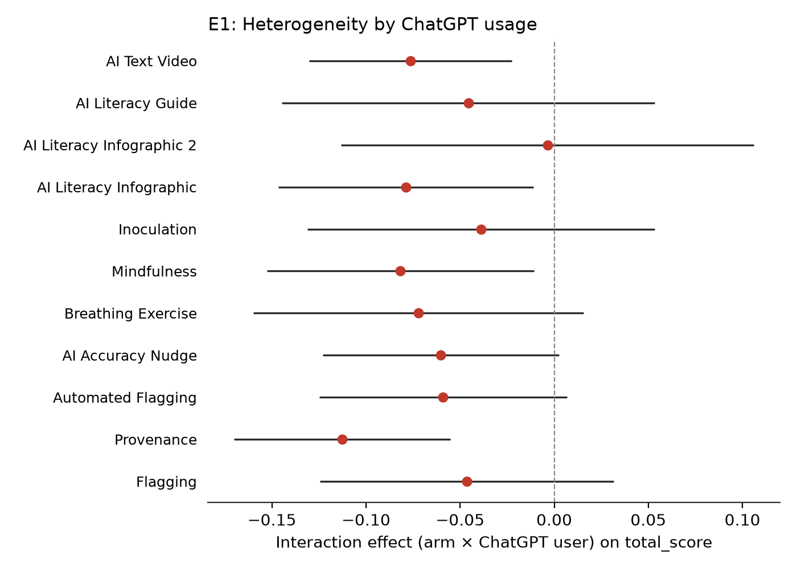
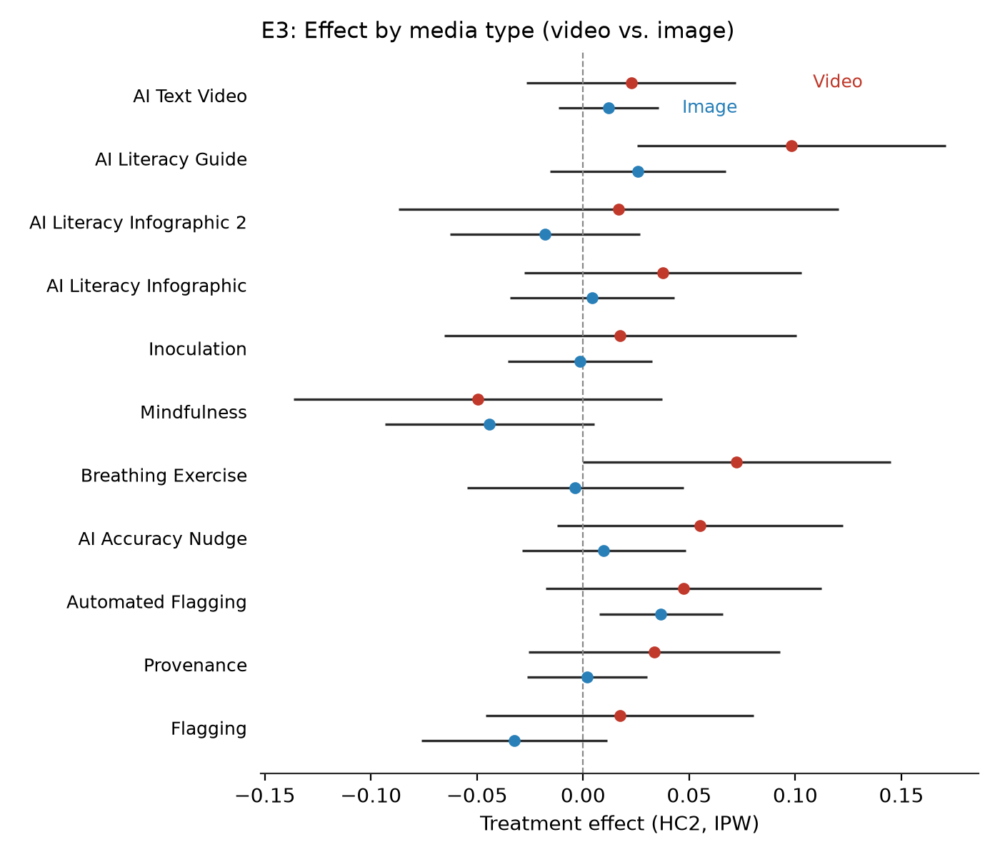

# Improving AI Discernment: do misinformation interventions help people spot AI-generated media?

_Yamil Velez | 2026-10-01 | N = 2,030 analysed of 2,257 collected | survey experiment_

> **Provenance: FULLY AGENTIC — no human review recorded.** Generated by filedrawer 0.1.0 on 2026-10-01 with openrouter (orchestrator `anthropic/claude-sonnet-5.5`, standard `qwen/qwen3.8-27b`, zero data retention requested). Reviewer pass: yes. Human steps recorded: 0. Release status: draft.
>
> **No pre-registration. The analysis plan was reconstructed after data collection from the original analysis script (original/code/replication_script.R) and the study write-up; no pre-registration exists.** Every test below is post hoc or exploratory.

## Key findings

| Estimate | Finding | 95% CI | p |
|---|---|---|---|
| **+0.047** | AI Literacy Guide: Total discernment accuracy (H1) | [+0.002, +0.092] | 0.043 |
| **+0.044** | Automated Flagging: Total discernment accuracy (H1) | [+0.014, +0.073] | 0.004 |
| **-0.039** | Mindfulness: Total discernment accuracy (H1) | [-0.074, -0.003] | 0.032 |
| **+0.091** | Breathing Exercise: AI-content detection accuracy (H2) | [+0.032, +0.150] | 0.003 |
| **+0.079** | AI Literacy Guide: AI-content detection accuracy (H2) | [+0.000, +0.157] | 0.049 |
| **+0.066** | AI Accuracy Nudge: AI-content detection accuracy (H2) | [+0.014, +0.119] | 0.014 |
| **+0.010** | Pooled across 11 arms: Total discernment accuracy (H1) | [-0.003, +0.024] | 0.132 |
| **+0.038** | Pooled across 11 arms: AI-content detection accuracy (H2) | [+0.017, +0.058] | <0.001 |
| **-0.007** | Pooled across 11 arms: Authentic-content accuracy (H3) | [-0.026, +0.013] | 0.502 |

Estimates are differences from the control group in the outcome's own units. p-values are not corrected for multiple comparisons.

## Summary

This study tested eleven interventions aimed at improving people's ability to discern AI-generated media from authentic content in a US survey experiment. Because no pre-registration exists, all tests are post hoc. Three interventions produced significant effects on total discernment accuracy: Automated Flagging raised it by 4.4 points (95% CI [1.4, 7.3], p = 0.004, two-sided), AI Literacy Guide by 4.7 points (95% CI [0.2, 9.2], p = 0.043), and Mindfulness lowered it by 3.9 points (95% CI [−7.4, −0.3], p = 0.032). The pooled effect across arms was not distinguishable from zero. For detection of AI-generated content, three arms were significant: Breathing Exercise (+9.1 points, 95% CI [3.2, 15.0], p = 0.003), AI Accuracy Nudge (+6.6 points, 95% CI [1.4, 11.9], p = 0.014), and AI Literacy Guide (+7.9 points, 95% CI [0.04, 15.7], p = 0.049); the pooled effect was +3.8 points (p < 0.001). For recognition of authentic content, only AI Literacy Infographic 2 was significant (−6.1 points, 95% CI [−11.1, −1.0], p = 0.019).

## Design and data

Design: survey experiment. Arms: `treatment`: 11 treatment arms (1 = Flagging, 2 = Provenance, 3 = Automated Flagging, 4 = AI Accuracy Nudge, 5 = Breathing Exercise, 6 = Mindfulness, 7 = Inoculation, 8 = AI Literacy Infographic, 9 = AI Literacy Infographic 2, 10 = AI Literacy Guide, 11 = AI Text Video) vs control 0 = Control. Population: other, US.

Sample: 2,257 raw responses; 2,030 in the analysis sample after exclusions `total_score == total_score`.

Analysis plan: author-supplied pap.json; registration: none. Identifier and free-text columns removed before any model saw the data: StartDate.

A between-subjects survey experiment fielded in the United States from October 30 to November 21, 2023 (IRB Columbia AAAU9484). Eleven treatment arms were compared against a no-intervention control. Of 2,257 raw respondents, 2,030 were retained for analysis; the control group contained 181 participants. No pre-registration exists, so all tests are post hoc. One methodological deviation from the original plan: standard errors use HC2 robust variance without cluster adjustment, because the shipped data contain one row per respondent with no participant identifier, making clustering both impossible and unnecessary at that level. Inverse-probability weights were applied throughout.

## Results

### H1. Total discernment accuracy (proportion of 24 posts judged correctly)

_Each intervention changes total discernment accuracy relative to control._  
_Deviation from the original analysis plan: HC2 robust standard errors without clustering (the shipped data has one row per respondent and no participant_id column; clustering is impossible and, with one observation per respondent, unnecessary)._

11 treatment arms are compared with control (Control) in one model on Total discernment accuracy (proportion of 24 posts judged correctly).


Three of eleven arms differed significantly from control on total discernment accuracy (two-sided p). Automated Flagging raised accuracy by 4.4 points (95% CI [1.4, 7.3], p = 0.004) and AI Literacy Guide by 4.7 points (95% CI [0.2, 9.2], p = 0.043). Mindfulness lowered accuracy by 3.9 points (95% CI [−7.4, −0.3], p = 0.032). The remaining eight arms were within about ±3 points of control and not distinguishable from it. The random-effects pooled estimate was +1.0 points (p = 0.132), not significant. With eleven uncorrected post hoc tests, the two effects nearest the threshold (AI Literacy Guide, Mindfulness) warrant caution.

Pooled across 11 arms (random effects): 0.010, SE 0.007, p = 0.132, tau2 = 0.0002, I2 = 0.45. Caveat: the arm effects share one control group, so they are not independent; the random-effects pooling treats them as if they were, and its standard error and heterogeneity statistics are approximate.

```
total_score ~ C(arm_code, Treatment(reference='0')) * (media_trust_c + political_interest_c + pk_score_c + ai_scale_c)
Lin (2013) covariate adjustment | weights = ipw | HC2 robust SEs | N = 2030 | two-sided test, alpha = 0.05
```

| Arm | Estimate | SE | p | 95% CI | n (arm) | Supported |
|---|---|---|---|---|---|---|
| Flagging | -0.010 | 0.015 | 0.5128 | [-0.039, 0.019] | 215 | no |
| Provenance | 0.011 | 0.014 | 0.4423 | [-0.017, 0.038] | 145 | no |
| Automated Flagging | 0.044 | 0.015 | 0.0035 | [0.014, 0.073] | 127 | yes |
| AI Accuracy Nudge | 0.020 | 0.015 | 0.1855 | [-0.010, 0.050] | 333 | no |
| Breathing Exercise | 0.015 | 0.022 | 0.5092 | [-0.029, 0.059] | 134 | no |
| Mindfulness | -0.039 | 0.018 | 0.0318 | [-0.074, -0.003] | 180 | yes |
| Inoculation | 0.008 | 0.019 | 0.6509 | [-0.028, 0.045] | 78 | no |
| AI Literacy Infographic | 0.012 | 0.017 | 0.4753 | [-0.021, 0.044] | 102 | no |
| AI Literacy Infographic 2 | -0.008 | 0.021 | 0.7178 | [-0.049, 0.034] | 80 | no |
| AI Literacy Guide | 0.047 | 0.023 | 0.0429 | [0.002, 0.092] | 162 | yes |
| AI Text Video | 0.016 | 0.013 | 0.2217 | [-0.009, 0.040] | 293 | no |

### H2. AI-content detection accuracy (proportion of 12 AI-generated posts identified)

_Each intervention changes detection of AI-generated content relative to control._  
_Deviation from the original analysis plan: HC2 robust standard errors without clustering (as for H1)._

11 treatment arms are compared with control (Control) in one model on AI-content detection accuracy (proportion of 12 AI-generated posts identified).


Three arms significantly improved detection of AI-generated content relative to control. Breathing Exercise raised fake-detection accuracy by 9.1 points (95% CI [3.2, 15.0], p = 0.003), AI Accuracy Nudge by 6.6 points (95% CI [1.4, 11.9], p = 0.014), and AI Literacy Guide by 7.9 points (95% CI [0.04, 15.7], p = 0.049). The other eight arms were not distinguishable from control. The pooled effect was +3.8 points (p < 0.001). The AI Literacy Guide effect is borderline (p = 0.049) and the arm is relatively small (n = 160), so this finding should be treated with some caution.

Pooled across 11 arms (random effects): 0.038, SE 0.011, p = 0.000, tau2 = 0.0002, I2 = 0.18. Caveat: the arm effects share one control group, so they are not independent; the random-effects pooling treats them as if they were, and its standard error and heterogeneity statistics are approximate.

```
fake_score ~ C(arm_code, Treatment(reference='0')) * (media_trust_c + political_interest_c + pk_score_c + ai_scale_c)
Lin (2013) covariate adjustment | weights = ipw | HC2 robust SEs | N = 2023 | two-sided test, alpha = 0.05
```

| Arm | Estimate | SE | p | 95% CI | n (arm) | Supported |
|---|---|---|---|---|---|---|
| Flagging | 0.018 | 0.027 | 0.4991 | [-0.035, 0.071] | 215 | no |
| Provenance | 0.040 | 0.029 | 0.1703 | [-0.017, 0.098] | 145 | no |
| Automated Flagging | 0.050 | 0.030 | 0.0995 | [-0.009, 0.110] | 127 | no |
| AI Accuracy Nudge | 0.066 | 0.027 | 0.0135 | [0.014, 0.119] | 332 | yes |
| Breathing Exercise | 0.091 | 0.030 | 0.0027 | [0.032, 0.150] | 134 | yes |
| Mindfulness | -0.041 | 0.041 | 0.3249 | [-0.122, 0.040] | 179 | no |
| Inoculation | 0.007 | 0.045 | 0.8737 | [-0.081, 0.096] | 76 | no |
| AI Literacy Infographic | 0.024 | 0.031 | 0.4352 | [-0.037, 0.085] | 102 | no |
| AI Literacy Infographic 2 | 0.055 | 0.037 | 0.1379 | [-0.018, 0.128] | 79 | no |
| AI Literacy Guide | 0.079 | 0.040 | 0.0488 | [0.000, 0.157] | 160 | yes |
| AI Text Video | 0.005 | 0.025 | 0.8242 | [-0.043, 0.054] | 293 | no |

### H3. Authentic-content accuracy (proportion of 12 real posts identified)

_Each intervention changes recognition of authentic content relative to control._  
_Deviation from the original analysis plan: HC2 robust standard errors without clustering (as for H1)._

11 treatment arms are compared with control (Control) in one model on Authentic-content accuracy (proportion of 12 real posts identified).


Only one arm differed significantly from control on recognition of authentic content: AI Literacy Infographic 2 lowered accuracy by 6.1 points (95% CI [−11.1, −1.0], p = 0.019). The other ten arms were not distinguishable from zero. The pattern suggests that most interventions, to the extent they had any effect, shifted respondents toward flagging more content as AI-generated rather than improving balanced discernment. The AI Literacy Infographic 2 arm is small (n = 80), and with no pre-registration and multiple uncorrected tests, this single significant result warrants caution.

Pooled across 11 arms (random effects): -0.007, SE 0.010, p = 0.502, tau2 = 0.0004, I2 = 0.40. Caveat: the arm effects share one control group, so they are not independent; the random-effects pooling treats them as if they were, and its standard error and heterogeneity statistics are approximate.

```
real_score ~ C(arm_code, Treatment(reference='0')) * (media_trust_c + political_interest_c + pk_score_c + ai_scale_c)
Lin (2013) covariate adjustment | weights = ipw | HC2 robust SEs | N = 2025 | two-sided test, alpha = 0.05
```

| Arm | Estimate | SE | p | 95% CI | n (arm) | Supported |
|---|---|---|---|---|---|---|
| Flagging | -0.030 | 0.026 | 0.2572 | [-0.082, 0.022] | 215 | no |
| Provenance | -0.012 | 0.021 | 0.5443 | [-0.053, 0.028] | 145 | no |
| Automated Flagging | 0.040 | 0.023 | 0.0751 | [-0.004, 0.084] | 127 | no |
| AI Accuracy Nudge | -0.018 | 0.026 | 0.5025 | [-0.070, 0.034] | 333 | no |
| Breathing Exercise | -0.048 | 0.034 | 0.1551 | [-0.113, 0.018] | 134 | no |
| Mindfulness | -0.041 | 0.032 | 0.1966 | [-0.104, 0.021] | 179 | no |
| Inoculation | 0.012 | 0.028 | 0.6696 | [-0.042, 0.066] | 77 | no |
| AI Literacy Infographic | -0.001 | 0.027 | 0.9710 | [-0.054, 0.052] | 100 | no |
| AI Literacy Infographic 2 | -0.061 | 0.026 | 0.0192 | [-0.111, -0.010] | 80 | yes |
| AI Literacy Guide | 0.021 | 0.025 | 0.4015 | [-0.028, 0.069] | 162 | no |
| AI Text Video | 0.023 | 0.018 | 0.1905 | [-0.012, 0.058] | 292 | no |


## Exploratory analyses

_Everything in this section is exploratory and was not pre-registered._

### E1. Heterogeneity by ChatGPT usage

AI literacy interventions may be more effective for those without prior AI experience; the arm × ChatGPT interaction identifies which subgroups benefit most.

Method: IPW-weighted OLS of total_score ~ C(arm_code) × C(chatgpt), HC2 robust SEs

**Finding.** 4 out of 10 arms show a statistically significant arm × ChatGPT-user interaction on total discernment accuracy (p < 0.05, HC2, IPW).



Four of ten arms showed a significant interaction with ChatGPT usage on total accuracy. Provenance (−11.3 points, p < 0.001), Mindfulness (−8.2 points, p = 0.024), and AI Literacy Infographic (−7.9 points, p = 0.023) all showed larger negative effects among ChatGPT users. These are post hoc and uncorrected for multiplicity.

| arm_code | arm_label | estimate | std_error | p_value | conf_low | conf_high |
|---|---|---|---|---|---|---|
| 1 | Flagging | -0.046 | 0.040 | 0.245 | -0.124 | 0.032 |
| 2 | Provenance | -0.113 | 0.029 | 0.0001 | -0.170 | -0.055 |
| 3 | Automated Flagging | -0.059 | 0.034 | 0.078 | -0.125 | 0.007 |
| 4 | AI Accuracy Nudge | -0.060 | 0.032 | 0.060 | -0.123 | 0.003 |
| 5 | Breathing Exercise | -0.072 | 0.045 | 0.107 | -0.160 | 0.015 |
| 6 | Mindfulness | -0.082 | 0.036 | 0.024 | -0.152 | -0.011 |
| 7 | Inoculation | -0.039 | 0.047 | 0.409 | -0.131 | 0.053 |
| 8 | AI Literacy Infographic | -0.079 | 0.035 | 0.023 | -0.146 | -0.011 |
| 9 | AI Literacy Infographic 2 | -0.004 | 0.056 | 0.948 | -0.113 | 0.106 |
| 10 | AI Literacy Guide | -0.046 | 0.051 | 0.366 | -0.145 | 0.053 |
| 11 | AI Text Video | -0.076 | 0.028 | 0.005 | -0.130 | -0.022 |

### E2. Robustness excluding attention-check failures

Excluding respondents who failed both attention checks (pk_score = 0) tests whether registered results are driven by inattentive respondents.

Method: IPW-weighted OLS of total_score ~ C(arm_code) on sample with pk_score > 0 (n=1983), HC2 robust SEs

**Finding.** After excluding 47 attention-check failures, 3 of 10 arms remain significant on total_score, consistent with the registered results (Automated Flagging, Mindfulness, AI Literacy Guide).

After excluding 47 attention-check failures, three arms remain significant on total accuracy: Automated Flagging (p = 0.012), Mindfulness (p = 0.021), and AI Literacy Guide (p = 0.045). The pattern is consistent with the main results, suggesting the findings are not driven by inattentive respondents.

| arm_code | arm_label | estimate | std_error | p_value | conf_low | conf_high |
|---|---|---|---|---|---|---|
| 1 | Flagging | -0.021 | 0.019 | 0.273 | -0.058 | 0.016 |
| 2 | Provenance | 0.009 | 0.014 | 0.517 | -0.019 | 0.037 |
| 3 | Automated Flagging | 0.039 | 0.016 | 0.012 | 0.009 | 0.070 |
| 4 | AI Accuracy Nudge | 0.021 | 0.016 | 0.192 | -0.011 | 0.053 |
| 5 | Breathing Exercise | 0.018 | 0.023 | 0.451 | -0.028 | 0.063 |
| 6 | Mindfulness | -0.045 | 0.020 | 0.021 | -0.084 | -0.007 |
| 7 | Inoculation | 0.003 | 0.019 | 0.895 | -0.036 | 0.041 |
| 8 | AI Literacy Infographic | 0.010 | 0.017 | 0.559 | -0.024 | 0.044 |
| 9 | AI Literacy Infographic 2 | -0.005 | 0.028 | 0.859 | -0.061 | 0.051 |
| 10 | AI Literacy Guide | 0.044 | 0.022 | 0.045 | 0.001 | 0.086 |
| 11 | AI Text Video | 0.015 | 0.013 | 0.235 | -0.010 | 0.040 |

### E3. Decomposition by media type (video vs. image)

Interventions may differentially affect detection of video versus image content, explaining why some arms improve fake_score but not total_score.

Method: IPW-weighted OLS of video_score and image_score (mean of item-level correct responses by media type) ~ C(arm_code), HC2 robust SEs

**Finding.** Only 1 of 10 arms is significant on video_score and 1 of 10 on image_score, indicating that treatment effects are broadly similar across media types rather than concentrated in one format.



Decomposing by media type, only AI Literacy Guide was significant on video accuracy (+9.8 points, p = 0.008) and one arm was significant on image accuracy. Effects are broadly similar across formats rather than concentrated in one, suggesting interventions operate on general discernment rather than format-specific cues.

| outcome | arm_code | arm_label | estimate | std_error | p_value | conf_low | conf_high |
|---|---|---|---|---|---|---|---|
| video_score | 1 | Flagging | 0.017 | 0.032 | 0.592 | -0.046 | 0.081 |
| video_score | 2 | Provenance | 0.034 | 0.030 | 0.265 | -0.026 | 0.093 |
| video_score | 3 | Automated Flagging | 0.047 | 0.033 | 0.152 | -0.018 | 0.112 |
| video_score | 4 | AI Accuracy Nudge | 0.055 | 0.034 | 0.108 | -0.012 | 0.122 |
| video_score | 5 | Breathing Exercise | 0.072 | 0.037 | 0.051 | -0.0002 | 0.145 |
| video_score | 6 | Mindfulness | -0.050 | 0.044 | 0.263 | -0.136 | 0.037 |
| video_score | 7 | Inoculation | 0.018 | 0.042 | 0.679 | -0.065 | 0.100 |
| video_score | 8 | AI Literacy Infographic | 0.038 | 0.033 | 0.258 | -0.028 | 0.103 |
| video_score | 9 | AI Literacy Infographic 2 | 0.017 | 0.053 | 0.753 | -0.087 | 0.120 |
| video_score | 10 | AI Literacy Guide | 0.098 | 0.037 | 0.008 | 0.025 | 0.171 |
| video_score | 11 | AI Text Video | 0.023 | 0.025 | 0.368 | -0.027 | 0.072 |
| image_score | 1 | Flagging | -0.032 | 0.022 | 0.148 | -0.076 | 0.011 |
| … 10 more rows |  | | | | | | |

## Silicon-sampling replication

_Exploratory. LLM personas are not evidence about humans._

_Skipped: silicon sampling skipped._

## Related findings

The retrieved literature offers only limited direct evidence on interventions targeting detection of AI-generated content specifically. The closest prior findings concern interventions that improve general credibility or misinformation discernment: Bhuiyan et al. (2021) found that nudge-based design interventions on social media can shift users toward more credible news sources, suggesting that lightweight cues may alter overall discernment accuracy (relevant to H1). Roozenbeek et al. (2022) demonstrated that psychological inoculation improves resilience against misinformation, indicating that pre-bunking-style interventions can change how people evaluate the authenticity of content (relevant to H1 and H3). However, none of the retrieved works directly test whether such interventions differentially affect detection of AI-generated versus authentic content (H2 vs. H3), leaving a clear gap that the present study addresses.

Retrieved works (OpenAlex; queries: inoculation AI-generated media detection; deepfake detection intervention accuracy; synthetic media literacy nudge discernment; misinformation intervention AI content recognition):

- Susannah J. Salter, Michael J. Cox, Elena M. Turek, Szymon Calus (2014). Reagent and laboratory contamination can critically impact sequence-based microbiome analyses. BMC Biology. https://doi.org/10.1186/s12915-014-0087-z
- Pamela Calvo, Louise M. Nelson, Joseph W. Kloepper (2014). Agricultural uses of plant biostimulants. Plant and Soil. https://doi.org/10.1007/s11104-014-2131-8
- Christy Echakachi Manyi-Loh, Sampson Mamphweli, Edson L. Meyer, Anthony Ifeanyi Okoh (2018). Antibiotic Use in Agriculture and Its Consequential Resistance in Environmental Sources: Potential Public Health Implications. Molecules. https://doi.org/10.3390/molecules23040795
- Christian Janiesch, Patrick Zschech, Kai Heinrich (2021). Machine learning and deep learning. Electronic Markets. https://doi.org/10.1007/s12525-021-00475-2
- Jürgen Rudolph, Samson Tan, Shannon Tan (2023). ChatGPT: Bullshit spewer or the end of traditional assessments in higher education?. Journal of Applied Learning & Teaching. https://doi.org/10.37074/jalt.2023.6.1.9
- Ullrich K. H. Ecker, Stephan Lewandowsky, John Cook, Philipp Schmid (2022). The psychological drivers of misinformation belief and its resistance to correction. Nature Reviews Psychology. https://doi.org/10.1038/s44159-021-00006-y
- Jon Roozenbeek, Sander van der Linden, Beth Goldberg, Steve Rathje (2022). Psychological inoculation improves resilience against misinformation on social media. Science Advances. https://doi.org/10.1126/sciadv.abo6254
- Kirill Bryanov, Victoria Vziatysheva (2021). Determinants of individuals’ belief in fake news: A scoping review determinants of belief in fake news. PLoS ONE. https://doi.org/10.1371/journal.pone.0253717
- Md Momen Bhuiyan, Michael Horning, Sang Won Lee, Tanushree Mitra (2021). NudgeCred: Supporting News Credibility Assessment on Social Media Through Nudges. Proceedings of the ACM on Human-Computer Interaction. https://doi.org/10.1145/3479571
- Andy Clark (2013). Whatever next? Predictive brains, situated agents, and the future of cognitive science. Behavioral and Brain Sciences. https://doi.org/10.1017/s0140525x12000477

## Limitations

No pre-registration means all tests are post hoc, and with eleven arms and three outcomes (33 comparisons) no multiplicity correction was applied, inflating the false-positive rate. Several significant effects sit near the 0.05 threshold (AI Literacy Guide on total accuracy, p = 0.043; AI Literacy Guide on fake detection, p = 0.049), and some arms are small (Inoculation n = 78, AI Literacy Infographic 2 n = 80), limiting precision. The control group (n = 181) is modest relative to the eleven treatment arms. The sample is a US convenience sample, so generalizability is uncertain. The HC2 standard errors, while appropriate given the data structure, do not account for any within-respondent correlation that might exist if multiple items contributed to the composite scores. Finally, the study measures self-reported classification accuracy in a single session; it is unclear whether effects persist over time or transfer to real-world media consumption.

## Plan fidelity

Tags compare the registered and implemented specifications field by field; they are not self-reported.

| Analysis | Tag | Registered | Implemented | Justification |
|---|---|---|---|---|
| H1 | **deviation** | estimator.cluster="participant_id" | estimator.cluster=null | HC2 robust standard errors without clustering (the shipped data has one row per respondent and no participant_id column; clustering is impossible and, with one observation per respondent, unnecessary) |
| H2 | **deviation** | estimator.cluster="participant_id" | estimator.cluster=null | HC2 robust standard errors without clustering (as for H1) |
| H3 | **deviation** | estimator.cluster="participant_id" | estimator.cluster=null | HC2 robust standard errors without clustering (as for H1) |

Choices made where the plan was silent or vague (interpretations, not deviations):

- H1 / sample_exclusions: "filter(!is.na(treatment)) %>% filter(!is.na(total_score))" -> rows outside the twelve arms are dropped by the arm filter; total_score == total_score drops missing outcomes (pandas query equivalent of the R filters)

Derived columns, computed in `scripts/02_clean.py`:

```
ipw = 1 / pr
```

## Reviewer pass

A single automated reviewer pass flagged 8 issue(s); see `review.md`.

## Reproduction

From the study folder:

```bash
python scripts/02_clean.py && python scripts/03_registered.py
python scripts/04_exploratory.py   # if present
filedrawer reproduce .             # re-runs everything and checks every results table is byte-identical
```

Data files: `data/raw_tidy.csv` (tidy export, identifiers removed), `data/clean.csv` (analysis sample with constructed outcomes), `codebook.md` (from the survey schema), `pap.json` (machine-readable analysis plan). See `RUN.md`.

## Files

- `.git/COMMIT_EDITMSG`
- `.git/FETCH_HEAD`
- `.git/HEAD`
- `.git/ORIG_HEAD`
- `.git/config`
- `.git/description`
- `.git/hooks/applypatch-msg.sample`
- `.git/hooks/commit-msg.sample`
- `.git/hooks/fsmonitor-watchman.sample`
- `.git/hooks/post-update.sample`
- `.git/hooks/pre-applypatch.sample`
- `.git/hooks/pre-commit.sample`
- `.git/hooks/pre-merge-commit.sample`
- `.git/hooks/pre-push.sample`
- `.git/hooks/pre-rebase.sample`
- `.git/hooks/pre-receive.sample`
- `.git/hooks/prepare-commit-msg.sample`
- `.git/hooks/push-to-checkout.sample`
- `.git/hooks/update.sample`
- `.git/index`
- `.git/info/exclude`
- `.git/logs/HEAD`
- `.git/logs/refs/heads/main`
- `.git/logs/refs/remotes/origin/main`
- `.git/objects/03/decc535340f4c029b7b53696c1f2303eb7e221`
- `.git/objects/05/4a9a9e6d538105171f292e9ca12110aa9961d8`
- `.git/objects/05/cfaccf226960e4464a755338116f794814a210`
- `.git/objects/08/ab00a3793bbf3f92845b8873d99776c5646343`
- `.git/objects/09/3dbe96a0db36a80638f915f665426e45ff95c4`
- `.git/objects/0a/184ef5924aed5c86c796a8de71a8cdfb304b51`
- `.git/objects/0e/752d731cc3f879ef49d746f8ab3fb0498cdb21`
- `.git/objects/0f/c1ada236d08e3b709d7ca3de6dc00edeb02066`
- `.git/objects/10/01587959b3ef8ae165cca7cabdd30f489245ef`
- `.git/objects/18/0ff1edb40c0e3e5ea67cc4011e76b8edb92e40`
- `.git/objects/1e/3d22fadbbc190039edd8b115a9e2c9f2f276ad`
- `.git/objects/1f/b945cd4c58df41a58fb3e1f7ac81b103cc7447`
- `.git/objects/23/505b39970323e9ac59058a5c59e295bd89a964`
- `.git/objects/24/f4a3effd83c9f5ac00dfc64977a03632d1abce`
- `.git/objects/25/3b367526b11644e26db7b5f1d42198ee85b31a`
- `.git/objects/27/822c885aecb640179cb90bdfc9113befe7d750`
- `.git/objects/27/991007ee2800b0e38c6b23d71750b687fbf160`
- `.git/objects/27/c9d4bf9486741cf273607d3858fd2f17709619`
- `.git/objects/28/2f34536609131f79974378765f52a936fdf5a3`
- `.git/objects/31/757e72c94d49aad7bff6d226a0284a0b36bacb`
- `.git/objects/33/1fc31fd20d51bb256956a647a503a3228ff8a9`
- `.git/objects/36/c5d9b5f74ee126881d958e23e8f595fa47dd51`
- `.git/objects/38/79ed288008960d3709506722ef0d5e0620a873`
- `.git/objects/38/b5ed5b3bd3aa70be4286fbb95e006583663c54`
- `.git/objects/3b/3cce70b8abbac3ff9f1edfde8bea4407deb355`
- `.git/objects/3f/60b8d2c06e6d49889dc19e99346df6f0f2b0e5`
- `.git/objects/41/b0550869a20995abc658d0864e11d94614029c`
- `.git/objects/42/e059dbd90cfcdeb1eed434f1f611d44ca6cf09`
- `.git/objects/45/c72b951b9799dad5f67e56497aba096275e434`
- `.git/objects/45/d53afbc216f9595adacda9c0ecb1e877c0b7e8`
- `.git/objects/49/b1d2c7cc27780cbbd166480aa59c0ed454e97e`
- `.git/objects/4b/854f41d289ea30eedefa037f3f525c0d5494cb`
- `.git/objects/4d/843afd76af1f09bd27a1c60d7b67680ee59296`
- `.git/objects/4e/2b401f2e022d75ad618d16e564b90ac0f86dcf`
- `.git/objects/4e/fb12cd18e8fa9a3d7ef22b855b97c67099eb14`
- `.git/objects/50/660b41646405013ab5ac7c7fabf3c0306c17ca`
- `.git/objects/52/ac4058f1bcb1086fbc9dc379527ff1d496964a`
- `.git/objects/52/e2d2fd9ae76f2aa4703c4ca1f584d8a391dfac`
- `.git/objects/53/68a5b9ffac30e8268920558cfc917a431bd5ef`
- `.git/objects/57/217ee6df4c128764509c8df201693b0840186d`
- `.git/objects/57/de58fa62d3b1223f90d4401f34a13aeaba2f31`
- `.git/objects/59/80d2d9118cc03168e36049665faac719fa3f48`
- `.git/objects/5d/1e452c207a1e3266710790beca9fb759b056e3`
- `.git/objects/5d/9321dae54a7995f157b2b65a0a15781d809759`
- `.git/objects/5e/8ea9912335433ca73ce2c7d456bcdfe1379a58`
- `.git/objects/5f/4d91d0ec7ce51c69de3c35037d4165c661f28d`
- `.git/objects/64/63e7125677f2c6139551c15b6427fb1071b365`
- `.git/objects/65/20fe30f85a971e975ca4c5555f17c7b97cce9c`
- `.git/objects/68/1e2c61027293651218262218785aa2db829bcb`
- `.git/objects/6b/ec6f73bfa145c7169778aa4d4bacc6fea83c5c`
- `.git/objects/6c/e5dc305b9085d9fc4e394e88d70bf35df7631e`
- `.git/objects/70/e51920704cdf848a3283a97b1303b852398623`
- `.git/objects/72/d1aa15270c9fbbe7867a8d6a7137e7bbf17b70`
- `.git/objects/73/0572dda606dce6386cd55eca60925943c1e80c`
- `.git/objects/79/35dda421db09094d7954df3f5bacc6011643ea`
- `.git/objects/79/b11246595dcad4a7e44b0d728fa841f407857a`
- `.git/objects/7b/ab233c254d46f120903dcb2402a0a38edd6dee`
- `.git/objects/7c/75df70b8a5dae1648f43c8341a26550a56380f`
- `.git/objects/7d/24fe5600dde4f03dbb944cf715ddde3bc3eb37`
- `.git/objects/7d/f867495e4912b6f1cf450265450f63b3c32764`
- `.git/objects/81/1330fe0eb137e26c5af916a918cc23cdf76c96`
- `.git/objects/81/2d86462434f29e9f2212cf9ae3c91910aead14`
- `.git/objects/86/d1260b93958a2e99134e083bf4d88acef54148`
- `.git/objects/8a/6815aa03fcc3498b23caf1659f12a2d583a6ff`
- `.git/objects/8d/5f61a5d6e562dd8de7112e9326a22e03d1b3a4`
- `.git/objects/8d/cd84d7a803b3ff14abf66586b78c0b8828c39b`
- `.git/objects/8f/24406bc651e5e9a714a814feef60fafeaf5796`
- `.git/objects/8f/2f711a02dcad0eeb1f3cc66f7ba36ff67d3771`
- `.git/objects/90/7a1569e4e621ccb37718e539269ffdd47e1b4f`
- `.git/objects/90/edcf51c61fc775c629b7faf4a4220495cb352e`
- `.git/objects/91/db84074690c8d43b0e63fd7a876baefafe7938`
- `.git/objects/93/417ed66709b9f5048c23d2044958a6ff3c4c25`
- `.git/objects/95/7d09e702499272b6506eade14e85b94f9c11a2`
- `.git/objects/95/dce9933a5c44bde55438fe81c9430f6192708e`
- `.git/objects/98/614e5201a3d065b41f2313078dba58057114d9`
- `.git/objects/9a/71f905a0adb8e8eb913e4548b69d867a7e23e1`
- `.git/objects/9a/d867e8787188dd248d7f9933354aa180c77df9`
- `.git/objects/9b/8a39298596b6ab5ddf6fb14e3bfdb5397ec6bd`
- `.git/objects/9d/815ab3195e8642d988dd6db3688cc45a2f8c9c`
- `.git/objects/a3/042fa56ef6cde690b72594465363c2efe7acb4`
- `.git/objects/a7/a96d31d78381834db9f60eaa57f131f53af33e`
- `.git/objects/a7/f6f3dac40c53127c06add7c4eec10a8b6ce385`
- `.git/objects/a8/2e6785a9bdd2a28064a17965a0bcaff8549593`
- `.git/objects/a9/17a9fb349f137531d7f830b2a60bd496d10602`
- `.git/objects/a9/a04ad798577794db11cf1114e25fa15c610b22`
- `.git/objects/ae/d75af6a54b7f6aa61b95b05a871d7febfb2a13`
- `.git/objects/af/ad37ff08e042895e595e6ce84a7a8f932059a0`
- `.git/objects/b1/ff5fb00a98239fe0e426e590a5ace1d873f692`
- `.git/objects/b4/3c4ed005af6c5d6ab177ee499a33b977685b1d`
- `.git/objects/b5/72f20a4e3cf135c7c8922622c860eab78b6114`
- `.git/objects/b6/89f92ba46a1ea4d4e6c4e3ab0194ab3b4bba37`
- `.git/objects/b9/cbf4c9400004053522f846734a72e67bcb30e9`
- `.git/objects/be/839ec41d534977727031bf16c79712a05e4da3`
- `.git/objects/bf/72383baddeb9031e7550ed3a9521aafa35a0e4`
- `.git/objects/c2/f01b3140ddcc29f0606d38147a740608abc580`
- `.git/objects/c2/fd2f78390c490bc2aca885152877d73f939529`
- `.git/objects/c6/cd35531fcebd0326e137b001b973135b2c7015`
- `.git/objects/c7/ca595fc1aee229524a6289adafff86340e830e`
- `.git/objects/cb/49e5980af0a20e3bf35625565be6fe1e5778fa`
- `.git/objects/cd/3d6363e87021053eb6337974e6a8c408eabf30`
- `.git/objects/cd/d6cd3a01b272e3a2f8a6f11bb36686383aa44d`
- `.git/objects/ce/bc94822dbeae158769089d5d8e4bb0165df81b`
- `.git/objects/d2/50fdae70f3a9a2cb28e95badff8191de137f73`
- `.git/objects/da/04366ef1d58bdeefd8c7372b7b08bea5713bd9`
- `.git/objects/dd/68c8d28a31454b065bb7598bc594c5ce71f63d`
- `.git/objects/df/51acf94816367d3fc0e2be723705a37d71bd1a`
- `.git/objects/e0/5fe4de4ebbd3e6323956ea0f968507eee8fb4e`
- `.git/objects/e0/9c1775b2cb4cbde13f0b4df945f7b0c9c2d738`
- `.git/objects/e8/5211ed4d5ea4a01f7a00bd2de62c6d2247e801`
- `.git/objects/eb/6a1b9b850145c35d8fa7251fe3c535631ce6c1`
- `.git/objects/ef/5cd123213298bee0ebda3c0d7ac5c64422257c`
- `.git/objects/f0/745d6e68bd6a9214932f4492074d58e54d7108`
- `.git/objects/f2/648f477170bd3aceb4d139bccbdf34a2d4aedc`
- `.git/objects/f2/dd7d894f844bbef0c0481e7e9daf65031329ac`
- `.git/objects/f6/59ee1c186f17b56c90cd7f7dd8b71a230fbd9b`
- `.git/objects/f7/124109f0733789a6ec201f292b5ff83a0e6e0d`
- `.git/objects/f8/a938240fdc143c7144332fc3ef331114c0311a`
- `.git/objects/f9/0c863ab7b796c9743dcd27da771b952c579129`
- `.git/objects/fb/2602c35b69e52bf2271c515300cac3e8909388`
- `.git/objects/fb/48374622975718da85c7598631ed0204272a5c`
- `.git/objects/fc/b07091e64703289b12469ca8a517a07e696581`
- `.git/objects/fc/fb8ddf2c454b74c8b2feb73157d136218a891c`
- `.git/objects/fd/df2ff01f46779aa789de490a78f2e4fe1b7a4b`
- `.git/objects/fd/f03290d86c0da0b07250507d0fc88f63499ee0`
- `.git/refs/heads/main`
- `.git/refs/remotes/origin/main`
- `.gitignore`
- `README.md`
- `RUN.md`
- `codebook.json`
- `codebook.md`
- `data/clean.csv`
- `data/raw_tidy.csv`
- `figures/E1_chatgpt_heterogeneity.png`
- `figures/E3_media_type_decomposition.png`
- `figures/H1_arms.png`
- `figures/H2_arms.png`
- `figures/H3_arms.png`
- `figures/registered_effects.png`
- `inputs/pap.json`
- `inputs/pap.md`
- `inputs/replication_data.csv`
- `inputs/survey.qsf`
- `original/code/create_replication_data.R`
- `original/code/replication_script.R`
- `original/site/index.html`
- `pap.json`
- `pap.md`
- `provenance/literature.json`
- `provenance/llm_log.jsonl`
- `provenance/provenance.json`
- `report.md`
- `results/E1_chatgpt_heterogeneity.csv`
- `results/E2_no_attention_fail.csv`
- `results/E3_media_type_decomposition.csv`
- `results/H1.csv`
- `results/H1_arms.csv`
- `results/H2.csv`
- `results/H2_arms.csv`
- `results/H3.csv`
- `results/H3_arms.csv`
- `results/analysis_tags.csv`
- `results/registered_summary.csv`
- `review.md`
- `run.log`
- `run.sh`
- `scripts/01_tidy.py`
- `scripts/02_clean.py`
- `scripts/03_registered.py`
- `scripts/04_exploratory.py`
- `study.json`
- `survey.qsf`
