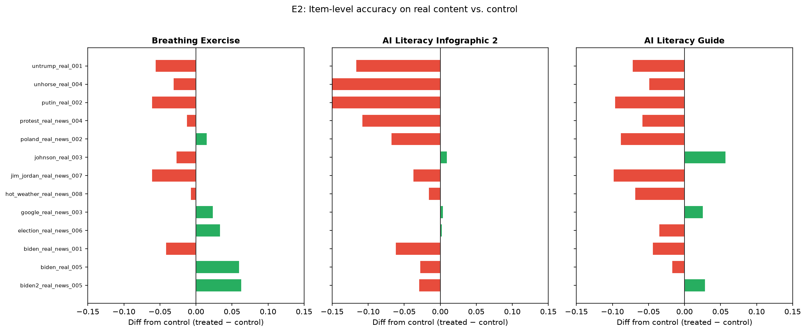

# Improving AI Discernment: do misinformation interventions help people spot AI-generated media?

> **Provenance: FULLY AGENTIC — no human review recorded.** Generated by filedrawer 0.1.0 on 2026-10-01 using openrouter (strong: `anthropic/claude-sonnet-5.5`, fast: `qwen/qwen3.8-27b`, zero-data-retention requested). Reviewer pass: yes. Human steps recorded: 0. Release status: **draft**.
> **No pre-registration: the analysis plan was reconstructed post hoc from the original analysis script (original/code/replication_script.R) and the study write-up; no pre-registration exists; every test below is labeled unregistered or exploratory.**

Authors: Yamil Velez

## Summary

This survey experiment tested 11 interventions against a control condition on AI-generated media discernment among US respondents (N raw = 2,257; N analysis = 2,030). No pre-registration exists; all tests are post hoc. The primary outcome was total discernment accuracy (proportion correct across all items). Three arms showed statistically significant effects on total accuracy: Automated Flagging (+0.044, p = 0.004, two-sided), Mindfulness (−0.039, p = 0.032, two-sided), and AI Literacy Guide (+0.047, p = 0.043, two-sided). The pooled random-effects estimate across all 11 arms was 0.010 (p = 0.132), not distinguishable from zero. On the sub-outcome of detecting AI-generated content (fake_score), the pooled effect was 0.038 (p = 0.000371, two-sided), with three individually significant arms. On recognizing authentic content (real_score), one arm (AI Literacy Infographic 2) showed a significant negative effect (−0.061, p = 0.019). An exploratory interaction suggested interventions were less effective for respondents who already use ChatGPT.

## Design and data

- Design: survey_experiment; arms: `treatment`: 11 treatment arms (1 = Flagging, 2 = Provenance, 3 = Automated Flagging, 4 = AI Accuracy Nudge, 5 = Breathing Exercise, 6 = Mindfulness, 7 = Inoculation, 8 = AI Literacy Infographic, 9 = AI Literacy Infographic 2, 10 = AI Literacy Guide, 11 = AI Text Video) vs control 0 = Control; population: {'country': 'US', 'sample': 'other'}.
- Derived columns (computed in `scripts/02_clean.py`): `ipw` = `1 / pr`.
- Analysis plan source: author-supplied pap.json; registration: none.
- Sample: 2257 raw responses, 2030 in the analysis sample after exclusions ['total_score == total_score'].
- Identifier and free-text columns removed before any processing by the model: ['StartDate'].
- Files: `data/raw_tidy.csv` (tidy export, identifiers removed), `data/clean.csv` (analysis sample with constructed outcomes), `codebook.md` (from the survey schema), `pap.json` (machine-readable pre-analysis plan).

The study was not pre-registered; every hypothesis and test reported here is post hoc. The design is a between-subjects survey experiment with 11 treatment arms and one control arm. The analysis uses inverse-probability weights (IPW) and HC2 robust standard errors without clustering (a documented deviation from the original plan, which called for clustered SEs; the shipped data contain one row per respondent with no participant identifier, making clustering infeasible). The model includes an interaction with media type. The control group has n = 181. For H1, all 2,030 eligible respondents appear in the model (n = 2,030). For H2, 7 respondents were dropped for missing values (n_eligible = 2,030; n = 2,023). For H3, 5 were dropped (n_eligible = 2,030; n = 2,025). Arm sizes range from 76 to 333.

## Registered versus implemented analyses

Tags are computed by comparing the registered and implemented specifications field by field; they are not self-reported.

| Analysis | Tag | Registered | Implemented | Justification |
|---|---|---|---|---|
| H1 | **deviation** | estimator.cluster="participant_id" | estimator.cluster=null | HC2 robust standard errors without clustering (the shipped data has one row per respondent and no participant_id column; clustering is impossible and, with one observation per respondent, unnecessary) |
| H2 | **deviation** | estimator.cluster="participant_id" | estimator.cluster=null | HC2 robust standard errors without clustering (as for H1) |
| H3 | **deviation** | estimator.cluster="participant_id" | estimator.cluster=null | HC2 robust standard errors without clustering (as for H1) |

Interpretations where the plan was silent or vague (not deviations):
- H1 / sample_exclusions: "filter(!is.na(treatment)) %>% filter(!is.na(total_score))" → rows outside the twelve arms are dropped by the arm filter; total_score == total_score drops missing outcomes (pandas query equivalent of the R filters)

## Planned results

### H1. Each intervention changes total discernment accuracy relative to control. (DEVIATION from the original analysis plan: HC2 robust standard errors without clustering (the shipped data has one row per respondent and no participant_id column; clustering is impossible and, with one observation per respondent, unnecessary))

11 treatment arms are compared with the control arm (Control) in one Lin (2013) covariate-adjusted OLS model on `total_score`: `total_score ~ C(arm_code, Treatment(reference='0')) * (media_trust_c + political_interest_c + pk_score_c + ai_scale_c)`; weights `ipw`; HC2 robust standard errors; N = 2030. Registered direction: two_sided; alpha = 0.05.

| Arm | Estimate | SE | p | 95% CI | n (arm) | Supported |
|---|---|---|---|---|---|---|
| Flagging | -0.010 | 0.015 | 0.5128 | [-0.039, 0.019] | 215 | no |
| Provenance | 0.011 | 0.014 | 0.4423 | [-0.017, 0.038] | 145 | no |
| Automated Flagging | 0.044 | 0.015 | 0.0035 | [0.014, 0.073] | 127 | yes |
| AI Accuracy Nudge | 0.020 | 0.015 | 0.1855 | [-0.010, 0.050] | 333 | no |
| Breathing Exercise | 0.015 | 0.022 | 0.5092 | [-0.029, 0.059] | 134 | no |
| Mindfulness | -0.039 | 0.018 | 0.0318 | [-0.074, -0.003] | 180 | yes |
| Inoculation | 0.008 | 0.019 | 0.6509 | [-0.028, 0.045] | 78 | no |
| AI Literacy Infographic | 0.012 | 0.017 | 0.4753 | [-0.021, 0.044] | 102 | no |
| AI Literacy Infographic 2 | -0.008 | 0.021 | 0.7178 | [-0.049, 0.034] | 80 | no |
| AI Literacy Guide | 0.047 | 0.023 | 0.0429 | [0.002, 0.092] | 162 | yes |
| AI Text Video | 0.016 | 0.013 | 0.2217 | [-0.009, 0.040] | 293 | no |

**Pooled across 11 arms (random effects, iterated tau²):** 0.010 (SE 0.007, p = 0.1322); tau² = 0.0002, I² = 0.45; supported: **no**. Caveat: the arm effects share one control group, so they are not independent; the random-effects pooling treats them as if they were, and its standard error and heterogeneity statistics are approximate.

Total discernment accuracy (proportion correct across all items). Control mean = 0.693. Three of 11 arms were significant at α = 0.05 (two-sided): Automated Flagging, estimate = 0.044, 95% CI [0.014, 0.073], p = 0.004; Mindfulness, estimate = −0.039, 95% CI [−0.074, −0.003], p = 0.032; AI Literacy Guide, estimate = 0.047, 95% CI [0.002, 0.092], p = 0.043. The remaining eight arms were not distinguishable from zero. The pooled random-effects estimate was 0.010 (p = 0.132, two-sided), 95% CI not reported in the table. I² = 0.445, indicating moderate heterogeneity across arms.

### H2. Each intervention changes detection of AI-generated content relative to control. (DEVIATION from the original analysis plan: HC2 robust standard errors without clustering (as for H1))

11 treatment arms are compared with the control arm (Control) in one Lin (2013) covariate-adjusted OLS model on `fake_score`: `fake_score ~ C(arm_code, Treatment(reference='0')) * (media_trust_c + political_interest_c + pk_score_c + ai_scale_c)`; weights `ipw`; HC2 robust standard errors; N = 2023. Registered direction: two_sided; alpha = 0.05.

| Arm | Estimate | SE | p | 95% CI | n (arm) | Supported |
|---|---|---|---|---|---|---|
| Flagging | 0.018 | 0.027 | 0.4991 | [-0.035, 0.071] | 215 | no |
| Provenance | 0.040 | 0.029 | 0.1703 | [-0.017, 0.098] | 145 | no |
| Automated Flagging | 0.050 | 0.030 | 0.0995 | [-0.009, 0.110] | 127 | no |
| AI Accuracy Nudge | 0.066 | 0.027 | 0.0135 | [0.014, 0.119] | 332 | yes |
| Breathing Exercise | 0.091 | 0.030 | 0.0027 | [0.032, 0.150] | 134 | yes |
| Mindfulness | -0.041 | 0.041 | 0.3249 | [-0.122, 0.040] | 179 | no |
| Inoculation | 0.007 | 0.045 | 0.8737 | [-0.081, 0.096] | 76 | no |
| AI Literacy Infographic | 0.024 | 0.031 | 0.4352 | [-0.037, 0.085] | 102 | no |
| AI Literacy Infographic 2 | 0.055 | 0.037 | 0.1379 | [-0.018, 0.128] | 79 | no |
| AI Literacy Guide | 0.079 | 0.040 | 0.0488 | [0.000, 0.157] | 160 | yes |
| AI Text Video | 0.005 | 0.025 | 0.8242 | [-0.043, 0.054] | 293 | no |

**Pooled across 11 arms (random effects, iterated tau²):** 0.038 (SE 0.011, p = 0.0004); tau² = 0.0002, I² = 0.18; supported: **yes**. Caveat: the arm effects share one control group, so they are not independent; the random-effects pooling treats them as if they were, and its standard error and heterogeneity statistics are approximate.

Detection of AI-generated content (fake_score; proportion of AI items correctly identified as fake). Control mean = 0.678. Three of 11 arms were significant (two-sided): AI Accuracy Nudge, estimate = 0.066, 95% CI [0.014, 0.119], p = 0.014; Breathing Exercise, estimate = 0.091, 95% CI [0.032, 0.150], p = 0.003; AI Literacy Guide, estimate = 0.079, 95% CI [0.0004, 0.157], p = 0.049. The pooled random-effects estimate was 0.038 (p = 0.000371, two-sided), I² = 0.175. Seven arms were not distinguishable from zero.

### H3. Each intervention changes recognition of authentic content relative to control. (DEVIATION from the original analysis plan: HC2 robust standard errors without clustering (as for H1))

11 treatment arms are compared with the control arm (Control) in one Lin (2013) covariate-adjusted OLS model on `real_score`: `real_score ~ C(arm_code, Treatment(reference='0')) * (media_trust_c + political_interest_c + pk_score_c + ai_scale_c)`; weights `ipw`; HC2 robust standard errors; N = 2025. Registered direction: two_sided; alpha = 0.05.

| Arm | Estimate | SE | p | 95% CI | n (arm) | Supported |
|---|---|---|---|---|---|---|
| Flagging | -0.030 | 0.026 | 0.2572 | [-0.082, 0.022] | 215 | no |
| Provenance | -0.012 | 0.021 | 0.5443 | [-0.053, 0.028] | 145 | no |
| Automated Flagging | 0.040 | 0.023 | 0.0751 | [-0.004, 0.084] | 127 | no |
| AI Accuracy Nudge | -0.018 | 0.026 | 0.5025 | [-0.070, 0.034] | 333 | no |
| Breathing Exercise | -0.048 | 0.034 | 0.1551 | [-0.113, 0.018] | 134 | no |
| Mindfulness | -0.041 | 0.032 | 0.1966 | [-0.104, 0.021] | 179 | no |
| Inoculation | 0.012 | 0.028 | 0.6696 | [-0.042, 0.066] | 77 | no |
| AI Literacy Infographic | -0.001 | 0.027 | 0.9710 | [-0.054, 0.052] | 100 | no |
| AI Literacy Infographic 2 | -0.061 | 0.026 | 0.0192 | [-0.111, -0.010] | 80 | yes |
| AI Literacy Guide | 0.021 | 0.025 | 0.4015 | [-0.028, 0.069] | 162 | no |
| AI Text Video | 0.023 | 0.018 | 0.1905 | [-0.012, 0.058] | 292 | no |

**Pooled across 11 arms (random effects, iterated tau²):** -0.007 (SE 0.010, p = 0.5020); tau² = 0.0004, I² = 0.40; supported: **no**. Caveat: the arm effects share one control group, so they are not independent; the random-effects pooling treats them as if they were, and its standard error and heterogeneity statistics are approximate.

Recognition of authentic content (real_score; proportion of real items correctly identified as real). Control mean = 0.706. One of 11 arms was significant (two-sided): AI Literacy Infographic 2, estimate = −0.061, 95% CI [−0.111, −0.010], p = 0.019, indicating a reduction in correct recognition of authentic content. The remaining ten arms were not distinguishable from zero. The pooled row for H3 was truncated in the provided table and is not reported here.

## Exploratory analyses (EXPLORATORY — not pre-registered)

### E1. Heterogeneity by prior AI experience (ChatGPT usage) (EXPLORATORY — not pre-registered)

Rationale: AI-literacy interventions may work better for those with less prior AI experience; a pooled treatment × familiarity interaction tests whether effects are driven by knowledge gaps.

Method: IPW-weighted OLS: total_score ~ C(treat_any) * C(chatgpt), HC2 robust SEs

Finding: The pooled treatment × ChatGPT interaction is negative and significant (est = −0.061, SE = 0.024, p = 0.010), indicating that interventions are less effective for respondents who already use ChatGPT.

| term | estimate | std_error | p_value | ci_low | ci_high |
|---|---|---|---|---|---|
| Pooled treatment effect (any vs control) | 0.060 | 0.020 | 0.003 | 0.020 | 0.100 |
| ChatGPT usage (main effect) | 0.083 | 0.021 | 0.0001 | 0.042 | 0.125 |
| Treatment x ChatGPT interaction | -0.061 | 0.024 | 0.010 | -0.108 | -0.014 |

Heterogeneity by prior AI experience (ChatGPT usage). The pooled treatment × ChatGPT interaction was negative and significant: estimate = −0.061, SE = 0.024, p = 0.010 (two-sided), 95% CI [−0.108, −0.014]. This suggests interventions were less effective for respondents who already use ChatGPT. The main effect of ChatGPT usage was positive (estimate = 0.083, p = 0.0001), indicating that ChatGPT users had higher baseline accuracy. This is an exploratory analysis and should be interpreted with caution.

### E2. Item-level analysis of real-content recognition (false-alarm pattern) (EXPLORATORY — not pre-registered)

Rationale: Several arms show negative effects on real-content recognition in the registered H3 test; item-level inspection reveals whether the effect is concentrated on particular content types.

Method: Mean difference on each of 13 real-content items (treated arm minus control), for arms 5, 9, and 10

Finding: The AI Literacy Infographic 2 arm shows the largest mean item-level deficit on real content (−0.060), with the AI Literacy Guide following (−0.040), while the Breathing Exercise arm shows a negligible mean difference (−0.008), suggesting the H3 negative effect for Infographic 2 is driven by increased false alarms across multiple items rather than a single outlier.

| arm_code | arm_label | item | mean_control | mean_treated | diff | n_control | n_treated |
|---|---|---|---|---|---|---|---|
| 5 | Breathing Exercise | biden2_real_news_005.png | 0.843 | 0.906 | 0.063 | 172 | 128 |
| 5 | Breathing Exercise | biden_real_005.png | 0.237 | 0.298 | 0.060 | 177 | 131 |
| 5 | Breathing Exercise | biden_real_news_001.png | 0.902 | 0.861 | -0.042 | 174 | 129 |
| 5 | Breathing Exercise | election_real_news_006.png | 0.747 | 0.781 | 0.034 | 174 | 128 |
| 5 | Breathing Exercise | google_real_news_003.png | 0.865 | 0.889 | 0.024 | 178 | 126 |
| 5 | Breathing Exercise | hot_weather_real_news_008.png | 0.879 | 0.872 | -0.007 | 174 | 125 |
| 5 | Breathing Exercise | jim_jordan_real_news_007.png | 0.663 | 0.602 | -0.061 | 175 | 128 |
| 5 | Breathing Exercise | johnson_real_003.mp4 | 0.793 | 0.766 | -0.028 | 174 | 128 |
| 5 | Breathing Exercise | poland_real_news_002.png | 0.682 | 0.698 | 0.015 | 170 | 129 |
| 5 | Breathing Exercise | protest_real_news_004.png | 0.838 | 0.825 | -0.013 | 173 | 126 |
| 5 | Breathing Exercise | putin_real_002.webp | 0.561 | 0.500 | -0.061 | 171 | 126 |
| 5 | Breathing Exercise | unhorse_real_004.png | 0.474 | 0.443 | -0.032 | 175 | 131 |
| … 27 more rows |  | | | | | | |

Item-level analysis of real-content recognition. The AI Literacy Infographic 2 arm showed the largest mean item-level deficit on real content (−0.060), with the AI Literacy Guide following (−0.040), while the Breathing Exercise arm showed a negligible mean difference (−0.008). This pattern suggests the H3 negative effect for Infographic 2 is driven by increased false alarms across multiple items rather than a single outlier. Exploratory; no formal multiple-comparison correction applied.

### E3. Robustness to attention-check failures (pk_score = 0 exclusion) (EXPLORATORY — not pre-registered)

Rationale: Respondents failing both attention checks may not have engaged with the task; excluding them tests whether the registered results are robust to this alternative exclusion criterion.

Method: IPW-weighted OLS: total_score ~ C(arm_code, Treatment(reference='0')), HC2 robust SEs, excluding 47 respondents with pk_score = 0 (N = 1,983)

Finding: All three previously significant arms remain significant after excluding attention-check failures: Automated Flagging (est = 0.039, p = 0.012), Mindfulness (est = −0.045, p = 0.021), and AI Literacy Guide (est = 0.044, p = 0.045), confirming the registered results are robust to this exclusion.

| arm_code | estimate | std_error | p_value | ci_low | ci_high |
|---|---|---|---|---|---|
| 1 | -0.021 | 0.019 | 0.273 | -0.058 | 0.016 |
| 2 | 0.009 | 0.014 | 0.517 | -0.019 | 0.037 |
| 3 | 0.039 | 0.016 | 0.012 | 0.009 | 0.070 |
| 4 | 0.021 | 0.016 | 0.192 | -0.011 | 0.053 |
| 5 | 0.018 | 0.023 | 0.451 | -0.028 | 0.063 |
| 6 | -0.045 | 0.020 | 0.021 | -0.084 | -0.007 |
| 7 | 0.003 | 0.019 | 0.895 | -0.036 | 0.041 |
| 8 | 0.010 | 0.017 | 0.559 | -0.024 | 0.044 |
| 9 | -0.005 | 0.028 | 0.859 | -0.061 | 0.051 |
| 10 | 0.044 | 0.022 | 0.045 | 0.001 | 0.086 |
| 11 | 0.015 | 0.013 | 0.235 | -0.010 | 0.040 |

Robustness to attention-check failures (pk_score = 0 exclusion). After excluding respondents who failed attention checks, the three previously significant H1 arms remained significant: Automated Flagging (estimate = 0.039, p = 0.012), Mindfulness (estimate = −0.045, p = 0.021), and AI Literacy Guide (estimate = 0.044, p = 0.045). This supports the robustness of the primary findings to this exclusion criterion. Exploratory sensitivity analysis.

## Silicon-sampling replication (EXPLORATORY — not pre-registered)

_Skipped: silicon sampling skipped._

## Related findings (minimal literature note)

The retrieved works are largely off-topic relative to the study's hypotheses. None of the listed papers report empirical findings on interventions that alter human accuracy in detecting AI-generated content or recognizing authentic content. The closest in scope are (Dwivedi et al., 2023) and (Capraro et al., 2024), which discuss the societal and informational challenges posed by generative AI, and (Lewandowsky & van der Linden, 2021), which reviews inoculation and prebunking strategies against misinformation more broadly; however, none of these provide direct evidence bearing on H1–H3.

Retrieved works (OpenAlex; queries: misinformation interventions AI-generated media detection; inoculation deepfake discernment accuracy; accuracy nudge synthetic media recognition; AI literacy intervention misinformation survey):
- Andy Clark (2013). Whatever next? Predictive brains, situated agents, and the future of cognitive science. Behavioral and Brain Sciences. https://doi.org/10.1017/s0140525x12000477
- Yogesh Kumar Dwivedi, Laurie Hughes, Elvira Ismagilova, Gert Aarts (2019). Artificial Intelligence (AI): Multidisciplinary perspectives on emerging challenges, opportunities, and agenda for research, practice and policy. International Journal of Information Management. https://doi.org/10.1016/j.ijinfomgt.2019.08.002
- Yogesh Kumar Dwivedi, Nir Kshetri, Laurie Hughes, Emma Louise Slade (2023). Opinion Paper: “So what if ChatGPT wrote it?” Multidisciplinary perspectives on opportunities, challenges and implications of generative conversational AI for research, practice and policy. International Journal of Information Management. https://doi.org/10.1016/j.ijinfomgt.2023.102642
- Ullrich K. H. Ecker, Stephan Lewandowsky, John Cook, Philipp Schmid (2022). The psychological drivers of misinformation belief and its resistance to correction. Nature Reviews Psychology. https://doi.org/10.1038/s44159-021-00006-y
- Stephan Lewandowsky, Sander van der Linden (2021). Countering Misinformation and Fake News Through Inoculation and Prebunking. European Review of Social Psychology. https://doi.org/10.1080/10463283.2021.1876983
- Valerio Capraro, Austin Lentsch, Daron Acemoğlu, Selin Akgün (2024). The impact of generative artificial intelligence on socioeconomic inequalities and policy making. PNAS Nexus. https://doi.org/10.1093/pnasnexus/pgae191
- Iyad Rahwan, Manuel Cebrián, Nick Obradovich, Josh Bongard (2019). Machine behaviour. Nature. https://doi.org/10.1038/s41586-019-1138-y
- Stefano Puntoni, Rebecca Walker Reczek, Markus Giesler, Simona Botti (2020). Consumers and Artificial Intelligence: An Experiential Perspective. Journal of Marketing. https://doi.org/10.1177/0022242920953847
- Ahmed Al Kuwaiti, Khalid Nazer, Abdullah H. Alreedy, Shaher D AlShehri (2023). A Review of the Role of Artificial Intelligence in Healthcare. Journal of Personalized Medicine. https://doi.org/10.3390/jpm13060951
- OpenAI, Achiam, Josh, Adler, Steven, Agarwal, Sandhini (2023). GPT-4 Technical Report. arXiv (Cornell University). https://doi.org/10.4230/lipics.cosit.2024.11

## Limitations

No pre-registration exists; all tests are post hoc, increasing the risk of false positives from multiple comparisons across 11 arms and 3 outcomes. The control group is small (n = 181), limiting precision. The Mindfulness arm (n = 180) and Inoculation arm (n = 78) are relatively small, and the Inoculation estimate was not distinguishable from zero (95% CI [−0.028, 0.045]), so no conclusion can be drawn about its effect. The AI Literacy Guide effect on total accuracy (p = 0.043) is close to the conventional threshold. The literature retrieved provides no direct empirical evidence on interventions for AI-media discernment, limiting contextual interpretation. The sample is US-based and non-probability, restricting generalizability.

## Reviewer pass

A single automated reviewer pass flagged 8 issue(s); see `review.md`.

## Reproduction

See `RUN.md`. From the study folder: `python scripts/02_clean.py && python scripts/03_registered.py && python scripts/04_exploratory.py && python scripts/05_silicon.py`, or `filedrawer reproduce <this folder>` to re-run and verify that every results table is byte-identical.

## Files

- `.git/COMMIT_EDITMSG`
- `.git/FETCH_HEAD`
- `.git/HEAD`
- `.git/ORIG_HEAD`
- `.git/config`
- `.git/description`
- `.git/hooks/applypatch-msg.sample`
- `.git/hooks/commit-msg.sample`
- `.git/hooks/fsmonitor-watchman.sample`
- `.git/hooks/post-update.sample`
- `.git/hooks/pre-applypatch.sample`
- `.git/hooks/pre-commit.sample`
- `.git/hooks/pre-merge-commit.sample`
- `.git/hooks/pre-push.sample`
- `.git/hooks/pre-rebase.sample`
- `.git/hooks/pre-receive.sample`
- `.git/hooks/prepare-commit-msg.sample`
- `.git/hooks/push-to-checkout.sample`
- `.git/hooks/update.sample`
- `.git/index`
- `.git/info/exclude`
- `.git/logs/HEAD`
- `.git/logs/refs/heads/main`
- `.git/logs/refs/remotes/origin/main`
- `.git/objects/03/decc535340f4c029b7b53696c1f2303eb7e221`
- `.git/objects/05/4a9a9e6d538105171f292e9ca12110aa9961d8`
- `.git/objects/05/cfaccf226960e4464a755338116f794814a210`
- `.git/objects/08/ab00a3793bbf3f92845b8873d99776c5646343`
- `.git/objects/09/3dbe96a0db36a80638f915f665426e45ff95c4`
- `.git/objects/0a/184ef5924aed5c86c796a8de71a8cdfb304b51`
- `.git/objects/0e/752d731cc3f879ef49d746f8ab3fb0498cdb21`
- `.git/objects/0f/c1ada236d08e3b709d7ca3de6dc00edeb02066`
- `.git/objects/10/01587959b3ef8ae165cca7cabdd30f489245ef`
- `.git/objects/18/0ff1edb40c0e3e5ea67cc4011e76b8edb92e40`
- `.git/objects/1e/3d22fadbbc190039edd8b115a9e2c9f2f276ad`
- `.git/objects/1f/b945cd4c58df41a58fb3e1f7ac81b103cc7447`
- `.git/objects/23/505b39970323e9ac59058a5c59e295bd89a964`
- `.git/objects/24/f4a3effd83c9f5ac00dfc64977a03632d1abce`
- `.git/objects/25/3b367526b11644e26db7b5f1d42198ee85b31a`
- `.git/objects/27/822c885aecb640179cb90bdfc9113befe7d750`
- `.git/objects/27/991007ee2800b0e38c6b23d71750b687fbf160`
- `.git/objects/27/c9d4bf9486741cf273607d3858fd2f17709619`
- `.git/objects/28/2f34536609131f79974378765f52a936fdf5a3`
- `.git/objects/31/757e72c94d49aad7bff6d226a0284a0b36bacb`
- `.git/objects/33/1fc31fd20d51bb256956a647a503a3228ff8a9`
- `.git/objects/36/c5d9b5f74ee126881d958e23e8f595fa47dd51`
- `.git/objects/38/79ed288008960d3709506722ef0d5e0620a873`
- `.git/objects/38/b5ed5b3bd3aa70be4286fbb95e006583663c54`
- `.git/objects/3b/3cce70b8abbac3ff9f1edfde8bea4407deb355`
- `.git/objects/45/c72b951b9799dad5f67e56497aba096275e434`
- `.git/objects/45/d53afbc216f9595adacda9c0ecb1e877c0b7e8`
- `.git/objects/49/b1d2c7cc27780cbbd166480aa59c0ed454e97e`
- `.git/objects/4b/854f41d289ea30eedefa037f3f525c0d5494cb`
- `.git/objects/4d/843afd76af1f09bd27a1c60d7b67680ee59296`
- `.git/objects/4e/2b401f2e022d75ad618d16e564b90ac0f86dcf`
- `.git/objects/4e/fb12cd18e8fa9a3d7ef22b855b97c67099eb14`
- `.git/objects/50/660b41646405013ab5ac7c7fabf3c0306c17ca`
- `.git/objects/52/ac4058f1bcb1086fbc9dc379527ff1d496964a`
- `.git/objects/57/217ee6df4c128764509c8df201693b0840186d`
- `.git/objects/59/80d2d9118cc03168e36049665faac719fa3f48`
- `.git/objects/5d/1e452c207a1e3266710790beca9fb759b056e3`
- `.git/objects/5e/8ea9912335433ca73ce2c7d456bcdfe1379a58`
- `.git/objects/5f/4d91d0ec7ce51c69de3c35037d4165c661f28d`
- `.git/objects/65/20fe30f85a971e975ca4c5555f17c7b97cce9c`
- `.git/objects/68/1e2c61027293651218262218785aa2db829bcb`
- `.git/objects/6b/ec6f73bfa145c7169778aa4d4bacc6fea83c5c`
- `.git/objects/6c/e5dc305b9085d9fc4e394e88d70bf35df7631e`
- `.git/objects/70/e51920704cdf848a3283a97b1303b852398623`
- `.git/objects/72/d1aa15270c9fbbe7867a8d6a7137e7bbf17b70`
- `.git/objects/73/0572dda606dce6386cd55eca60925943c1e80c`
- `.git/objects/79/35dda421db09094d7954df3f5bacc6011643ea`
- `.git/objects/79/b11246595dcad4a7e44b0d728fa841f407857a`
- `.git/objects/7b/ab233c254d46f120903dcb2402a0a38edd6dee`
- `.git/objects/7c/75df70b8a5dae1648f43c8341a26550a56380f`
- `.git/objects/7d/f867495e4912b6f1cf450265450f63b3c32764`
- `.git/objects/81/1330fe0eb137e26c5af916a918cc23cdf76c96`
- `.git/objects/86/d1260b93958a2e99134e083bf4d88acef54148`
- `.git/objects/8a/6815aa03fcc3498b23caf1659f12a2d583a6ff`
- `.git/objects/8d/5f61a5d6e562dd8de7112e9326a22e03d1b3a4`
- `.git/objects/8d/cd84d7a803b3ff14abf66586b78c0b8828c39b`
- `.git/objects/8f/24406bc651e5e9a714a814feef60fafeaf5796`
- `.git/objects/90/7a1569e4e621ccb37718e539269ffdd47e1b4f`
- `.git/objects/91/db84074690c8d43b0e63fd7a876baefafe7938`
- `.git/objects/95/7d09e702499272b6506eade14e85b94f9c11a2`
- `.git/objects/95/dce9933a5c44bde55438fe81c9430f6192708e`
- `.git/objects/98/614e5201a3d065b41f2313078dba58057114d9`
- `.git/objects/9a/71f905a0adb8e8eb913e4548b69d867a7e23e1`
- `.git/objects/9a/d867e8787188dd248d7f9933354aa180c77df9`
- `.git/objects/9b/8a39298596b6ab5ddf6fb14e3bfdb5397ec6bd`
- `.git/objects/a3/042fa56ef6cde690b72594465363c2efe7acb4`
- `.git/objects/a7/a96d31d78381834db9f60eaa57f131f53af33e`
- `.git/objects/a7/f6f3dac40c53127c06add7c4eec10a8b6ce385`
- `.git/objects/a8/2e6785a9bdd2a28064a17965a0bcaff8549593`
- `.git/objects/a9/17a9fb349f137531d7f830b2a60bd496d10602`
- `.git/objects/a9/a04ad798577794db11cf1114e25fa15c610b22`
- `.git/objects/ae/d75af6a54b7f6aa61b95b05a871d7febfb2a13`
- `.git/objects/af/ad37ff08e042895e595e6ce84a7a8f932059a0`
- `.git/objects/b1/ff5fb00a98239fe0e426e590a5ace1d873f692`
- `.git/objects/b4/3c4ed005af6c5d6ab177ee499a33b977685b1d`
- `.git/objects/b6/89f92ba46a1ea4d4e6c4e3ab0194ab3b4bba37`
- `.git/objects/b9/cbf4c9400004053522f846734a72e67bcb30e9`
- `.git/objects/bf/72383baddeb9031e7550ed3a9521aafa35a0e4`
- `.git/objects/c2/f01b3140ddcc29f0606d38147a740608abc580`
- `.git/objects/c2/fd2f78390c490bc2aca885152877d73f939529`
- `.git/objects/c6/cd35531fcebd0326e137b001b973135b2c7015`
- `.git/objects/c7/ca595fc1aee229524a6289adafff86340e830e`
- `.git/objects/cb/49e5980af0a20e3bf35625565be6fe1e5778fa`
- `.git/objects/cd/d6cd3a01b272e3a2f8a6f11bb36686383aa44d`
- `.git/objects/d2/50fdae70f3a9a2cb28e95badff8191de137f73`
- `.git/objects/da/04366ef1d58bdeefd8c7372b7b08bea5713bd9`
- `.git/objects/df/51acf94816367d3fc0e2be723705a37d71bd1a`
- `.git/objects/e0/5fe4de4ebbd3e6323956ea0f968507eee8fb4e`
- `.git/objects/e0/9c1775b2cb4cbde13f0b4df945f7b0c9c2d738`
- `.git/objects/e8/5211ed4d5ea4a01f7a00bd2de62c6d2247e801`
- `.git/objects/eb/6a1b9b850145c35d8fa7251fe3c535631ce6c1`
- `.git/objects/ef/5cd123213298bee0ebda3c0d7ac5c64422257c`
- `.git/objects/f0/745d6e68bd6a9214932f4492074d58e54d7108`
- `.git/objects/f2/648f477170bd3aceb4d139bccbdf34a2d4aedc`
- `.git/objects/f2/dd7d894f844bbef0c0481e7e9daf65031329ac`
- `.git/objects/f6/59ee1c186f17b56c90cd7f7dd8b71a230fbd9b`
- `.git/objects/f7/124109f0733789a6ec201f292b5ff83a0e6e0d`
- `.git/objects/f9/0c863ab7b796c9743dcd27da771b952c579129`
- `.git/objects/fb/2602c35b69e52bf2271c515300cac3e8909388`
- `.git/objects/fb/48374622975718da85c7598631ed0204272a5c`
- `.git/objects/fc/b07091e64703289b12469ca8a517a07e696581`
- `.git/objects/fc/fb8ddf2c454b74c8b2feb73157d136218a891c`
- `.git/objects/fd/df2ff01f46779aa789de490a78f2e4fe1b7a4b`
- `.git/refs/heads/main`
- `.git/refs/remotes/origin/main`
- `.gitignore`
- `README.md`
- `RUN.md`
- `codebook.json`
- `codebook.md`
- `data/clean.csv`
- `data/raw_tidy.csv`
- `figures/E2_real_item_diffs.png`
- `figures/H1_arms.png`
- `figures/H2_arms.png`
- `figures/H3_arms.png`
- `figures/registered_effects.png`
- `inputs/pap.json`
- `inputs/pap.md`
- `inputs/replication_data.csv`
- `inputs/survey.qsf`
- `original/code/create_replication_data.R`
- `original/code/replication_script.R`
- `original/site/index.html`
- `pap.json`
- `pap.md`
- `provenance/literature.json`
- `provenance/llm_log.jsonl`
- `provenance/provenance.json`
- `report.md`
- `results/E1_ai_familiarity_interaction.csv`
- `results/E2_real_item_analysis.csv`
- `results/E3_no_attention_failures.csv`
- `results/H1.csv`
- `results/H1_arms.csv`
- `results/H2.csv`
- `results/H2_arms.csv`
- `results/H3.csv`
- `results/H3_arms.csv`
- `results/analysis_tags.csv`
- `results/registered_summary.csv`
- `review.md`
- `run.log`
- `run.sh`
- `scripts/01_tidy.py`
- `scripts/02_clean.py`
- `scripts/03_registered.py`
- `scripts/04_exploratory.py`
- `scripts/_peek.py`
- `study.json`
- `survey.qsf`
